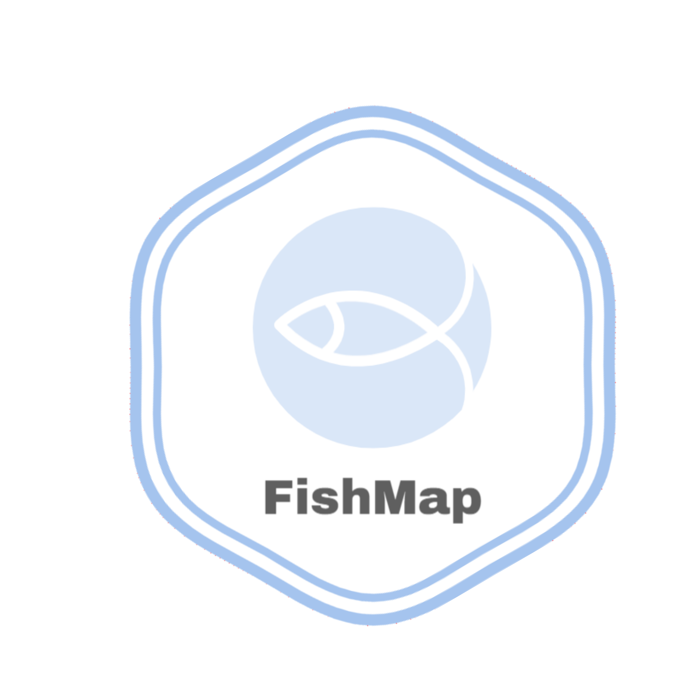
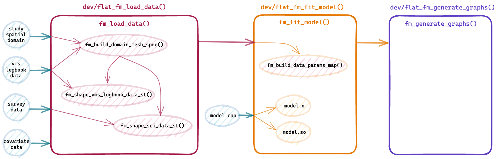

<!-- README.md is generated from README.Rmd. Please edit that file -->

```{r, include = FALSE}
knitr::opts_chunk$set(
  collapse = TRUE,
  comment = "#>",
  fig.path = "man/figures/README-",
  out.width = "100%"
)
```

# FishMap 

<!-- badges: start -->
[](https://github.com/balglave/FishMap/actions/workflows/.github/workflows/R-CMD-check.yaml)
[](https://app.codecov.io/gh/balglave/FishMap?branch=main)
<!-- badges: end -->

The goal of FishMap is to ...

## Installation

### Dependencies

You must [install INLA](https://www.r-inla.org/download-install).
Checkout [INLA doc](https://www.r-inla.org/download-install) to upgrade INLA. Your INLA version should satisfy the minimal required version for running FishMap (`r desc::desc(file = here::here("DESCRIPTION"))$get_field("Config/FishMap/INLA/version")`).

```{r, eval = FALSE}
if (!requireNamespace("BiocManager", quietly = TRUE))
  install.packages("BiocManager")
BiocManager::install(c("graph", "Rgraphviz"), dep=TRUE)

install.packages("INLA",repos=c(getOption("repos"),INLA="https://inla.r-inla-download.org/R/stable"), dep=TRUE)
```

You must [install TMB](https://github.com/kaskr/adcomp/wiki/Download). The installation of TMB requires compiler tools. If you are installing from Windows machine, make sure that your [Rtools installation is matching your R-version](https://github.com/kaskr/adcomp/wiki/Download#windows---installing-required-tools). Your TMB version should satisfy the minimal required version for running FishMap (`r desc::desc(file = here::here("DESCRIPTION"))$get_field("Config/FishMap/TMB/version")`).

```{r, eval = FALSE}
install.packages("TMB")
```


### FishMap

You can install the development version of FishMap from [GitHub](https://github.com/) with:

``` r
# install.packages("remotes")
remotes::install_github("balglave/FishMap")
```

### Vignettes

You can install the development version of FishMap together with the vignettes with:

``` r
# install.packages("remotes")
remotes::install_github("balglave/FishMap", build_vignettes = TRUE)
```

Installing with `build_vignettes = TRUE` will allow you to access the vignettes locally.
Once you have installed FishMap with vignettes, you can access them using the command `vignette(package = "FishMap")`.

## Documentation

Full documentation website on: https://balglave.github.io/FishMap  
In particular, you can follow this vignette:  

```r
vignette("user-running-fishmap", package = "FishMap")
```

#### Unit tests in the package :

Writing unit tests is an essential practice in software development that can greatly improve the quality and maintainability of your code. Here are some of the key reasons why writing unit tests is important:

- Ensuring correctness: Unit tests help ensure that your code works as intended and meets the requirements of the system. By writing tests that cover a wide range of scenarios and edge cases, you can catch bugs and errors before they become bigger problems down the line.

- Facilitating code changes: Unit tests can also help you make changes to your code with confidence. By having a comprehensive suite of tests that can quickly validate changes, you can refactor and optimize your codebase without fear of introducing new bugs or breaking existing functionality.

- Saving time and money: Catching bugs early in the development process can save time and money in the long run. By reducing the time spent on debugging and fixing issues, you can focus more on delivering new features and improvements to your application.

- Promoting code quality: Writing tests can also encourage good coding practices, such as writing modular and reusable code. By breaking down your code into smaller, testable units, you can make your code more flexible and maintainable over time.

Overall, unit testing is a critical practice that can improve the quality, maintainability, and reliability of your software. By investing time and effort into writing good tests, you can ensure that your code works as intended and can adapt to changing requirements and user needs.

You'll find under this [link](https://balglave.github.io/FishMap/testdown/testdown-report-for-fishmap.html), the testdown report that describe the tests implemented for this package and you will find in this [vignette](https://balglave.github.io/FishMap/articles/dev_how_to_maintain_my_tests_and_examples.html) the technical choices made for the realization of these tests. 

## Workflow

This workflow is intended for developers, it summaries the structure of the package. For each flat file in the `dev/` folder, you have a set of defined functions as well as the list of files generated from the flat file when running the `fusen::inflate()` command.

```{r echo=FALSE}

```


## Example

This is a basic example which shows you how to solve a common problem:

```{r eval=FALSE}
library(FishMap)

# Read internal data as Rds files
survey_data_file <- system.file("original_data",
                                "Solea_solea",
                                "survey_data.Rds",
                                package = "FishMap"
                                )

survey_data <- readr::read_rds(file = survey_data_file)

vmslogbook_data_file <- system.file("original_data",
                                "Solea_solea",
                                "vmslogbook_data.Rds",
                                package = "FishMap"
                                )

vmslogbook_data <- readr::read_rds(file = vmslogbook_data_file)

study_domain_file <- system.file("original_data",
                                "Solea_solea",
                                "study_domain.Rds",
                                package = "FishMap"
                                )

study_domain <- readr::read_rds(file = study_domain_file)


# prepare and load model inputs
fm_data_inputs <- fm_load_data(species = "Solea_solea",
                         fleet = c("OTB_DEF_>=70_0","OTB_CEP_>=70_0","OTT_DEF_>=70_0"),
                         fitted_data = "biomass",
                         survey_data = survey_data,
                         vmslogbook_data = vmslogbook_data,
                         study_domain = study_domain,
                         year_start = 2018,
                         year_end = 2018,
                         month_start = 11,
                         month_end = 11,
                         time_step = "Month",
                         k = 0.25,
                         grid_xmin = -6,
                         grid_xmax = 0,
                         grid_ymin = 42,
                         grid_ymax = 48)

# Fit the model
fm_model_results <- fm_fit_model(fm_data_inputs = fm_data_inputs,
                                 SE = 1,
                                 data_source = 1,
                                 data_obs = 2,
                                 samp_process = 0,
                                 b_constraint = 2,
                                 cov_samp_process = 0,
                                 biomass_temporal = 1,
                                 sampling_temporal = 0,
                                 lf_link = 0,
                                 ref_data = "com",
                                 EM = "est_b",
                                 month_ref = 1)

# Generate figure outputs
fm_generate_graphs(fm_model_results = fm_model_results)
```


## Code of Conduct

Please note that the FishMap project is released with a [Contributor Code of Conduct](https://contributor-covenant.org/version/2/1/CODE_OF_CONDUCT.html). By contributing to this project, you agree to abide by its terms.
