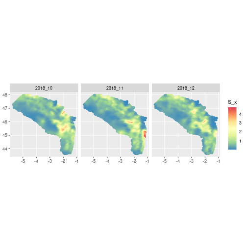

# Checking reproducibility of FishMap results

 <!-- this vignette is generated from dev/dev_check_model_reproducibility_highres_same_pkg_version.Rmd, make your edit on this original file -->

This notebook gather the analysis performed in order to compare the output of the original FishMap `main.R` script between Client and ThinkR. We will compare the results obtained with identical seeds following the execution of the script `dev/run_main_and_save_output.R`.

Here, we use **high resolution parameters** :

  * `k = 0.75`
  * `month_start <- 10`
  * `month_end <- 12`

We use similar **package versions** for Client and ThinkR outputs :

  * Baptiste : `R version 4.2.3` ; `TMB_1.9.2` ; `INLA_22.12.16`
  * ThinkR [swann] : `R version 4.2.0` ; `TMB_1.9.0` ; `INLA_22.12.16`

## Executing `main.R`

We generate the outputs on ThinkR machine. Make sure your .Renviron variables `FISHMAP_UPDATE_OUTPUTS` and `FISHMAP_OUTPUT_DIR` are correctly set.

```r
# Run main.R a second time (model files are already compiled from first run)
source(here::here("dev", "run_main_and_save_output.R"))
```



We list the resulting output files.


```r
thinkr1_output_dir <- file.path("~","shared","outputs_fishmap_highres_rerun")

thinkr1_output <- paste0(
  list.files(
    path = thinkr1_output_dir,
    full.names = TRUE
  ),
  collapse = "\n"
)

glue::glue("The paths to ThinkR's second run output files are :\n {thinkr1_output}")
```

```
## The paths to ThinkR's second run output files are :
## /home/rstudio/shared/outputs_fishmap_highres_rerun/converge_output.rds
## /home/rstudio/shared/outputs_fishmap_highres_rerun/obj_input.rds
## /home/rstudio/shared/outputs_fishmap_highres_rerun/opt_output.rds
## /home/rstudio/shared/outputs_fishmap_highres_rerun/report_output.rds
```

## Loading Client's output

We now load the outputs generated from Clients (BA) in a temporary folder.


```r
# Create tmp folder to store Client output
tmp_folder <- tempfile(pattern = "fishmap_highres")
dir.create(tmp_folder)

# Download and unzip BA highres outputs from Git repo
ba_zip_file_url <- "https://github.com/balglave/FishMap/files/11011699/outputs_fishmap_highres_updatepkg.zip"
download.file(
  url = ba_zip_file_url,
  destfile = file.path(tmp_folder, "ba_output.zip")
)

unzip(
  zipfile = file.path(tmp_folder, "ba_output.zip"),
  exdir = file.path(tmp_folder, "ba_output")
)

ba_output_dir <- file.path(tmp_folder, "ba_output", "outputs_fishmap_highres_updatepkg")

ba_output <- paste0(
  list.files(
    path = ba_output_dir,
    full.names = TRUE
  ),
  collapse = "\n"
)

glue::glue("The paths to Baptiste's output files are :\n {ba_output}")
```

```
## The paths to Baptiste's output files are :
## /tmp/Rtmpt9gcrc/fishmap_highres6fbd36f67d13/ba_output/outputs_fishmap_highres_updatepkg/converge_output.rds
## /tmp/Rtmpt9gcrc/fishmap_highres6fbd36f67d13/ba_output/outputs_fishmap_highres_updatepkg/obj_input.rds
## /tmp/Rtmpt9gcrc/fishmap_highres6fbd36f67d13/ba_output/outputs_fishmap_highres_updatepkg/opt_output.rds
## /tmp/Rtmpt9gcrc/fishmap_highres6fbd36f67d13/ba_output/outputs_fishmap_highres_updatepkg/report_output.rds
```

## Contrasting files

Results between ThinkR and Client's are not perfectly identical.

**Important note** : To compare numerical results at two precision levels, we will consecutively set a tolerance in numerical differences to **1e-4** (as used in the other comparison vignettes) and **1e-6**.

**Conclusion** : 

  * We find **no differences** in numerical outputs when we use a numerical tolerance of **1e-4**.
  * We detect differences in numerical outputs with a tolerance of **1e-6**
  * We find a non-numerical difference in the `fn` element of the `obj_input.rds` file for both tolerance thresholds
  * Numerical differences between Client and ThinkR outputs exist but are all inferior to 1e-4.

### Create contrast function

We will use again `{waldo}` within a function to display the differences for each file. We will adapt the `tolerance` parameter to adjust numerical comparison threshold.


```r
# Create a function to explore waldo's output file by file between ThinkR and Baptiste outputs

compare_output_file <- function(file_name, tolerance) {
  # define client output dir
  client_output_dir <- ba_output_dir

  # running waldo on one file (thinkR ~ client)
  message(glue::glue("contrasting output of {file_name} between thinkr and baptiste with a numerical tolerance of {tolerance}"))
  compare_author <- waldo::compare(
    x = readRDS(
      file.path(client_output_dir, file_name)
    ),
    y = readRDS(
      file.path(thinkr1_output_dir, file_name)
    ),
    x_arg = "baptiste",
    y_arg = "thinkr",
    max_diffs = 100,
    tolerance = tolerance
  )

  return(compare_author)
}
```

### Contrasting all outputs at `1e-4` numerical tolerance

We first make the comparison for each file with a tolerance of `1e-4`.


```r
compare_output_file(file_name = "converge_output.rds", tolerance = 1e-4)
```

```
## contrasting output of converge_output.rds between thinkr and baptiste with a numerical tolerance of 1e-04
```

```
## ✔ No differences
```

```r
compare_output_file(file_name = "opt_output.rds", tolerance = 1e-4)
```

```
## contrasting output of opt_output.rds between thinkr and baptiste with a numerical tolerance of 1e-04
```

```
## ✔ No differences
```

```r
compare_output_file(file_name = "report_output.rds", tolerance = 1e-4)
```

```
## contrasting output of report_output.rds between thinkr and baptiste with a numerical tolerance of 1e-04
```

```
## ✔ No differences
```

```r
compare_output_file(file_name = "obj_input.rds", tolerance = 1e-4)
```

```
## contrasting output of obj_input.rds between thinkr and baptiste with a numerical tolerance of 1e-04
```

```
## body(environment(baptiste$fn)$dataSanitize)[2:8] vs body(environment(thinkr$fn)$dataSanitize)[2:8]
##   `    if (is.list(x)) `
##   `        return(lapply(x, dataSanitize))`
##   `    if (is(x, "sparseMatrix")) {`
## - `        x <- as(as(x, "TsparseMatrix"), "generalMatrix")`
## + `        x <- as(x, "dgTMatrix")`
##   `    }`
##   `    else if (is.character(x)) {`
##   `    }`
```
With a numerical tolerance of `1-e4`, the outputs between ThinkR and Baptiste are identical, with the exception of the `fn` object in `obj_inputs.rds`, which was also reported when contrasting Juliette's outputs. All numerical outputs are identical at **1e-4** numerical tolerance.

### Contrasting `converge_output.rds` output at `1e-6` numerical tolerance

We will now run the same comparison for each file, with a more stringent numerical tolerance of `1e-6`.


```r
compare_output_file(file_name = "converge_output.rds", tolerance = 1e-6)
```

```
## contrasting output of converge_output.rds between thinkr and baptiste with a numerical tolerance of 1e-06
```

```
## ✔ No differences
```

### Contrasting `opt_output.rds` output at `1e-6` numerical tolerance


```r
compare_output_file(file_name = "opt_output.rds", tolerance = 1e-6)
```

```
## contrasting output of opt_output.rds between thinkr and baptiste with a numerical tolerance of 1e-06
```

```
## baptiste$diagnostics vs thinkr$diagnostics
##                                 gradient
## - baptiste$diagnostics[1, ]   1.67192449
## + thinkr$diagnostics[1, ]     1.67189504
## - baptiste$diagnostics[2, ]   0.70886451
## + thinkr$diagnostics[2, ]     0.70885969
## - baptiste$diagnostics[3, ]  -0.37728734
## + thinkr$diagnostics[3, ]    -0.37729758
## - baptiste$diagnostics[4, ]  -4.46957286
## + thinkr$diagnostics[4, ]    -4.46965720
## - baptiste$diagnostics[5, ]   5.81270808
## + thinkr$diagnostics[5, ]     5.81289388
## - baptiste$diagnostics[6, ]  -0.98874901
## + thinkr$diagnostics[6, ]    -0.98878432
## - baptiste$diagnostics[7, ]   0.01814658
## + thinkr$diagnostics[7, ]     0.01816961
## - baptiste$diagnostics[8, ]   2.14903894
## + thinkr$diagnostics[8, ]     2.14908977
## - baptiste$diagnostics[9, ]   3.62156457
## + thinkr$diagnostics[9, ]     3.62162359
## - baptiste$diagnostics[10, ]  0.63560792
## + thinkr$diagnostics[10, ]    0.63561021
## - baptiste$diagnostics[11, ] -0.68677212
## + thinkr$diagnostics[11, ]   -0.68678928
## - baptiste$diagnostics[12, ] 10.32376816
## + thinkr$diagnostics[12, ]   10.32393378
## - baptiste$diagnostics[13, ] -1.73655472
## + thinkr$diagnostics[13, ]   -1.73655628
## - baptiste$diagnostics[14, ]  0.20486158
## + thinkr$diagnostics[14, ]    0.20489779
## - baptiste$diagnostics[15, ]  1.49571994
## + thinkr$diagnostics[15, ]    1.49572741
## - baptiste$diagnostics[16, ] -5.45643706
## + thinkr$diagnostics[16, ]   -5.45641105
## - baptiste$diagnostics[17, ] -5.40520190
## + thinkr$diagnostics[17, ]   -5.40517877
## 
## baptiste$diagnostics$gradient vs thinkr$diagnostics$gradient
## - 1.671924
## + 1.671895
## - 0.708865
## + 0.708860
## - -0.377287
## + -0.377298
## - -4.469573
## + -4.469657
## - 5.812708
## + 5.812894
## - -0.988749
## + -0.988784
## - 0.018147
## + 0.018170
## - 2.149039
## + 2.149090
## - 3.621565
## + 3.621624
## - 0.635608
## + 0.635610
## - -0.686772
## + -0.686789
## - 10.323768
## + 10.323934
## - -1.736555
## + -1.736556
## - 0.204862
## + 0.204898
## - 1.495720
## + 1.495727
## - -5.456437
## + -5.456411
## - -5.405202
## + -5.405179
```

### Contrasting `report_output.rds` output at `1e-6` numerical tolerance


```r
compare_output_file(file_name = "report_output.rds", tolerance = 1e-6)
```

```
## contrasting output of report_output.rds between thinkr and baptiste with a numerical tolerance of 1e-06
```

```
## baptiste$epsilon_com_i vs thinkr$epsilon_com_i
## - 1.0073558
## + 1.0073565
## - 0.6248639
## + 0.6248646
## - 0.6377997
## + 0.6378004
## - 0.6445140
## + 0.6445147
## - 0.6445140
## + 0.6445147
## - 0.6185812
## + 0.6185819
## - 0.6185812
## + 0.6185819
## - 0.6185812
## + 0.6185819
## - 0.5667157
## + 0.5667163
## - 0.3358944
## + 0.3358950
## - -0.4689177
## + -0.4689169
## - -0.4689177
## + -0.4689169
## - -0.3841556
## + -0.3841548
## - -0.4689177
## + -0.4689169
## - -0.4689177
## + -0.4689169
## - -0.4689177
## + -0.4689169
## - -0.1319374
## + -0.1319366
## - -0.0736060
## + -0.0736052
## - -0.1319374
## + -0.1319366
## - 0.2050429
## + 0.2050437
## - 0.2050429
## + 0.2050437
## - 0.2369435
## + 0.2369443
## - 0.2369435
## + 0.2369443
## - 0.5474930
## + 0.5474938
## - 0.5420232
## + 0.5420239
## - 0.5420232
## + 0.5420239
## - 0.5420232
## + 0.5420239
## - 0.5474930
## + 0.5474938
## - 0.5420232
## + 0.5420239
## - 1.1685921
## + 1.1685929
## - 1.2159838
## + 1.2159845
## - 1.2446875
## + 1.2446882
## - 1.1065326
## + 1.1065333
## - 1.1065326
## + 1.1065333
## - 1.2446875
## + 1.2446882
## - 1.2733912
## + 1.2733919
## - 1.2733912
## + 1.2733919
## - 1.0444730
## + 1.0444738
## - 1.1295904
## + 1.1295911
## - 1.2733912
## + 1.2733919
## - 1.2733912
## + 1.2733919
## - 1.2733912
## + 1.2733919
## - 1.2733912
## + 1.2733919
## - 1.0444730
## + 1.0444738
## - 1.0444730
## + 1.0444738
## - 1.0444730
## + 1.0444738
## - 1.2733912
## + 1.2733919
## - 1.0444730
## + 1.0444738
## - 1.1295904
## + 1.1295911
## - 1.0444730
## + 1.0444738
## - 1.1295904
## + 1.1295911
## - 1.0444730
## + 1.0444738
## - 1.1295904
## + 1.1295911
## - 1.1295904
## + 1.1295911
## - 1.0444730
## + 1.0444738
## - 1.0444730
## + 1.0444738
## - 1.0444730
## + 1.0444738
## - 1.0444730
## + 1.0444738
## - 1.0444730
## + 1.0444738
## - 1.0444730
## + 1.0444738
## - 1.1295904
## + 1.1295911
## - 1.2733912
## + 1.2733919
## - 1.2733912
## + 1.2733919
## - 1.0444730
## + 1.0444738
## - 1.2733912
## + 1.2733919
## - 1.0444730
## + 1.0444738
## - 1.0444730
## + 1.0444738
## - 1.1295904
## + 1.1295911
## - 1.0444730
## + 1.0444738
## - 1.0444730
## + 1.0444738
## - 1.0444730
## + 1.0444738
## - 1.2733912
## + 1.2733919
## - 1.1295904
## + 1.1295911
## - 1.0444730
## + 1.0444738
## - 1.0444730
## + 1.0444738
## - 1.1295904
## + 1.1295911
## - 1.0444730
## + 1.0444738
## - 1.0444730
## + 1.0444738
## - 1.1295904
## + 1.1295911
## - 1.0444730
## + 1.0444738
## - 1.1295904
## + 1.1295911
## - 1.0444730
## + 1.0444738
## - 1.1295904
## + 1.1295911
## - 1.0444730
## + 1.0444738
## - 1.1295904
## + 1.1295911
## - 1.0444730
## + 1.0444738
## - 1.0444730
## + 1.0444738
## - 1.1295904
## + 1.1295911
## - 1.0444730
## + 1.0444738
## - 1.2733912
## + 1.2733919
## - 1.2733912
## + 1.2733919
## - 1.0444730
## + 1.0444738
## - 1.2733912
## + 1.2733919
## - 1.2733912
## + 1.2733919
## - 1.2733912
## + 1.2733919
## - 1.0444730
## + 1.0444738
## - 1.0444730
## + 1.0444738
## - 1.0444730
## + 1.0444738
## - 1.2733912
## + 1.2733919
## - 1.0444730
## + 1.0444738
## and 74798 more ...
## 
## baptiste$log_notencounterprob_sci vs thinkr$log_notencounterprob_sci
## - -8.4378676
## + -8.4378913
## - -11.9025328
## + -11.9025647
## - -10.7281148
## + -10.7281449
## - -3.6568408
## + -3.6568500
## - -13.9993535
## + -13.9993916
## - -4.7496863
## + -4.7496996
## - -5.9983170
## + -5.9983338
## - -10.6338790
## + -10.6339085
## - -0.2718837
## + -0.2718845
## - -9.8252455
## + -9.8252728
## - -1.1515926
## + -1.1515958
## - -8.9746022
## + -8.9746271
## - -0.0844392
## + -0.0844394
## - -6.5128996
## + -6.5129180
## - -8.0163647
## + -8.0163870
## - -4.2778013
## + -4.2778129
## - -5.3917790
## + -5.3917942
## - -11.9493657
## + -11.9493992
## - -7.8696753
## + -7.8696974
## - -4.3481545
## + -4.3481667
## - -4.7484014
## + -4.7484147
## - -3.3715294
## + -3.3715387
## - -6.4965698
## + -6.4965880
## - -4.9373382
## + -4.9373521
## - -6.3692586
## + -6.3692766
## - -10.2740094
## + -10.2740380
## - -0.1953962
## + -0.1953968
## - -12.9313675
## + -12.9314041
## - -11.7841341
## + -11.7841671
## - -11.7465400
## + -11.7465731
## - -9.0991425
## + -9.0991680
## - -1.5796523
## + -1.5796563
## - -1.4171995
## + -1.4172033
## - -15.6455709
## + -15.6456149
## - -16.8503461
## + -16.8503935
## - -4.6849265
## + -4.6849393
## - -1.3393992
## + -1.3394028
## - -7.4594191
## + -7.4594399
## - -1.7462032
## + -1.7462081
## - -2.2046092
## + -2.2046152
## - -10.0430919
## + -10.0431203
## - -16.3307502
## + -16.3307951
## - -5.2753108
## + -5.2753257
## - -20.3563054
## + -20.3563628
## - -22.8975399
## + -22.8976043
## - -9.5645422
## + -9.5645692
## - -6.5130286
## + -6.5130470
## - -8.6042300
## + -8.6042542
## - -9.1322190
## + -9.1322446
## 
## `baptiste$q1_sci`: 1.170038
##   `thinkr$q1_sci`: 1.170040
## 
## baptiste$epsilon_p vs thinkr$epsilon_p
##                                       [,1]         [,2]          [,3]
## - baptiste$epsilon_p[1, ]     5.007213e-01 -0.384155585 -0.4689177045
## + thinkr$epsilon_p[1, ]       5.007219e-01 -0.384154775 -0.4689169269
## - baptiste$epsilon_p[2, ]     6.489942e-01 -0.073606042 -0.1319373971
## + thinkr$epsilon_p[2, ]       6.489947e-01 -0.073605249 -0.1319366362
## - baptiste$epsilon_p[3, ]     7.972670e-01  0.236943501  0.2050429103
## + thinkr$epsilon_p[3, ]       7.972676e-01  0.236944277  0.2050436544
## - baptiste$epsilon_p[4, ]     1.242086e+00  1.168592130  1.2159838324
## + thinkr$epsilon_p[4, ]       1.242086e+00  1.168592854  1.2159845263
## - baptiste$epsilon_p[5, ]     1.185838e+00  1.106532577  1.2446875298
## + thinkr$epsilon_p[5, ]       1.185839e+00  1.106533313  1.2446882343
## - baptiste$epsilon_p[6, ]     1.129590e+00  1.044473023  1.2733912271
## + thinkr$epsilon_p[6, ]       1.129591e+00  1.044473772  1.2733919423
## - baptiste$epsilon_p[7, ]     1.073343e+00  0.982413470  1.3020949244
## + thinkr$epsilon_p[7, ]       1.073344e+00  0.982414230  1.3020956503
## - baptiste$epsilon_p[8, ]     1.219880e+00  1.077616087  1.2674039012
## + thinkr$epsilon_p[8, ]       1.219880e+00  1.077616814  1.2674045960
## - baptiste$epsilon_p[9, ]     1.366417e+00  1.172818703  1.2327128779
## + thinkr$epsilon_p[9, ]       1.366417e+00  1.172819398  1.2327135416
## - baptiste$epsilon_p[10, ]    6.026871e-01  0.035292382 -0.0320336068
## + thinkr$epsilon_p[10, ]      6.026877e-01  0.035293167 -0.0320328594
## - baptiste$epsilon_p[11, ]    4.961888e-01 -0.173520432 -0.3000437398
## + thinkr$epsilon_p[11, ]      4.961894e-01 -0.173519634 -0.3000429682
## - baptiste$epsilon_p[12, ]    4.770724e-01 -0.371044846 -0.4213005305
## + thinkr$epsilon_p[12, ]      4.770730e-01 -0.371044019 -0.4212997400
## - baptiste$epsilon_p[13, ]    6.253452e-01 -0.060495303 -0.0843202231
## + thinkr$epsilon_p[13, ]      6.253458e-01 -0.060494493 -0.0843194494
## - baptiste$epsilon_p[14, ]    7.736181e-01  0.250054240  0.2526600843
## + thinkr$epsilon_p[14, ]      7.736187e-01  0.250055033  0.2526608412
## - baptiste$epsilon_p[15, ]    9.224040e-01  0.610059252  0.6011075005
## + thinkr$epsilon_p[15, ]      9.224046e-01  0.610060019  0.6011082385
## - baptiste$epsilon_p[16, ]    1.071703e+00  1.019519734  0.9610220257
## + thinkr$epsilon_p[16, ]      1.071704e+00  1.019520466  0.9610227425
## - baptiste$epsilon_p[17, ]    1.015455e+00  0.957460181  0.9897257231
## + thinkr$epsilon_p[17, ]      1.015456e+00  0.957460924  0.9897264505
## - baptiste$epsilon_p[18, ]    9.592079e-01  0.895400628  1.0184294204
## + thinkr$epsilon_p[18, ]      9.592085e-01  0.895401383  1.0184301585
## - baptiste$epsilon_p[19, ]    1.004392e+00  0.882418936  1.1401634764
## + thinkr$epsilon_p[19, ]      1.004392e+00  0.882419686  1.1401642127
## - baptiste$epsilon_p[20, ]    1.211285e+00  1.044959047  1.1902800358
## + thinkr$epsilon_p[20, ]      1.211286e+00  1.044959796  1.1902807671
## - baptiste$epsilon_p[21, ]    1.418179e+00  1.207499158  1.2403965951
## + thinkr$epsilon_p[21, ]      1.418179e+00  1.207499906  1.2403973215
## - baptiste$epsilon_p[22, ]    1.625072e+00  1.370039269  1.2905131544
## + thinkr$epsilon_p[22, ]      1.625072e+00  1.370040016  1.2905138760
## - baptiste$epsilon_p[23, ]    8.402786e-01  0.667315965  0.7217784046
## + thinkr$epsilon_p[23, ]      8.402792e-01  0.667316715  0.7217790957
## - baptiste$epsilon_p[24, ]    7.046530e-01  0.454740350  0.4048504908
## + thinkr$epsilon_p[24, ]      7.046536e-01  0.454741108  0.4048512080
## - baptiste$epsilon_p[25, ]    5.690273e-01  0.242164735  0.0879225771
## + thinkr$epsilon_p[25, ]      5.690279e-01  0.242165502  0.0879233203
## - baptiste$epsilon_p[26, ]    4.916563e-01  0.037114721 -0.1311697751
## + thinkr$epsilon_p[26, ]      4.916569e-01  0.037115506 -0.1311690095
## - baptiste$epsilon_p[27, ]    4.725399e-01 -0.160409693 -0.2524265658
## + thinkr$epsilon_p[27, ]      4.725405e-01 -0.160408879 -0.2524257813
## - baptiste$epsilon_p[28, ]    4.534234e-01 -0.357934107 -0.3736833565
## + thinkr$epsilon_p[28, ]      4.534240e-01 -0.357933263 -0.3736825532
## - baptiste$epsilon_p[29, ]    6.027225e-01  0.051526375 -0.0137688313
## + thinkr$epsilon_p[29, ]      6.027231e-01  0.051527183 -0.0137680492
## - baptiste$epsilon_p[30, ]    7.520215e-01  0.460986857  0.3461456938
## + thinkr$epsilon_p[30, ]      7.520221e-01  0.460987630  0.3461464547
## - baptiste$epsilon_p[31, ]    9.013205e-01  0.870447339  0.7060602190
## + thinkr$epsilon_p[31, ]      9.013211e-01  0.870448077  0.7060609587
## - baptiste$epsilon_p[32, ]    8.450729e-01  0.808387786  0.7347639164
## + thinkr$epsilon_p[32, ]      8.450736e-01  0.808388536  0.7347646667
## - baptiste$epsilon_p[33, ]    8.902568e-01  0.795406094  0.8564979724
## + thinkr$epsilon_p[33, ]      8.902574e-01  0.795406839  0.8564987209
## - baptiste$epsilon_p[34, ]    9.354407e-01  0.782424402  0.9782320284
## + thinkr$epsilon_p[34, ]      9.354413e-01  0.782425143  0.9782327751
## - baptiste$epsilon_p[35, ]    1.142334e+00  0.944964513  1.0283485878
## + thinkr$epsilon_p[35, ]      1.142335e+00  0.944965253  1.0283493295
## - baptiste$epsilon_p[36, ]    1.290078e+00  1.099491132  1.1036697630
## + thinkr$epsilon_p[36, ]      1.290079e+00  1.099491874  1.1036704981
## - baptiste$epsilon_p[37, ]    1.378674e+00  1.246004260  1.2041955541
## + thinkr$epsilon_p[37, ]      1.378674e+00  1.246005008  1.2041962809
## - baptiste$epsilon_p[38, ]    1.338965e+00  1.433172763  1.3018908764
## + thinkr$epsilon_p[38, ]      1.338966e+00  1.433173493  1.3018916074
## - baptiste$epsilon_p[39, ]    1.118856e+00  1.370402664  1.4604705656
## + thinkr$epsilon_p[39, ]      1.118856e+00  1.370403259  1.4604711676
## - baptiste$epsilon_p[40, ]    9.808729e-01  1.202629915  1.2649157136
## + thinkr$epsilon_p[40, ]      9.808733e-01  1.202630478  1.2649163024
## - baptiste$epsilon_p[41, ]    9.118813e-01  1.118743541  1.1671382876
## + thinkr$epsilon_p[41, ]      9.118817e-01  1.118744088  1.1671388697
## - baptiste$epsilon_p[42, ]    7.246275e-01  0.537424045  0.6124321851
## + thinkr$epsilon_p[42, ]      7.246282e-01  0.537424787  0.6124329013
## - baptiste$epsilon_p[43, ]    6.978104e-01  0.599518374  0.5686194299
## + thinkr$epsilon_p[43, ]      6.978110e-01  0.599519115  0.5686201445
## - baptiste$epsilon_p[44, ]    6.709932e-01  0.661612702  0.5248066748
## + thinkr$epsilon_p[44, ]      6.709938e-01  0.661613443  0.5248073877
## - baptiste$epsilon_p[45, ]    5.353675e-01  0.449037087  0.2078787610
## + thinkr$epsilon_p[45, ]      5.353682e-01  0.449037837  0.2078795000
## - baptiste$epsilon_p[46, ]    4.871238e-01  0.247749873  0.0377041896
## + thinkr$epsilon_p[46, ]      4.871244e-01  0.247750646  0.0377049492
## - baptiste$epsilon_p[47, ]    4.464326e-01  0.079889601 -0.0383782920
## + thinkr$epsilon_p[47, ]      4.464333e-01  0.079890395 -0.0383775217
## - baptiste$epsilon_p[48, ]    3.841668e-01 -0.058306531 -0.0692864645
## + thinkr$epsilon_p[48, ]      3.841674e-01 -0.058305725 -0.0692856916
## - baptiste$epsilon_p[49, ]    4.997572e-01  0.201587294  0.1041751611
## + thinkr$epsilon_p[49, ]      4.997578e-01  0.201588080  0.1041759305
## - baptiste$epsilon_p[50, ]    6.153476e-01  0.461481118  0.2776367867
## + thinkr$epsilon_p[50, ]      6.153482e-01  0.461481884  0.2776375527
## - baptiste$epsilon_p[51, ]    7.309379e-01  0.721374943  0.4510984123
## + thinkr$epsilon_p[51, ]      7.309386e-01  0.721375688  0.4510991748
## - baptiste$epsilon_p[52, ]    7.761218e-01  0.708393252  0.5728324684
## + thinkr$epsilon_p[52, ]      7.761225e-01  0.708393992  0.5728332290
## - baptiste$epsilon_p[53, ]    8.213057e-01  0.695411560  0.6945665244
## + thinkr$epsilon_p[53, ]      8.213063e-01  0.695412295  0.6945672832
## - baptiste$epsilon_p[54, ]    8.664896e-01  0.682429868  0.8163005805
## + thinkr$epsilon_p[54, ]      8.664902e-01  0.682430599  0.8163013375
## - baptiste$epsilon_p[55, ]    9.550848e-01  0.828942996  0.9168263716
## + thinkr$epsilon_p[55, ]      9.550855e-01  0.828943732  0.9168271202
## - baptiste$epsilon_p[56, ]    1.043680e+00  0.975456124  1.0173521627
## + thinkr$epsilon_p[56, ]      1.043681e+00  0.975456866  1.0173529030
## - baptiste$epsilon_p[57, ]    1.132275e+00  1.121969251  1.1178779538
## + thinkr$epsilon_p[57, ]      1.132276e+00  1.121969999  1.1178786858
## - baptiste$epsilon_p[58, ]    1.092567e+00  1.309137754  1.2155732761
## + thinkr$epsilon_p[58, ]      1.092568e+00  1.309138485  1.2155740123
## - baptiste$epsilon_p[59, ]    1.090773e+00  1.491121326  1.5455937187
## + thinkr$epsilon_p[59, ]      1.090773e+00  1.491121966  1.5455943711
## - baptiste$epsilon_p[60, ]    1.136668e+00  1.472670252  1.5895058079
## + thinkr$epsilon_p[60, ]      1.136669e+00  1.472670885  1.5895064453
## - baptiste$epsilon_p[61, ]    1.008171e+00  1.372872489  1.4406904766
## + thinkr$epsilon_p[61, ]      1.008171e+00  1.372873109  1.4406911134
## - baptiste$epsilon_p[62, ]    9.391790e-01  1.288986114  1.3429130506
## + thinkr$epsilon_p[62, ]      9.391795e-01  1.288986719  1.3429136807
## - baptiste$epsilon_p[63, ]    9.087841e-01  1.247099316  1.2709531424
## + thinkr$epsilon_p[63, ]      9.087845e-01  1.247099914  1.2709537723
## - baptiste$epsilon_p[64, ]    9.555824e-01  1.289211671  1.2506282698
## + thinkr$epsilon_p[64, ]      9.555828e-01  1.289212280  1.2506289122
## - baptiste$epsilon_p[65, ]    6.089765e-01  0.407532125  0.5030859657
## + thinkr$epsilon_p[65, ]      6.089771e-01  0.407532860  0.5030867070
## - baptiste$epsilon_p[66, ]    5.821593e-01  0.469626454  0.4592732105
## + thinkr$epsilon_p[66, ]      5.821599e-01  0.469627188  0.4592739502
## - baptiste$epsilon_p[67, ]    5.553421e-01  0.531720782  0.4154604553
## + thinkr$epsilon_p[67, ]      5.553427e-01  0.531721516  0.4154611934
## - baptiste$epsilon_p[68, ]    5.285249e-01  0.593815111  0.3716477001
## + thinkr$epsilon_p[68, ]      5.285256e-01  0.593815844  0.3716484366
## - baptiste$epsilon_p[69, ]    5.017077e-01  0.655909440  0.3278349450
## + thinkr$epsilon_p[69, ]      5.017084e-01  0.655910171  0.3278356797
## - baptiste$epsilon_p[70, ]    4.394419e-01  0.517713308  0.2969267725
## + thinkr$epsilon_p[70, ]      4.394425e-01  0.517714052  0.2969275098
## - baptiste$epsilon_p[71, ]    3.771760e-01  0.379517176  0.2660186000
## + thinkr$epsilon_p[71, ]      3.771766e-01  0.379517933  0.2660193399
## - baptiste$epsilon_p[72, ]    3.149101e-01  0.241321045  0.2351104276
## + thinkr$epsilon_p[72, ]      3.149107e-01  0.241321814  0.2351111700
## - baptiste$epsilon_p[73, ]    4.305005e-01  0.501214869  0.4085720532
## + thinkr$epsilon_p[73, ]      4.305011e-01  0.501215618  0.4085727921
## - baptiste$epsilon_p[74, ]    4.993092e-01  0.653606059  0.5392198082
## + thinkr$epsilon_p[74, ]      4.993098e-01  0.653606799  0.5392205499
## - baptiste$epsilon_p[75, ]    5.213361e-01  0.698494613  0.6270536927
## + thinkr$epsilon_p[75, ]      5.213367e-01  0.698495357  0.6270544434
## - baptiste$epsilon_p[76, ]    5.665200e-01  0.685512921  0.7487877487
## + thinkr$epsilon_p[76, ]      5.665206e-01  0.685513660  0.7487884977
## - baptiste$epsilon_p[77, ]    6.117039e-01  0.672531230  0.8705218048
## + thinkr$epsilon_p[77, ]      6.117045e-01  0.672531964  0.8705225519
## - baptiste$epsilon_p[78, ]    5.414782e-01  0.491231412  0.9014621762
## + thinkr$epsilon_p[78, ]      5.414788e-01  0.491232046  0.9014629039
## - baptiste$epsilon_p[79, ]    6.562778e-01  0.660132355  0.9448282353
## + thinkr$epsilon_p[79, ]      6.562784e-01  0.660133028  0.9448289661
## - baptiste$epsilon_p[80, ]    7.710774e-01  0.829033299  0.9881942944
## + thinkr$epsilon_p[80, ]      7.710780e-01  0.829034009  0.9881950284
## - baptiste$epsilon_p[81, ]    8.858770e-01  0.997934242  1.0315603535
## + thinkr$epsilon_p[81, ]      8.858776e-01  0.997934991  1.0315610907
## - baptiste$epsilon_p[82, ]    8.461686e-01  1.185102745  1.1292556758
## + thinkr$epsilon_p[82, ]      8.461693e-01  1.185103476  1.1292564173
## - baptiste$epsilon_p[83, ]    8.064603e-01  1.372271248  1.2269509981
## + thinkr$epsilon_p[83, ]      8.064609e-01  1.372271962  1.2269517438
## - baptiste$epsilon_p[84, ]    7.667519e-01  1.559439750  1.3246463203
## + thinkr$epsilon_p[84, ]      7.667526e-01  1.559440447  1.3246470704
## - baptiste$epsilon_p[85, ]    9.147208e-01  1.585639869  1.4776815961
## + thinkr$epsilon_p[85, ]      9.147214e-01  1.585640561  1.4776823225
## - baptiste$epsilon_p[86, ]    1.062690e+00  1.611839988  1.6307168718
## + thinkr$epsilon_p[86, ]      1.062690e+00  1.611840674  1.6307175746
## - baptiste$epsilon_p[87, ]    1.210659e+00  1.638040107  1.7837521476
## + thinkr$epsilon_p[87, ]      1.210659e+00  1.638040787  1.7837528266
## - baptiste$epsilon_p[88, ]    1.154481e+00  1.574937841  1.7185410502
## + thinkr$epsilon_p[88, ]      1.154481e+00  1.574938512  1.7185417230
## - baptiste$epsilon_p[89, ]    9.962299e-01  1.467184382  1.5442067662
## + thinkr$epsilon_p[89, ]      9.962304e-01  1.467185042  1.5442074414
## - baptiste$epsilon_p[90, ]    8.974851e-01  1.375342313  1.4209103876
## + thinkr$epsilon_p[90, ]      8.974857e-01  1.375342959  1.4209110591
## - baptiste$epsilon_p[91, ]    9.056868e-01  1.375455092  1.3747679972
## + thinkr$epsilon_p[91, ]      9.056874e-01  1.375455740  1.3747686748
## - baptiste$epsilon_p[92, ]    9.524851e-01  1.417567447  1.3544431245
## + thinkr$epsilon_p[92, ]      9.524857e-01  1.417568106  1.3544438148
## - baptiste$epsilon_p[93, ]    9.992835e-01  1.459679802  1.3341182519
## + thinkr$epsilon_p[93, ]      9.992840e-01  1.459680472  1.3341189547
## - baptiste$epsilon_p[94, ]    8.902125e-01  1.272727059  1.1813596558
## + thinkr$epsilon_p[94, ]      8.902130e-01  1.272727747  1.1813603717
## - baptiste$epsilon_p[95, ]    7.811415e-01  1.085774317  1.0286010598
## + thinkr$epsilon_p[95, ]      7.811420e-01  1.085775022  1.0286017887
## - baptiste$epsilon_p[96, ]    6.720705e-01  0.898821575  0.8758424637
## + thinkr$epsilon_p[96, ]      6.720711e-01  0.898822298  0.8758432056
## - baptiste$epsilon_p[97, ]    5.744540e-01  0.815558767  0.8477646090
## + thinkr$epsilon_p[97, ]      5.744545e-01  0.815559462  0.8477653160
## - baptiste$epsilon_p[98, ]    5.294209e-01  0.181593718  0.6587346164
## + thinkr$epsilon_p[98, ]      5.294215e-01  0.181594467  0.6587353469
## - baptiste$epsilon_p[99, ]    5.709567e-01  0.274494528  0.5941775518
## + thinkr$epsilon_p[99, ]      5.709573e-01  0.274495271  0.5941782847
## - baptiste$epsilon_p[100, ]   6.124925e-01  0.367395337  0.5296204873
## + thinkr$epsilon_p[100, ]     6.124931e-01  0.367396076  0.5296212225
## and 3441 more ...
```

### Contrasting `obj_input.rds` output at `1e-6` numerical tolerance


```r
compare_output_file(file_name = "obj_input.rds", tolerance = 1e-6)
```

```
## contrasting output of obj_input.rds between thinkr and baptiste with a numerical tolerance of 1e-06
```

```
## body(environment(baptiste$fn)$dataSanitize)[2:8] vs body(environment(thinkr$fn)$dataSanitize)[2:8]
##   `    if (is.list(x)) `
##   `        return(lapply(x, dataSanitize))`
##   `    if (is(x, "sparseMatrix")) {`
## - `        x <- as(as(x, "TsparseMatrix"), "generalMatrix")`
## + `        x <- as(x, "dgTMatrix")`
##   `    }`
##   `    else if (is.character(x)) {`
##   `    }`
```


```r
# delete temporary folder
unlink(tmp_folder)
```


```r
# knit the Rmd as a compiled Rmd in vignettes
knitr::knit(
  input = here::here("dev/dev_check_model_reproducibility_highres_same_pkg_version.Rmd"),
  output = here::here("vignettes/dev-check-model-reproducibility-highres-same-pkg-version.Rmd")
)
```
