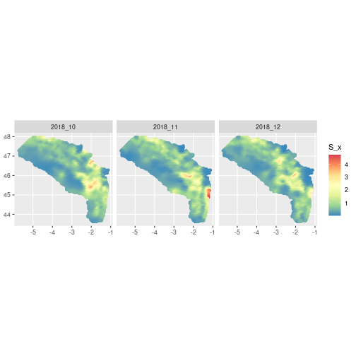

# Checking reproducibility of FishMap results

 <!-- this vignette is generated from dev/dev_check_model_reproducibility_highres.Rmd, make your edit on this original file -->

This notebook gather the analysis performed in order to compare the output of the original FishMap `main.R` script between Client and ThinkR. We will compare the results obtained with identical seeds following the execution of the script `dev/run_main_and_save_output.R`.

Here, we use **high resolution parameters** :

  * `k = 0.75`
  * `month_start <- 10`
  * `month_end <- 12`

## Executing `main.R`

We generate the outputs on ThinkR machine.
> make sure your .Renviron variables `FISHMAP_UPDATE_OUTPUTS` and `FISHMAP_OUTPUT_DIR` are correctly set


```r
# Generate results (model files are compiled)
source(here::here("dev", "run_main_and_save_output.R"))
```

Executing this code results in four outputs to be compared.


```r
output_dir <- Sys.getenv("FISHMAP_OUTPUT_DIR")
list.files(path = file.path(output_dir))
```

```
## [1] "converge_output.rds" "obj_input.rds"       "opt_output.rds"      "report_output.rds"
```

To check whether the seed is effectively making the output reproducible, we will run a second time `main.R` with the same seed.


```r
# Change output dir to avoid overriding previous run
Sys.setenv(FISHMAP_OUTPUT_DIR = "~/shared/outputs_fishmap_highres_rerun")

# Run main.R a second time (model files are already compiled from first run)
source(here::here("dev", "run_main_and_save_output.R"))
```



_Note_: model fit is performed in 186 steps in this run.

We list the resulting output files.


```r
thinkr1_output_dir <- file.path("~","shared","outputs_fishmap_highres_rerun")

thinkr1_output <- paste0(
  list.files(
    path = thinkr1_output_dir,
    full.names = TRUE
  ),
  collapse = "\n"
)

glue::glue("The paths to ThinkR's second run output files are :\n {thinkr1_output}")
```

```
## The paths to ThinkR's second run output files are :
## /home/rstudio/shared/outputs_fishmap_highres_rerun/converge_output.rds
## /home/rstudio/shared/outputs_fishmap_highres_rerun/obj_input.rds
## /home/rstudio/shared/outputs_fishmap_highres_rerun/opt_output.rds
## /home/rstudio/shared/outputs_fishmap_highres_rerun/report_output.rds
```

```r
thinkr2_output_dir <- file.path("~","shared","outputs_fishmap_highres")

thinkr2_output <- paste0(
  list.files(
    path = thinkr2_output_dir,
    full.names = TRUE
  ),
  collapse = "\n"
)

glue::glue("The paths to ThinkR's first run output files are :\n {thinkr2_output}")
```

```
## The paths to ThinkR's first run output files are :
## /home/rstudio/shared/outputs_fishmap_highres/converge_output.rds
## /home/rstudio/shared/outputs_fishmap_highres/obj_input.rds
## /home/rstudio/shared/outputs_fishmap_highres/opt_output.rds
## /home/rstudio/shared/outputs_fishmap_highres/report_output.rds
```

## Checking seed reproducibility

In order to contrast output files from both ThinkR runs, we will use the package `{waldo}`.


```r
# list of output fiiles to contrast
files_to_contrast <- list.files(path = file.path(thinkr1_output_dir))

# running waldo on each files comparing thinkR runs
purrr::map(
  .x = files_to_contrast,
  ~ waldo::compare(
    x = readRDS(
      file.path(thinkr1_output_dir, .x)
    ),
    y = readRDS(
      file.path(thinkr2_output_dir, .x)
    )
  )
) %>% setNames(files_to_contrast)
```

```
## $converge_output.rds
## ✔ No differences
## 
## $obj_input.rds
## ✔ No differences
## 
## $opt_output.rds
## ✔ No differences
## 
## $report_output.rds
## ✔ No differences
```
Both ThinkR outputs are identical. We will use one of them to now compare with the Client's output.

## Loading Client's output

We now load the outputs generated from Clients (BA and JC) in a temporary folder.


```r
# Create tmp folder to store Client output
tmp_folder <- tempfile(pattern = "fishmap_highres")
dir.create(tmp_folder)

# Download and unzip JC highres outputs from Git repo
jc_zip_file_url <- "https://github.com/balglave/FishMap/files/10970908/outputs_fishmap_highres.zip"
download.file(
  url = jc_zip_file_url,
  destfile = file.path(tmp_folder, "jc_output.zip")
)

unzip(
  zipfile = file.path(tmp_folder, "jc_output.zip"),
  exdir = file.path(tmp_folder, "jc_output")
)

jc_output_dir <- file.path(tmp_folder, "jc_output", "outputs_fishmap_highres")

jc_output <- paste0(
  list.files(
    path = jc_output_dir,
    full.names = TRUE
  ),
  collapse = "\n"
)

glue::glue("The paths to Juliette's output files are :\n {jc_output}")
```

```
## The paths to Juliette's output files are :
## /tmp/Rtmp0gt7ih/fishmap_highres515145316ce4/jc_output/outputs_fishmap_highres/converge_output.rds
## /tmp/Rtmp0gt7ih/fishmap_highres515145316ce4/jc_output/outputs_fishmap_highres/obj_input.rds
## /tmp/Rtmp0gt7ih/fishmap_highres515145316ce4/jc_output/outputs_fishmap_highres/opt_output.rds
## /tmp/Rtmp0gt7ih/fishmap_highres515145316ce4/jc_output/outputs_fishmap_highres/report_output.rds
```

```r
# Download and unzip BA highres outputs from Git repo
ba_zip_file_url <- "https://github.com/balglave/FishMap/files/10982408/outputs_fishmap_highres.zip"
download.file(
  url = ba_zip_file_url,
  destfile = file.path(tmp_folder, "ba_output.zip")
)

unzip(
  zipfile = file.path(tmp_folder, "ba_output.zip"),
  exdir = file.path(tmp_folder, "ba_output")
)

ba_output_dir <- file.path(tmp_folder, "ba_output","outputs_fishmap_highres")

ba_output <- paste0(
  list.files(
    path = ba_output_dir,
    full.names = TRUE
  ),
  collapse = "\n"
)

glue::glue("The paths to Baptiste's output files are :\n {ba_output}")
```

```
## The paths to Baptiste's output files are :
## /tmp/Rtmp0gt7ih/fishmap_highres515145316ce4/ba_output/outputs_fishmap_highres/converge_output.rds
## /tmp/Rtmp0gt7ih/fishmap_highres515145316ce4/ba_output/outputs_fishmap_highres/obj_input.rds
## /tmp/Rtmp0gt7ih/fishmap_highres515145316ce4/ba_output/outputs_fishmap_highres/opt_output.rds
## /tmp/Rtmp0gt7ih/fishmap_highres515145316ce4/ba_output/outputs_fishmap_highres/report_output.rds
```


## Contrasting files

Results between ThinkR and Client's are not perfectly identical. 

**Important note** : To compare numerical results we will set a tolerance in numerical differences to **10e-4**.

We find differences in function code present in the outputs (see section on `obj_inputs.rds`). This might indicate a difference in **package version**. cf. `sessionInfo()` provided by Clients.

### Create contrast function

We will use again `{waldo}` within a function to display the exact differences for each file.


```r
# Create a function to explore waldo's output file by file between ThinkR and Baptiste + Juliette outputs

compare_output_file <- function(file_name, author) {
  if (author == "juliette") {
    client_output_dir <- jc_output_dir
  } else if (author == "baptiste") {
    client_output_dir <- ba_output_dir
  } else {
    stop("author must be either juliette or baptiste")
  }

  # running waldo on one file (thinkR ~ client)
  message(glue::glue("contrasting output of {file_name} between thinkr and {author}"))
  compare_author <- waldo::compare(
    x = readRDS(
      file.path(client_output_dir, file_name)
    ),
    y = readRDS(
      file.path(thinkr1_output_dir, file_name)
    ),
    x_arg = author,
    y_arg = "thinkr",
    max_diffs = 100,
    tolerance = 10e-4
  )

  return(compare_author)
}
```

### Contrasting `converge_output.rds` output


```r
compare_output_file(file_name = "converge_output.rds", author = "baptiste")
```

```
## contrasting output of converge_output.rds between thinkr and baptiste
```

```
## `baptiste`: 0
##   `thinkr`: 1
```

```r
compare_output_file(file_name = "converge_output.rds", author = "juliette")
```

```
## contrasting output of converge_output.rds between thinkr and juliette
```

```
## ✔ No differences
```

### Contrasting `opt_output.rds` output


```r
compare_output_file(file_name = "opt_output.rds", author = "baptiste")
```

```
## contrasting output of opt_output.rds between thinkr and baptiste
```

```
## `baptiste$par`: -0.7514 -0.1077 -0.1778 1.4355 -1.0929 0.6456 0.0503 0.5536 0.7255 0.1177 -0.0026 0.0420 0.6365 1.0426 0.3378 1.2611 3.4480
##   `thinkr$par`: -0.7006 -0.1152 -0.2056 1.4413 -1.0769 0.6483 0.0472 0.5539 0.7252 0.1189 -0.0027 0.0423 0.6342 1.0385 0.2911 1.1700 2.3014
## 
## `baptiste$convergence`: 0
##   `thinkr$convergence`: 1
## 
## `baptiste$iterations`: 117
##   `thinkr$iterations`: 186
## 
## `baptiste$evaluations`: 145 118
##   `thinkr$evaluations`: 200 186
## 
## `baptiste$message`: "relative convergence (4)"                                 
## `thinkr$message`:   "function evaluation limit reached without convergence (9)"
## 
## baptiste$diagnostics vs thinkr$diagnostics
##                                       Est      gradient
## - baptiste$diagnostics[1, ]  -0.751415990 -0.0008476728
## + thinkr$diagnostics[1, ]    -0.700563771  1.6718950432
## - baptiste$diagnostics[2, ]  -0.107657037  0.0008587655
## + thinkr$diagnostics[2, ]    -0.115222118  0.7088596930
## - baptiste$diagnostics[3, ]  -0.177839145 -0.0021672452
## + thinkr$diagnostics[3, ]    -0.205590893 -0.3772975754
## - baptiste$diagnostics[4, ]   1.435519182 -0.0035913982
## + thinkr$diagnostics[4, ]     1.441283283 -4.4696572017
## - baptiste$diagnostics[5, ]  -1.092910641  0.0073067765
## + thinkr$diagnostics[5, ]    -1.076884702  5.8128938820
## - baptiste$diagnostics[6, ]   0.645620799 -0.0007044007
## + thinkr$diagnostics[6, ]     0.648331316 -0.9887843231
## - baptiste$diagnostics[7, ]   0.050349021  0.0185275649
## + thinkr$diagnostics[7, ]     0.047233023  0.0181696100
## - baptiste$diagnostics[8, ]   0.553610785  0.0214705955
## + thinkr$diagnostics[8, ]     0.553854258  2.1490897681
## - baptiste$diagnostics[9, ]   0.725546348  0.0038897983
## + thinkr$diagnostics[9, ]     0.725246076  3.6216235942
## - baptiste$diagnostics[10, ]  0.117706144 -0.0522378061
## + thinkr$diagnostics[10, ]    0.118880284  0.6356102082
## - baptiste$diagnostics[11, ] -0.002575488  0.0410938269
## + thinkr$diagnostics[11, ]   -0.002701783 -0.6867892773
## - baptiste$diagnostics[12, ]  0.041954595  0.0587537483
## + thinkr$diagnostics[12, ]    0.042256585 10.3239337808
## - baptiste$diagnostics[13, ]  0.636525714 -0.0284481299
## + thinkr$diagnostics[13, ]    0.634198980 -1.7365562754
## - baptiste$diagnostics[14, ]  1.042627379 -0.0035211442
## + thinkr$diagnostics[14, ]    1.038509555  0.2048977911
## - baptiste$diagnostics[15, ]  0.337767136 -0.0035421497
## + thinkr$diagnostics[15, ]    0.291074241  1.4957274081
## - baptiste$diagnostics[16, ]  1.261104737  0.0008438103
## + thinkr$diagnostics[16, ]    1.170039584 -5.4564110514
## - baptiste$diagnostics[17, ]  3.447997153  0.0002729818
## + thinkr$diagnostics[17, ]    2.301390441 -5.4051787706
## 
## `baptiste$diagnostics$Est`: -0.7514 -0.1077 -0.1778 1.4355 -1.0929 0.6456 0.0503 0.5536 0.7255 0.1177 -0.0026 0.0420 0.6365 1.0426 0.3378 1.2611 3.4480
##   `thinkr$diagnostics$Est`: -0.7006 -0.1152 -0.2056 1.4413 -1.0769 0.6483 0.0472 0.5539 0.7252 0.1189 -0.0027 0.0423 0.6342 1.0385 0.2911 1.1700 2.3014
## 
##      baptiste$diagnostics$gradient | thinkr$diagnostics$gradient     
##  [1] -0.0008                       - 1.6719                      [1] 
##  [2] 0.0009                        - 0.7089                      [2] 
##  [3] -0.0022                       - -0.3773                     [3] 
##  [4] -0.0036                       - -4.4697                     [4] 
##  [5] 0.0073                        - 5.8129                      [5] 
##  [6] -0.0007                       - -0.9888                     [6] 
##  [7] 0.0185                        - 0.0182                      [7] 
##  [8] 0.0215                        - 2.1491                      [8] 
##  [9] 0.0039                        - 3.6216                      [9] 
## [10] -0.0522                       - 0.6356                      [10]
## [11] 0.0411                        - -0.6868                     [11]
## [12] 0.0588                        - 10.3239                     [12]
## [13] -0.0284                       - -1.7366                     [13]
## [14] -0.0035                       - 0.2049                      [14]
## [15] -0.0035                       - 1.4957                      [15]
## [16] 0.0008                        - -5.4564                     [16]
## [17] 0.0003                        - -5.4052                     [17]
```

```r
compare_output_file(file_name = "opt_output.rds", author = "juliette")
```

```
## contrasting output of opt_output.rds between thinkr and juliette
```

```
## ✔ No differences
```

### Contrasting `report_output.rds` output


```r
compare_output_file(file_name = "report_output.rds", author = "baptiste")
```

```
## contrasting output of report_output.rds between thinkr and baptiste
```

```
## `baptiste$Sigma_sci`: 1.40
##   `thinkr$Sigma_sci`: 1.34
## 
##       baptiste$E_com | thinkr$E_com                   
##   [1] 1.1159784      - 1.2111504    [1]               
##   [2] 0.9419812      - 0.8261977    [2]               
##   [3] 0.8519238      - 0.7646368    [3]               
##   [4] 0.8127717      - 0.7697881    [4]               
##   [5] 0.8127717      - 0.7697881    [5]               
##   [6] 0.5063290      - 0.4757012    [6]               
##   [7] 0.7954573      - 0.7500820    [7]               
##   [8] 0.7954573      - 0.7500820    [8]               
##   [9] 0.5436222      - 0.7121702    [9]               
##  [10] 0.4267545      - 0.5653786    [10]              
##  [11] 0.1674002      - 0.1603391    [11]              
##  [12] 0.2629905      - 0.2528215    [12]              
##  [13] 0.3544091      - 0.3012121    [13]              
##  [14] 0.1674002      - 0.1603391    [14]              
##  [15] 0.1674002      - 0.1603391    [15]              
##  [16] 0.1674002      - 0.1603391    [16]              
##  [17] 0.3645781      - 0.3541300    [17]              
##  [18] 0.4660738      - 0.4109059    [18]              
##  [19] 0.2320633      - 0.2245889    [19]              
##  [20] 0.3217044      - 0.3145842    [20]              
##  [21] 0.5054068      - 0.4960339    [21]              
##  [22] 0.6129210      - 0.5605473    [22]              
##  [23] 0.6129210      - 0.5605473    [23]              
##  [24] 0.8060357      - 0.7646844    [24]              
##  [25] 0.4459720      - 0.4406417    [25]              
##  [26] 0.7006346      - 0.6948004    [26]              
##  [27] 0.7006346      - 0.6948004    [27]              
##  [28] 0.8060357      - 0.7646844    [28]              
##  [29] 0.4459720      - 0.4406417    [29]              
##  [30] 1.3939716      - 1.4230564    [30]              
##  [31] 0.8570548      - 0.8645357    [31]              
##  [32] 0.8831866      - 0.8897107    [32]              
##  [33] 1.3117538      - 1.3374267    [33]              
##  [34] 0.8349650      - 0.8481947    [34]              
##  [35] 0.8831866      - 0.8897107    [35]              
##  [36] 1.4298166      - 1.4437404    [36]              
##  [37] 1.4298166      - 1.4437404    [37]              
##  [38] 1.2343853      - 1.2569497    [38]              
##  [39] 0.9648024      - 0.9739793    [39]              
##  [40] 0.9101150      - 0.9156187    [40]              
##  [41] 1.4298166      - 1.4437404    [41]              
##  [42] 0.9101150      - 0.9156187    [42]              
##  [43] 0.9101150      - 0.9156187    [43]              
##  [44] 0.7857180      - 0.7971562    [44]              
##  [45] 0.7857180      - 0.7971562    [45]              
##  [46] 0.7857180      - 0.7971562    [46]              
##  [47] 0.9101150      - 0.9156187    [47]              
##  [48] 0.7857180      - 0.7971562    [48]              
##  [49] 0.9648024      - 0.9739793    [49]              
##  [50] 0.7857180      - 0.7971562    [50]              
##  [51] 0.9648024      - 0.9739793    [51]              
##  [52] 1.2343853      - 1.2569497    [52]              
##  [53] 0.9648024      - 0.9739793    [53]              
##  [54] 0.9648024      - 0.9739793    [54]              
##  [55] 0.7857180      - 0.7971562    [55]              
##  [56] 1.2343853      - 1.2569497    [56]              
##  [57] 0.7857180      - 0.7971562    [57]              
##  [58] 0.7857180      - 0.7971562    [58]              
##  [59] 0.7857180      - 0.7971562    [59]              
##  [60] 0.7857180      - 0.7971562    [60]              
##  [61] 1.5157320      - 1.5357630    [61]              
##  [62] 0.9101150      - 0.9156187    [62]              
##  [63] 0.9101150      - 0.9156187    [63]              
##  [64] 1.2343853      - 1.2569497    [64]              
##  [65] 1.4298166      - 1.4437404    [65]              
##  [66] 0.7857180      - 0.7971562    [66]              
##  [67] 0.7857180      - 0.7971562    [67]              
##  [68] 1.5157320      - 1.5357630    [68]              
##  [69] 0.7857180      - 0.7971562    [69]              
##  [70] 0.7857180      - 0.7971562    [70]              
##  [71] 0.7857180      - 0.7971562    [71]              
##  [72] 0.9101150      - 0.9156187    [72]              
##  [73] 1.5157320      - 1.5357630    [73]              
##  [74] 0.7857180      - 0.7971562    [74]              
##  [75] 0.7857180      - 0.7971562    [75]              
##  [76] 1.5157320      - 1.5357630    [76]              
##  [77] 0.7857180      - 0.7971562    [77]              
##  [78] 0.7857180      - 0.7971562    [78]              
##  [79] 1.5157320      - 1.5357630    [79]              
##  [80] 0.7857180      - 0.7971562    [80]              
##  [81] 0.9648024      - 0.9739793    [81]              
##  [82] 0.7857180      - 0.7971562    [82]              
##  [83] 0.9648024      - 0.9739793    [83]              
##  [84] 0.7857180      - 0.7971562    [84]              
##  [85] 0.9648024      - 0.9739793    [85]              
##  [86] 0.7857180      - 0.7971562    [86]              
##  [87] 0.7857180      - 0.7971562    [87]              
##  [88] 0.9648024      - 0.9739793    [88]              
##  [89] 0.7857180      - 0.7971562    [89]              
##  [90] 0.9101150      - 0.9156187    [90]              
##  [91] 0.9101150      - 0.9156187    [91]              
##  [92] 0.7857180      - 0.7971562    [92]              
##  [93] 0.9101150      - 0.9156187    [93]              
##  [94] 0.9101150      - 0.9156187    [94]              
##  [95] 0.9101150      - 0.9156187    [95]              
##  [96] 0.7857180      - 0.7971562    [96]              
##  [97] 0.7857180      - 0.7971562    [97]              
##  [98] 0.7857180      - 0.7971562    [98]              
##  [99] 0.9101150      - 0.9156187    [99]              
## [100] 0.7857180      - 0.7971562    [100]             
##   ... ...              ...          and 74798 more ...
## 
##       baptiste$S_com_i | thinkr$S_com_i                   
##   [1] 1.1159784        - 1.2111504      [1]               
##   [2] 0.9419812        - 0.8261977      [2]               
##   [3] 0.8519238        - 0.7646368      [3]               
##   [4] 0.8127717        - 0.7697881      [4]               
##   [5] 0.8127717        - 0.7697881      [5]               
##   [6] 0.7954573        - 0.7500820      [6]               
##   [7] 0.7954573        - 0.7500820      [7]               
##   [8] 0.7954573        - 0.7500820      [8]               
##   [9] 0.5436222        - 0.7121702      [9]               
##  [10] 0.4267545        - 0.5653786      [10]              
##  [11] 0.2629905        - 0.2528215      [11]              
##  [12] 0.2629905        - 0.2528215      [12]              
##  [13] 0.3544091        - 0.3012121      [13]              
##  [14] 0.2629905        - 0.2528215      [14]              
##  [15] 0.2629905        - 0.2528215      [15]              
##  [16] 0.2629905        - 0.2528215      [16]              
##  [17] 0.3645781        - 0.3541300      [17]              
##  [18] 0.4660738        - 0.4109059      [18]              
##  [19] 0.3645781        - 0.3541300      [19]              
##  [20] 0.5054068        - 0.4960339      [20]              
##  [21] 0.5054068        - 0.4960339      [21]              
##  [22] 0.6129210        - 0.5605473      [22]              
##  [23] 0.6129210        - 0.5605473      [23]              
##  [24] 0.8060357        - 0.7646844      [24]              
##  [25] 0.7006346        - 0.6948004      [25]              
##  [26] 0.7006346        - 0.6948004      [26]              
##  [27] 0.7006346        - 0.6948004      [27]              
##  [28] 0.8060357        - 0.7646844      [28]              
##  [29] 0.7006346        - 0.6948004      [29]              
##  [30] 1.3939716        - 1.4230564      [30]              
##  [31] 1.3464575        - 1.3631932      [31]              
##  [32] 1.3875112        - 1.4028888      [32]              
##  [33] 1.3117538        - 1.3374267      [33]              
##  [34] 1.3117538        - 1.3374267      [34]              
##  [35] 1.3875112        - 1.4028888      [35]              
##  [36] 1.4298166        - 1.4437404      [36]              
##  [37] 1.4298166        - 1.4437404      [37]              
##  [38] 1.2343853        - 1.2569497      [38]              
##  [39] 1.5157320        - 1.5357630      [39]              
##  [40] 1.4298166        - 1.4437404      [40]              
##  [41] 1.4298166        - 1.4437404      [41]              
##  [42] 1.4298166        - 1.4437404      [42]              
##  [43] 1.4298166        - 1.4437404      [43]              
##  [44] 1.2343853        - 1.2569497      [44]              
##  [45] 1.2343853        - 1.2569497      [45]              
##  [46] 1.2343853        - 1.2569497      [46]              
##  [47] 1.4298166        - 1.4437404      [47]              
##  [48] 1.2343853        - 1.2569497      [48]              
##  [49] 1.5157320        - 1.5357630      [49]              
##  [50] 1.2343853        - 1.2569497      [50]              
##  [51] 1.5157320        - 1.5357630      [51]              
##  [52] 1.2343853        - 1.2569497      [52]              
##  [53] 1.5157320        - 1.5357630      [53]              
##  [54] 1.5157320        - 1.5357630      [54]              
##  [55] 1.2343853        - 1.2569497      [55]              
##  [56] 1.2343853        - 1.2569497      [56]              
##  [57] 1.2343853        - 1.2569497      [57]              
##  [58] 1.2343853        - 1.2569497      [58]              
##  [59] 1.2343853        - 1.2569497      [59]              
##  [60] 1.2343853        - 1.2569497      [60]              
##  [61] 1.5157320        - 1.5357630      [61]              
##  [62] 1.4298166        - 1.4437404      [62]              
##  [63] 1.4298166        - 1.4437404      [63]              
##  [64] 1.2343853        - 1.2569497      [64]              
##  [65] 1.4298166        - 1.4437404      [65]              
##  [66] 1.2343853        - 1.2569497      [66]              
##  [67] 1.2343853        - 1.2569497      [67]              
##  [68] 1.5157320        - 1.5357630      [68]              
##  [69] 1.2343853        - 1.2569497      [69]              
##  [70] 1.2343853        - 1.2569497      [70]              
##  [71] 1.2343853        - 1.2569497      [71]              
##  [72] 1.4298166        - 1.4437404      [72]              
##  [73] 1.5157320        - 1.5357630      [73]              
##  [74] 1.2343853        - 1.2569497      [74]              
##  [75] 1.2343853        - 1.2569497      [75]              
##  [76] 1.5157320        - 1.5357630      [76]              
##  [77] 1.2343853        - 1.2569497      [77]              
##  [78] 1.2343853        - 1.2569497      [78]              
##  [79] 1.5157320        - 1.5357630      [79]              
##  [80] 1.2343853        - 1.2569497      [80]              
##  [81] 1.5157320        - 1.5357630      [81]              
##  [82] 1.2343853        - 1.2569497      [82]              
##  [83] 1.5157320        - 1.5357630      [83]              
##  [84] 1.2343853        - 1.2569497      [84]              
##  [85] 1.5157320        - 1.5357630      [85]              
##  [86] 1.2343853        - 1.2569497      [86]              
##  [87] 1.2343853        - 1.2569497      [87]              
##  [88] 1.5157320        - 1.5357630      [88]              
##  [89] 1.2343853        - 1.2569497      [89]              
##  [90] 1.4298166        - 1.4437404      [90]              
##  [91] 1.4298166        - 1.4437404      [91]              
##  [92] 1.2343853        - 1.2569497      [92]              
##  [93] 1.4298166        - 1.4437404      [93]              
##  [94] 1.4298166        - 1.4437404      [94]              
##  [95] 1.4298166        - 1.4437404      [95]              
##  [96] 1.2343853        - 1.2569497      [96]              
##  [97] 1.2343853        - 1.2569497      [97]              
##  [98] 1.2343853        - 1.2569497      [98]              
##  [99] 1.4298166        - 1.4437404      [99]              
## [100] 1.2343853        - 1.2569497      [100]             
##   ... ...                ...            and 74798 more ...
## 
## `dim(baptiste$delta_x)`: 570 3
##   `dim(thinkr$delta_x)`: 571 3
## 
## `baptiste$delta_x[1708:1710]`: 0 0 0      
##   `thinkr$delta_x[1708:1713]`: 0 0 0 0 0 0
## 
##       baptiste$epsilon_com_i | thinkr$epsilon_com_i                   
##   [1] 0.96880                - 1.00736              [1]               
##   [2] 0.79930                - 0.62486              [2]               
##   [3] 0.76900                - 0.63780              [3]               
##   [4] 0.72195                - 0.64451              [4]               
##   [5] 0.72195                - 0.64451              [5]               
##   [6] 0.70042                - 0.61858              [6]               
##   [7] 0.70042                - 0.61858              [7]               
##   [8] 0.70042                - 0.61858              [8]               
##   [9] 0.31975                - 0.56672              [9]               
##  [10] 0.07771                - 0.33590              [10]              
##  [11] -0.40638               - -0.46892             [11]              
##  [12] -0.40638               - -0.46892             [12]              
##  [13] -0.17823               - -0.38415             [13]              
##  [14] -0.40638               - -0.46892             [14]              
##  [15] -0.40638               - -0.46892             [15]              
##  [16] -0.40638               - -0.46892             [16]              
##  [17] -0.07976               - -0.13194             [17]              
##  [18] 0.09566                - -0.07361             [18]              
##  [19] -0.07976               - -0.13194             [19]              
##  [20] 0.24686                - 0.20504              [20]              
##  [21] 0.24686                - 0.20504              [21]              
##  [22] 0.36955                - 0.23694              [22]              
##  [23] 0.36955                - 0.23694              [23]              
##  [24] 0.64345                - 0.54749              [24]              
##  [25] 0.57349                - 0.54202              [25]              
##  [26] 0.57349                - 0.54202              [26]              
##  [27] 0.57349                - 0.54202              [27]              
##  [28] 0.64345                - 0.54749              [28]              
##  [29] 0.57349                - 0.54202              [29]              
##  [30] 1.19123                - 1.16859              [30]              
##  [31] 1.22673                - 1.21598              [31]              
##  [32] 1.25677                - 1.24469              [32]              
##  [33] 1.13044                - 1.10653              [33]              
##  [34] 1.13044                - 1.10653              [34]              
##  [35] 1.25677                - 1.24469              [35]              
##  [36] 1.28680                - 1.27339              [36]              
##  [37] 1.28680                - 1.27339              [37]              
##  [38] 1.06965                - 1.04447              [38]              
##  [39] 1.16731                - 1.12959              [39]              
##  [40] 1.28680                - 1.27339              [40]              
##  [41] 1.28680                - 1.27339              [41]              
##  [42] 1.28680                - 1.27339              [42]              
##  [43] 1.28680                - 1.27339              [43]              
##  [44] 1.06965                - 1.04447              [44]              
##  [45] 1.06965                - 1.04447              [45]              
##  [46] 1.06965                - 1.04447              [46]              
##  [47] 1.28680                - 1.27339              [47]              
##  [48] 1.06965                - 1.04447              [48]              
##  [49] 1.16731                - 1.12959              [49]              
##  [50] 1.06965                - 1.04447              [50]              
##  [51] 1.16731                - 1.12959              [51]              
##  [52] 1.06965                - 1.04447              [52]              
##  [53] 1.16731                - 1.12959              [53]              
##  [54] 1.16731                - 1.12959              [54]              
##  [55] 1.06965                - 1.04447              [55]              
##  [56] 1.06965                - 1.04447              [56]              
##  [57] 1.06965                - 1.04447              [57]              
##  [58] 1.06965                - 1.04447              [58]              
##  [59] 1.06965                - 1.04447              [59]              
##  [60] 1.06965                - 1.04447              [60]              
##  [61] 1.16731                - 1.12959              [61]              
##  [62] 1.28680                - 1.27339              [62]              
##  [63] 1.28680                - 1.27339              [63]              
##  [64] 1.06965                - 1.04447              [64]              
##  [65] 1.28680                - 1.27339              [65]              
##  [66] 1.06965                - 1.04447              [66]              
##  [67] 1.06965                - 1.04447              [67]              
##  [68] 1.16731                - 1.12959              [68]              
##  [69] 1.06965                - 1.04447              [69]              
##  [70] 1.06965                - 1.04447              [70]              
##  [71] 1.06965                - 1.04447              [71]              
##  [72] 1.28680                - 1.27339              [72]              
##  [73] 1.16731                - 1.12959              [73]              
##  [74] 1.06965                - 1.04447              [74]              
##  [75] 1.06965                - 1.04447              [75]              
##  [76] 1.16731                - 1.12959              [76]              
##  [77] 1.06965                - 1.04447              [77]              
##  [78] 1.06965                - 1.04447              [78]              
##  [79] 1.16731                - 1.12959              [79]              
##  [80] 1.06965                - 1.04447              [80]              
##  [81] 1.16731                - 1.12959              [81]              
##  [82] 1.06965                - 1.04447              [82]              
##  [83] 1.16731                - 1.12959              [83]              
##  [84] 1.06965                - 1.04447              [84]              
##  [85] 1.16731                - 1.12959              [85]              
##  [86] 1.06965                - 1.04447              [86]              
##  [87] 1.06965                - 1.04447              [87]              
##  [88] 1.16731                - 1.12959              [88]              
##  [89] 1.06965                - 1.04447              [89]              
##  [90] 1.28680                - 1.27339              [90]              
##  [91] 1.28680                - 1.27339              [91]              
##  [92] 1.06965                - 1.04447              [92]              
##  [93] 1.28680                - 1.27339              [93]              
##  [94] 1.28680                - 1.27339              [94]              
##  [95] 1.28680                - 1.27339              [95]              
##  [96] 1.06965                - 1.04447              [96]              
##  [97] 1.06965                - 1.04447              [97]              
##  [98] 1.06965                - 1.04447              [98]              
##  [99] 1.28680                - 1.27339              [99]              
## [100] 1.06965                - 1.04447              [100]             
##   ... ...                      ...                  and 74798 more ...
## 
##      baptiste$log_notencounterprob_sci | thinkr$log_notencounterprob_sci     
##  [1] -13.90                            - -8.44                           [1] 
##  [2] -20.81                            - -11.90                          [2] 
##  [3] -18.15                            - -10.73                          [3] 
##  [4] -6.56                             - -3.66                           [4] 
##  [5] -21.30                            - -14.00                          [5] 
##  [6] -7.93                             - -4.75                           [6] 
##  [7] -11.44                            - -6.00                           [7] 
##  [8] -17.34                            - -10.63                          [8] 
##  [9] -0.41                             - -0.27                           [9] 
## [10] -16.00                            - -9.83                           [10]
## [11] -1.84                             - -1.15                           [11]
## [12] -14.56                            - -8.97                           [12]
## [13] -0.13                             - -0.08                           [13]
## [14] -10.64                            - -6.51                           [14]
## [15] -13.07                            - -8.02                           [15]
## [16] -6.92                             - -4.28                           [16]
## [17] -8.78                             - -5.39                           [17]
## [18] -19.45                            - -11.95                          [18]
## [19] -12.82                            - -7.87                           [19]
## [20] -7.01                             - -4.35                           [20]
## [21] -7.73                             - -4.75                           [21]
## [22] -5.49                             - -3.37                           [22]
## [23] -10.61                            - -6.50                           [23]
## [24] -7.96                             - -4.94                           [24]
## [25] -10.38                            - -6.37                           [25]
## [26] -16.69                            - -10.27                          [26]
## [27] -0.31                             - -0.20                           [27]
## [28] -21.11                            - -12.93                          [28]
## [29] -19.19                            - -11.78                          [29]
## [30] -19.18                            - -11.75                          [30]
## [31] -14.87                            - -9.10                           [31]
## [32] -2.44                             - -1.58                           [32]
## [33] -2.19                             - -1.42                           [33]
## [34] -25.54                            - -15.65                          [34]
## [35] -27.46                            - -16.85                          [35]
## [36] -7.44                             - -4.68                           [36]
## [37] -2.06                             - -1.34                           [37]
## [38] -11.94                            - -7.46                           [38]
## [39] -2.75                             - -1.75                           [39]
## [40] -3.47                             - -2.20                           [40]
## [41] -16.16                            - -10.04                          [41]
## [42] -26.41                            - -16.33                          [42]
## [43] -8.55                             - -5.28                           [43]
## [44] -33.28                            - -20.36                          [44]
## [45] -37.46                            - -22.90                          [45]
## [46] -15.64                            - -9.56                           [46]
## [47] -10.63                            - -6.51                           [47]
## [48] -14.05                            - -8.60                           [48]
## [49] -14.94                            - -9.13                           [49]
## 
## `baptiste$MargSDAR1_S`: 0.84 0.28 0.28 0.28
##   `thinkr$MargSDAR1_S`: 0.83 0.28 0.28 0.28
## 
## `baptiste$q1_sci`: 1.26
##   `thinkr$q1_sci`: 1.17
## 
##      baptiste$encounterprob_sci | thinkr$encounterprob_sci     
##  [1] 0.9999990774               - 0.9997834938             [1] 
##  [2] 0.9999999991               - 0.9999932270             [2] 
##  [3] 0.9999999869               - 0.9999780807             [3] 
##  [4] 0.9985887308               - 0.9741863017             [4] 
##  [5] 0.9999999994               - 0.9999991680             [5] 
##  [6] 0.9996387347               - 0.9913457058             [6] 
##  [7] 0.9999892410               - 0.9975171142             [7] 
##  [8] 0.9999999705               - 0.9999759147             [8] 
##  [9] 0.3381761912               - 0.2380577334             [9] 
## [10] 0.9999998871               - 0.9999459323             [10]
## [11] 0.8405956012               - 0.6838681216             [11]
## [12] 0.9999995273               - 0.9998734189             [12]
## [13] 0.1237115942               - 0.0809726708             [13]
## [14] 0.9999760323               - 0.9985158573             [14]
## [15] 0.9999978980               - 0.9996699898             [15]
## [16] 0.9990119070               - 0.9861270297             [16]
## [17] 0.9998464743               - 0.9954462046             [17]
## [18] 0.9999999964               - 0.9999935369             [18]
## [19] 0.9999972929               - 0.9996178500             [19]
## [20] 0.9990986412               - 0.9870695041             [20]
## [21] 0.9995600934               - 0.9913345788             [21]
## [22] 0.9958723822               - 0.9656632381             [22]
## [23] 0.9999752810               - 0.9984914223             [23]
## [24] 0.9996516460               - 0.9928264319             [24]
## [25] 0.9999688334               - 0.9982866017             [25]
## [26] 0.9999999433               - 0.9999654823             [26]
## [27] 0.2637969217               - 0.1774917732             [27]
## [28] 0.9999999993               - 0.9999975792             [28]
## [29] 0.9999999954               - 0.9999923757             [29]
## [30] 0.9999999953               - 0.9999920836             [30]
## [31] 0.9999996514               - 0.9998882412             [31]
## [32] 0.9127088898               - 0.7939540900             [32]
## [33] 0.8883242498               - 0.7576090267             [33]
## [34] 1.0000000000               - 0.9999998396             [34]
## [35] 1.0000000000               - 0.9999999519             [35]
## [36] 0.9994137578               - 0.9907667047             [36]
## [37] 0.8720651069               - 0.7379979058             [37]
## [38] 0.9999934599               - 0.9994240213             [38]
## [39] 0.9357741811               - 0.8255658721             [39]
## [40] 0.9687796005               - 0.8897070463             [40]
## [41] 0.9999999040               - 0.9999565161             [41]
## [42] 1.0000000000               - 0.9999999192             [42]
## [43] 0.9998071742               - 0.9948837099             [43]
## [44] 1.0000000000               - 0.9999999986             [44]
## [45] 1.0000000000               - 0.9999999999             [45]
## [46] 0.9999998389               - 0.9999298286             [46]
## [47] 0.9999758829               - 0.9985160487             [47]
## [48] 0.9999992080               - 0.9998166758             [48]
## [49] 0.9999996755               - 0.9998918774             [49]
## 
## `baptiste$Range_S`: 0.476 2.000 2.000 2.000
##   `thinkr$Range_S`: 0.473 2.000 2.000 2.000
## 
## `baptiste$q1_com`: 0.0503 0.5536 0.7255
##   `thinkr$q1_com`: 0.0472 0.5539 0.7252
## 
## `dim(baptiste$epsilon_p)`: 3537 3
##   `dim(thinkr$epsilon_p)`: 3541 3
## 
##       baptiste$epsilon_p | thinkr$epsilon_p                    
##   [1] 0.589809245000566  - 0.500721859990173 [1]               
##   [2] 0.728466708183212  - 0.648994731939733 [2]               
##   [3] 0.867124171365858  - 0.797267603889292 [3]               
##   [4] 1.2830965609138    - 1.24208621973797  [4]               
##   [5] 1.22520550547639   - 1.1858386482997   [5]               
##   [6] 1.16731445003898   - 1.12959107686142  [6]               
##   [7] 1.10942339460157   - 1.07334350542315  [7]               
##   [8] 1.25454781573998   - 1.21988049564145  [8]               
##   [9] 1.39967223687839   - 1.36641748585975  [9]               
##  [10] 0.68958867142741   - 0.602687721013981 [10]              
##  [11] 0.599989527564296  - 0.496189383160169 [11]              
##  [12] 0.510390383701184  - 0.47707295393752  [12]              
##  [13] 0.649047846883813  - 0.625345825887068 [13]              
##  [14] 0.787705310066459  - 0.773618697836628 [14]              
##  [15] 0.944514560823859  - 0.922404647343562 [15]              
##  [16] 1.11947559915601   - 1.07170367440787  [16]              
##  [17] 1.0615845437186    - 1.0154561029696   [17]              
##  [18] 1.0036934882812    - 0.959208531531335 [18]              
##  [19] 1.06032391656841   - 1.00439241438866  [19]              
##  [20] 1.25941262837534   - 1.21128577399208  [20]              
##  [21] 1.45850134018227   - 1.41817913359549  [21]              
##  [22] 1.6575900519892    - 1.6250724931989   [22]              
##  [23] 0.789368097854252  - 0.84027922276866  [23]              
##  [24] 0.69976895399114   - 0.704653582037792 [24]              
##  [25] 0.610169810128025  - 0.569027941306924 [25]              
##  [26] 0.520570666264913  - 0.491656906330165 [26]              
##  [27] 0.4309715224018    - 0.472540477107517 [27]              
##  [28] 0.605932560733946  - 0.453424047884868 [28]              
##  [29] 0.780893599066093  - 0.602723074949178 [29]              
##  [30] 0.955854637398242  - 0.752022102013487 [30]              
##  [31] 0.897963581960836  - 0.901321129077799 [31]              
##  [32] 0.95459401024805   - 0.845073557639529 [32]              
##  [33] 1.01122443853526   - 0.890257440496859 [33]              
##  [34] 1.21031315034219   - 0.935441323354189 [34]              
##  [35] 1.34762666200074   - 1.1423346829576   [35]              
##  [36] 1.42316497351089   - 1.29007897700819  [36]              
##  [37] 1.40082541185824   - 1.37867420550595  [37]              
##  [38] 1.1877622583886    - 1.33896585249761  [38]              
##  [39] 1.05011294398992   - 1.11885642527124  [39]              
##  [40] 0.981288286790582  - 0.980873257397239 [40]              
##  [41] 0.734193526609231  - 0.911881673460237 [41]              
##  [42] 0.684801626874219  - 0.724628156851342 [42]              
##  [43] 0.635409727139201  - 0.697810979591045 [43]              
##  [44] 0.545810583276087  - 0.670993802330735 [44]              
##  [45] 0.456211439412974  - 0.535368161599867 [45]              
##  [46] 0.410329973003885  - 0.487124429500161 [46]              
##  [47] 0.494335532060762  - 0.446433270940623 [47]              
##  [48] 0.643284603850618  - 0.384167383044185 [48]              
##  [49] 0.792233675640475  - 0.499757783278698 [49]              
##  [50] 0.848864103927689  - 0.61534818351321  [50]              
##  [51] 0.905494532214902  - 0.730938583747724 [51]              
##  [52] 0.962124960502116  - 0.776122466605054 [52]              
##  [53] 1.03766327201227   - 0.821306349462383 [53]              
##  [54] 1.11320158352242   - 0.866490232319713 [54]              
##  [55] 1.18873989503257   - 0.955085460817473 [55]              
##  [56] 1.16640033337993   - 1.04368068931523  [56]              
##  [57] 1.17320935108783   - 1.13227591781299  [57]              
##  [58] 1.21250014015585   - 1.09256756480466  [58]              
##  [59] 1.08723329109827   - 1.09077332818897  [59]              
##  [60] 1.01840863389893   - 1.13666889292452  [60]              
##  [61] 0.985475064056646  - 1.00817105440883  [61]              
##  [62] 1.02432366892848   - 0.939179470471833 [62]              
##  [63] 0.679018955364199  - 0.908784518889429 [63]              
##  [64] 0.629627055629185  - 0.95558283201622  [64]              
##  [65] 0.58023515589417   - 0.608977090934012 [65]              
##  [66] 0.530843256159155  - 0.58215991367371  [66]              
##  [67] 0.48145135642414   - 0.555342736413408 [67]              
##  [68] 0.435569890015053  - 0.528525559153107 [68]              
##  [69] 0.389688423605967  - 0.501708381892806 [69]              
##  [70] 0.408750469929858  - 0.439442493996367 [70]              
##  [71] 0.557699541719701  - 0.37717660609993  [71]              
##  [72] 0.521123440786394  - 0.314910718203493 [72]              
##  [73] 0.5466850260001    - 0.430501118438005 [73]              
##  [74] 0.603315454287313  - 0.499309788779834 [74]              
##  [75] 0.658894558392513  - 0.521336729228998 [75]              
##  [76] 0.746512983436488  - 0.566520612086328 [76]              
##  [77] 0.850413899995357  - 0.611704494943652 [77]              
##  [78] 0.954314816554224  - 0.541478821229103 [78]              
##  [79] 0.931975254901579  - 0.656278424192737 [79]              
##  [80] 0.909635693248935  - 0.771078027156372 [80]              
##  [81] 0.887296131596291  - 0.885877630120005 [81]              
##  [82] 1.02297628769168   - 0.846169277111675 [82]              
##  [83] 1.15865644378707   - 0.806460924103345 [83]              
##  [84] 1.29433659988246   - 0.766752571095015 [84]              
##  [85] 1.23723802192311   - 0.914721401100863 [85]              
##  [86] 1.0837500769364    - 1.06269023110671  [86]              
##  [87] 0.986704323807929  - 1.21065906111255  [87]              
##  [88] 0.98966184132271   - 1.15448136057781  [88]              
##  [89] 1.02851044619455   - 0.996230394772771 [89]              
##  [90] 1.06735905106639   - 0.897485683546421 [90]              
##  [91] 0.951673279297016  - 0.905687364318621 [91]              
##  [92] 0.835987507527642  - 0.952485677445418 [92]              
##  [93] 0.720301735758268  - 0.999283990572216 [93]              
##  [94] 0.618745212863127  - 0.890213011988442 [94]              
##  [95] 0.604578581976854  - 0.781142033404668 [95]              
##  [96] 0.632413723507443  - 0.672071054820893 [96]              
##  [97] 0.650062056540277  - 0.574454515632734 [97]              
##  [98] 0.600670156805262  - 0.529421513903428 [98]              
##  [99] 0.551278257070248  - 0.570957316883879 [99]              
## [100] 0.491458174347819  - 0.612493119864328 [100]             
##   ... ...                  ...               and 10523 more ...
## 
##       baptiste$encounterprob_com | thinkr$encounterprob_com                   
##   [1] 0.69075003                 - 0.71909232               [1]               
##   [2] 0.62865485                 - 0.57943564               [2]               
##   [3] 0.59176631                 - 0.55139812               [3]               
##   [4] 0.57460692                 - 0.55381424               [4]               
##   [5] 0.57460692                 - 0.55381424               [5]               
##   [6] 0.58553669                 - 0.56294429               [6]               
##   [7] 0.56679021                 - 0.54450050               [7]               
##   [8] 0.56679021                 - 0.54450050               [8]               
##   [9] 0.43543166                 - 0.52603189               [9]               
##  [10] 0.36160069                 - 0.44718059               [10]              
##  [11] 0.25263115                 - 0.24344609               [11]              
##  [12] 0.24162007                 - 0.23283205               [12]              
##  [13] 0.31113509                 - 0.27078057               [13]              
##  [14] 0.25263115                 - 0.24344609               [14]              
##  [15] 0.25263115                 - 0.24344609               [15]              
##  [16] 0.25263115                 - 0.24344609               [16]              
##  [17] 0.31846262                 - 0.31013401               [17]              
##  [18] 0.38745993                 - 0.34999801               [18]              
##  [19] 0.33214180                 - 0.32346599               [19]              
##  [20] 0.42856934                 - 0.42152480               [20]              
##  [21] 0.41228022                 - 0.40549444               [21]              
##  [22] 0.47511235                 - 0.44437346               [22]              
##  [23] 0.47511235                 - 0.44437346               [23]              
##  [24] 0.57158284                 - 0.55142049               [24]              
##  [25] 0.53965467                 - 0.53545315               [25]              
##  [26] 0.52136360                 - 0.51732188               [26]              
##  [27] 0.52136360                 - 0.51732188               [27]              
##  [28] 0.57158284                 - 0.55142049               [28]              
##  [29] 0.53965467                 - 0.53545315               [29]              
##  [30] 0.76914227                 - 0.77505163               [30]              
##  [31] 0.77482251                 - 0.77781518               [31]              
##  [32] 0.78482919                 - 0.78733749               [32]              
##  [33] 0.74829318                 - 0.75392357               [33]              
##  [34] 0.76600152                 - 0.77140724               [34]              
##  [35] 0.78482919                 - 0.78733749               [35]              
##  [36] 0.77768269                 - 0.77987700               [36]              
##  [37] 0.77768269                 - 0.77987700               [37]              
##  [38] 0.72695717                 - 0.73226126               [38]              
##  [39] 0.81330811                 - 0.81634049               [39]              
##  [40] 0.79467595                 - 0.79671115               [40]              
##  [41] 0.77768269                 - 0.77987700               [41]              
##  [42] 0.79467595                 - 0.79671115               [42]              
##  [43] 0.79467595                 - 0.79671115               [43]              
##  [44] 0.74507205                 - 0.75017859               [44]              
##  [45] 0.74507205                 - 0.75017859               [45]              
##  [46] 0.74507205                 - 0.75017859               [46]              
##  [47] 0.79467595                 - 0.79671115               [47]              
##  [48] 0.74507205                 - 0.75017859               [48]              
##  [49] 0.81330811                 - 0.81634049               [49]              
##  [50] 0.74507205                 - 0.75017859               [50]              
##  [51] 0.81330811                 - 0.81634049               [51]              
##  [52] 0.72695717                 - 0.73226126               [52]              
##  [53] 0.81330811                 - 0.81634049               [53]              
##  [54] 0.81330811                 - 0.81634049               [54]              
##  [55] 0.74507205                 - 0.75017859               [55]              
##  [56] 0.72695717                 - 0.73226126               [56]              
##  [57] 0.74507205                 - 0.75017859               [57]              
##  [58] 0.74507205                 - 0.75017859               [58]              
##  [59] 0.74507205                 - 0.75017859               [59]              
##  [60] 0.74507205                 - 0.75017859               [60]              
##  [61] 0.79688875                 - 0.80012080               [61]              
##  [62] 0.79467595                 - 0.79671115               [62]              
##  [63] 0.79467595                 - 0.79671115               [63]              
##  [64] 0.72695717                 - 0.73226126               [64]              
##  [65] 0.77768269                 - 0.77987700               [65]              
##  [66] 0.74507205                 - 0.75017859               [66]              
##  [67] 0.74507205                 - 0.75017859               [67]              
##  [68] 0.79688875                 - 0.80012080               [68]              
##  [69] 0.74507205                 - 0.75017859               [69]              
##  [70] 0.74507205                 - 0.75017859               [70]              
##  [71] 0.74507205                 - 0.75017859               [71]              
##  [72] 0.79467595                 - 0.79671115               [72]              
##  [73] 0.79688875                 - 0.80012080               [73]              
##  [74] 0.74507205                 - 0.75017859               [74]              
##  [75] 0.74507205                 - 0.75017859               [75]              
##  [76] 0.79688875                 - 0.80012080               [76]              
##  [77] 0.74507205                 - 0.75017859               [77]              
##  [78] 0.74507205                 - 0.75017859               [78]              
##  [79] 0.79688875                 - 0.80012080               [79]              
##  [80] 0.74507205                 - 0.75017859               [80]              
##  [81] 0.81330811                 - 0.81634049               [81]              
##  [82] 0.74507205                 - 0.75017859               [82]              
##  [83] 0.81330811                 - 0.81634049               [83]              
##  [84] 0.74507205                 - 0.75017859               [84]              
##  [85] 0.81330811                 - 0.81634049               [85]              
##  [86] 0.74507205                 - 0.75017859               [86]              
##  [87] 0.74507205                 - 0.75017859               [87]              
##  [88] 0.81330811                 - 0.81634049               [88]              
##  [89] 0.74507205                 - 0.75017859               [89]              
##  [90] 0.79467595                 - 0.79671115               [90]              
##  [91] 0.79467595                 - 0.79671115               [91]              
##  [92] 0.74507205                 - 0.75017859               [92]              
##  [93] 0.79467595                 - 0.79671115               [93]              
##  [94] 0.79467595                 - 0.79671115               [94]              
##  [95] 0.79467595                 - 0.79671115               [95]              
##  [96] 0.74507205                 - 0.75017859               [96]              
##  [97] 0.74507205                 - 0.75017859               [97]              
##  [98] 0.74507205                 - 0.75017859               [98]              
##  [99] 0.79467595                 - 0.79671115               [99]              
## [100] 0.74507205                 - 0.75017859               [100]             
##   ... ...                          ...                      and 74798 more ...
## 
##       baptiste$log_notencounterprob_com | thinkr$log_notencounterprob_com                   
##   [1] -1.1736054                        - -1.2697292                      [1]               
##   [2] -0.9906233                        - -0.8661578                      [2]               
##   [3] -0.8959155                        - -0.8016195                      [3]               
##   [4] -0.8547416                        - -0.8070199                      [4]               
##   [5] -0.8547416                        - -0.8070199                      [5]               
##   [6] -0.8807708                        - -0.8276946                      [6]               
##   [7] -0.8365332                        - -0.7863607                      [7]               
##   [8] -0.8365332                        - -0.7863607                      [8]               
##   [9] -0.5716938                        - -0.7466152                      [9]               
##  [10] -0.4487913                        - -0.5927239                      [10]              
##  [11] -0.2911964                        - -0.2789815                      [11]              
##  [12] -0.2765708                        - -0.2650495                      [12]              
##  [13] -0.3727101                        - -0.3157806                      [13]              
##  [14] -0.2911964                        - -0.2789815                      [14]              
##  [15] -0.2911964                        - -0.2789815                      [15]              
##  [16] -0.2911964                        - -0.2789815                      [16]              
##  [17] -0.3834042                        - -0.3712579                      [17]              
##  [18] -0.4901409                        - -0.4307798                      [18]              
##  [19] -0.4036794                        - -0.3907726                      [19]              
##  [20] -0.5596121                        - -0.5473596                      [20]              
##  [21] -0.5315050                        - -0.5200252                      [21]              
##  [22] -0.6445710                        - -0.5876589                      [22]              
##  [23] -0.6445710                        - -0.5876589                      [23]              
##  [24] -0.8476579                        - -0.8016693                      [24]              
##  [25] -0.7757783                        - -0.7666929                      [25]              
##  [26] -0.7368140                        - -0.7284053                      [26]              
##  [27] -0.7368140                        - -0.7284053                      [27]              
##  [28] -0.8476579                        - -0.8016693                      [28]              
##  [29] -0.7757783                        - -0.7666929                      [29]              
##  [30] -1.4659536                        - -1.4918844                      [30]              
##  [31] -1.4908663                        - -1.5042457                      [31]              
##  [32] -1.5363231                        - -1.5480488                      [32]              
##  [33] -1.3794903                        - -1.4021131                      [33]              
##  [34] -1.4524407                        - -1.4758132                      [34]              
##  [35] -1.5363231                        - -1.5480488                      [35]              
##  [36] -1.5036496                        - -1.5135688                      [36]              
##  [37] -1.5036496                        - -1.5135688                      [37]              
##  [38] -1.2981266                        - -1.3177436                      [38]              
##  [39] -1.6782956                        - -1.6946717                      [39]              
##  [40] -1.5831658                        - -1.5931274                      [40]              
##  [41] -1.5036496                        - -1.5135688                      [41]              
##  [42] -1.5831658                        - -1.5931274                      [42]              
##  [43] -1.5831658                        - -1.5931274                      [43]              
##  [44] -1.3667743                        - -1.3870090                      [44]              
##  [45] -1.3667743                        - -1.3870090                      [45]              
##  [46] -1.3667743                        - -1.3870090                      [46]              
##  [47] -1.5831658                        - -1.5931274                      [47]              
##  [48] -1.3667743                        - -1.3870090                      [48]              
##  [49] -1.6782956                        - -1.6946717                      [49]              
##  [50] -1.3667743                        - -1.3870090                      [50]              
##  [51] -1.6782956                        - -1.6946717                      [51]              
##  [52] -1.2981266                        - -1.3177436                      [52]              
##  [53] -1.6782956                        - -1.6946717                      [53]              
##  [54] -1.6782956                        - -1.6946717                      [54]              
##  [55] -1.3667743                        - -1.3870090                      [55]              
##  [56] -1.2981266                        - -1.3177436                      [56]              
##  [57] -1.3667743                        - -1.3870090                      [57]              
##  [58] -1.3667743                        - -1.3870090                      [58]              
##  [59] -1.3667743                        - -1.3870090                      [59]              
##  [60] -1.3667743                        - -1.3870090                      [60]              
##  [61] -1.5940014                        - -1.6100421                      [61]              
##  [62] -1.5831658                        - -1.5931274                      [62]              
##  [63] -1.5831658                        - -1.5931274                      [63]              
##  [64] -1.2981266                        - -1.3177436                      [64]              
##  [65] -1.5036496                        - -1.5135688                      [65]              
##  [66] -1.3667743                        - -1.3870090                      [66]              
##  [67] -1.3667743                        - -1.3870090                      [67]              
##  [68] -1.5940014                        - -1.6100421                      [68]              
##  [69] -1.3667743                        - -1.3870090                      [69]              
##  [70] -1.3667743                        - -1.3870090                      [70]              
##  [71] -1.3667743                        - -1.3870090                      [71]              
##  [72] -1.5831658                        - -1.5931274                      [72]              
##  [73] -1.5940014                        - -1.6100421                      [73]              
##  [74] -1.3667743                        - -1.3870090                      [74]              
##  [75] -1.3667743                        - -1.3870090                      [75]              
##  [76] -1.5940014                        - -1.6100421                      [76]              
##  [77] -1.3667743                        - -1.3870090                      [77]              
##  [78] -1.3667743                        - -1.3870090                      [78]              
##  [79] -1.5940014                        - -1.6100421                      [79]              
##  [80] -1.3667743                        - -1.3870090                      [80]              
##  [81] -1.6782956                        - -1.6946717                      [81]              
##  [82] -1.3667743                        - -1.3870090                      [82]              
##  [83] -1.6782956                        - -1.6946717                      [83]              
##  [84] -1.3667743                        - -1.3870090                      [84]              
##  [85] -1.6782956                        - -1.6946717                      [85]              
##  [86] -1.3667743                        - -1.3870090                      [86]              
##  [87] -1.3667743                        - -1.3870090                      [87]              
##  [88] -1.6782956                        - -1.6946717                      [88]              
##  [89] -1.3667743                        - -1.3870090                      [89]              
##  [90] -1.5831658                        - -1.5931274                      [90]              
##  [91] -1.5831658                        - -1.5931274                      [91]              
##  [92] -1.3667743                        - -1.3870090                      [92]              
##  [93] -1.5831658                        - -1.5931274                      [93]              
##  [94] -1.5831658                        - -1.5931274                      [94]              
##  [95] -1.5831658                        - -1.5931274                      [95]              
##  [96] -1.3667743                        - -1.3870090                      [96]              
##  [97] -1.3667743                        - -1.3870090                      [97]              
##  [98] -1.3667743                        - -1.3870090                      [98]              
##  [99] -1.5831658                        - -1.5931274                      [99]              
## [100] -1.3667743                        - -1.3870090                      [100]             
##   ... ...                                 ...                             and 74798 more ...
## 
##      baptiste$E_sci | thinkr$E_sci     
##  [1] 3.94           - 2.62         [1] 
##  [2] 5.90           - 3.69         [2] 
##  [3] 5.14           - 3.33         [3] 
##  [4] 1.86           - 1.13         [4] 
##  [5] 6.04           - 4.34         [5] 
##  [6] 2.25           - 1.47         [6] 
##  [7] 3.24           - 1.86         [7] 
##  [8] 4.91           - 3.30         [8] 
##  [9] 0.12           - 0.08         [9] 
## [10] 4.53           - 3.05         [10]
## [11] 0.52           - 0.36         [11]
## [12] 4.13           - 2.79         [12]
## [13] 0.04           - 0.03         [13]
## [14] 3.01           - 2.02         [14]
## [15] 3.70           - 2.49         [15]
## [16] 1.96           - 1.33         [16]
## [17] 2.49           - 1.67         [17]
## [18] 5.51           - 3.71         [18]
## [19] 3.63           - 2.44         [19]
## [20] 1.99           - 1.35         [20]
## [21] 2.19           - 1.47         [21]
## [22] 1.56           - 1.05         [22]
## [23] 3.01           - 2.02         [23]
## [24] 2.26           - 1.53         [24]
## [25] 2.94           - 1.98         [25]
## [26] 4.73           - 3.19         [26]
## [27] 0.09           - 0.06         [27]
## [28] 5.98           - 4.01         [28]
## [29] 5.44           - 3.66         [29]
## [30] 5.44           - 3.65         [30]
## [31] 4.21           - 2.82         [31]
## [32] 0.69           - 0.49         [32]
## [33] 0.62           - 0.44         [33]
## [34] 7.24           - 4.86         [34]
## [35] 7.78           - 5.23         [35]
## [36] 2.11           - 1.45         [36]
## [37] 0.58           - 0.42         [37]
## [38] 3.38           - 2.32         [38]
## [39] 0.78           - 0.54         [39]
## [40] 0.98           - 0.68         [40]
## [41] 4.58           - 3.12         [41]
## [42] 7.48           - 5.07         [42]
## [43] 2.42           - 1.64         [43]
## [44] 9.43           - 6.32         [44]
## [45] 10.61          - 7.11         [45]
## [46] 4.43           - 2.97         [46]
## [47] 3.01           - 2.02         [47]
## [48] 3.98           - 2.67         [48]
## [49] 4.23           - 2.83         [49]
## 
##      baptiste$S_sci_i | thinkr$S_sci_i     
##  [1] 1.1419           - 1.1379         [1] 
##  [2] 1.7102           - 1.6051         [2] 
##  [3] 1.4915           - 1.4467         [3] 
##  [4] 0.5393           - 0.4931         [4] 
##  [5] 1.7504           - 1.8879         [5] 
##  [6] 0.6513           - 0.6405         [6] 
##  [7] 0.9401           - 0.8089         [7] 
##  [8] 1.4248           - 1.4340         [8] 
##  [9] 0.0339           - 0.0367         [9] 
## [10] 1.3145           - 1.3250         [10]
## [11] 0.1509           - 0.1553         [11]
## [12] 1.1969           - 1.2103         [12]
## [13] 0.0109           - 0.0114         [13]
## [14] 0.8742           - 0.8783         [14]
## [15] 1.0742           - 1.0811         [15]
## [16] 0.5686           - 0.5769         [16]
## [17] 0.7216           - 0.7271         [17]
## [18] 1.5983           - 1.6114         [18]
## [19] 1.0535           - 1.0613         [19]
## [20] 0.5762           - 0.5864         [20]
## [21] 0.6351           - 0.6403         [21]
## [22] 0.4511           - 0.4547         [22]
## [23] 0.8717           - 0.8761         [23]
## [24] 0.6543           - 0.6658         [24]
## [25] 0.8527           - 0.8589         [25]
## [26] 1.3712           - 1.3855         [26]
## [27] 0.0252           - 0.0264         [27]
## [28] 1.7344           - 1.7439         [28]
## [29] 1.5767           - 1.5892         [29]
## [30] 1.5765           - 1.5841         [30]
## [31] 1.2219           - 1.2271         [31]
## [32] 0.2004           - 0.2130         [32]
## [33] 0.1801           - 0.1911         [33]
## [34] 2.0987           - 2.1099         [34]
## [35] 2.2568           - 2.2724         [35]
## [36] 0.6115           - 0.6318         [36]
## [37] 0.1690           - 0.1806         [37]
## [38] 0.9810           - 1.0059         [38]
## [39] 0.2256           - 0.2355         [39]
## [40] 0.2849           - 0.2973         [40]
## [41] 1.3279           - 1.3544         [41]
## [42] 2.1702           - 2.2023         [42]
## [43] 0.7029           - 0.7114         [43]
## [44] 2.7348           - 2.7452         [44]
## [45] 3.0782           - 3.0879         [45]
## [46] 1.2853           - 1.2898         [46]
## [47] 0.8737           - 0.8783         [47]
## [48] 1.1545           - 1.1603         [48]
## [49] 1.2278           - 1.2315         [49]
## 
## `dim(baptiste$epsilon_x)`: 570 3
##   `dim(thinkr$epsilon_x)`: 571 3
## 
##       baptiste$epsilon_x   | thinkr$epsilon_x                      
##   [1] -0.0865586888662448  - -0.133678017310988   [1]              
##   [2] -0.101277017085326   - -0.131711703651285   [2]              
##   [3] -0.221648220243813   - -0.232036660294182   [3]              
##   [4] -0.107083262451229   - -0.098052822290101   [4]              
##   [5] -0.00213098670404253 - -0.0108278525217209  [5]              
##   [6] 0.0190865256789243   - -0.00999064077181169 [6]              
##   [7] -0.0782220015909815  - -0.0772161105415117  [7]              
##   [8] -0.191911154075809   - -0.189725106611226   [8]              
##   [9] -0.225196766795604   - -0.222473939228295   [9]              
##  [10] -0.644538369330472   - -0.638586970096977   [10]             
##  [11] -0.648117403579143   - -0.642436218238725   [11]             
##  [12] -0.555456129294189   - -0.552240841665651   [12]             
##  [13] -0.587857378769595   - -0.588043111174592   [13]             
##  [14] -0.542760194579124   - -0.544978863058534   [14]             
##  [15] -0.200478748448123   - -0.205156491651897   [15]             
##  [16] -0.0339470662441359  - -0.0429294944859792  [16]             
##  [17] -0.00628409299351321 - -0.0151637685789988  [17]             
##  [18] 0.0161400769196685   - 0.00925177598963051  [18]             
##  [19] -0.0695467099854427  - -0.0746544807898054  [19]             
##  [20] -0.0635661445691803  - -0.067581248281004   [20]             
##  [21] -0.30224153635396    - -0.299644920905863   [21]             
##  [22] -0.207373049835296   - -0.204694697973353   [22]             
##  [23] -0.190569701174159   - -0.188158829360602   [23]             
##  [24] -0.169097783709761   - -0.167142729251878   [24]             
##  [25] -0.132349064382187   - -0.131326034659308   [25]             
##  [26] -0.0258821569680019  - -0.0280521024123898  [26]             
##  [27] 0.101990810548797    - 0.0955293063046283   [27]             
##  [28] 0.0701294735064403   - 0.0653264660871604   [28]             
##  [29] 0.0200593240778642   - 0.016945078389958    [29]             
##  [30] -0.0380321835034158  - -0.0400232184147684  [30]             
##  [31] 0.160546437603403    - 0.151580871287147    [31]             
##  [32] 0.245826624152519    - 0.224805796907279    [32]             
##  [33] 0.301732675392512    - 0.227228509682226    [33]             
##  [34] 0.384871644725342    - 0.281956354417121    [34]             
##  [35] 0.521598866699935    - 0.39357170523366     [35]             
##  [36] 1.63977419229178     - 0.652070844769627    [36]             
##  [37] 0.608343120456599    - 0.271050303487796    [37]             
##  [38] 0.0933049977193261   - -0.0440366234005525  [38]             
##  [39] -0.00696269647593632 - -0.0829592384877386  [39]             
##  [40] -0.372875018731194   - -0.512697918560084   [40]             
##  [41] -0.356422505606855   - -0.437203110591774   [41]             
##  [42] -0.415645396019726   - -0.467540234304742   [42]             
##  [43] -0.467681259215744   - -0.497425997793662   [43]             
##  [44] -0.545116963215938   - -0.554025831453226   [44]             
##  [45] -0.656653765078503   - -0.65195847388915    [45]             
##  [46] -0.815159240758206   - -0.805993072317809   [46]             
##  [47] -1.00723120039936    - -1.14079756074559    [47]             
##  [48] -0.505480964266044   - -0.543072264411048   [48]             
##  [49] -0.0747414515639237  - -0.0856279268109567  [49]             
##  [50] 0.0403356888822472   - -0.0194022597541219  [50]             
##  [51] 0.152964113939316    - 0.0955986767219665   [51]             
##  [52] 0.197832343613413    - 0.180091179744077    [52]             
##  [53] 0.106591235175294    - 0.0981693638741341   [53]             
##  [54] -0.3461819088984     - -0.350662814524255   [54]             
##  [55] -0.358841713115001   - -0.362705620017706   [55]             
##  [56] -0.394061387792116   - -0.397306139068859   [56]             
##  [57] -0.641883496083734   - -0.647438291535392   [57]             
##  [58] -1.77136296136307    - -1.78185940923821    [58]             
##  [59] -2.55536044793379    - -2.57146431345629    [59]             
##  [60] -1.09800138481975    - -1.13494227278517    [60]             
##  [61] -0.243291915492765   - -0.27502840710354    [61]             
##  [62] 0.0769710224301845   - 0.0480189920055203   [62]             
##  [63] 0.156563992144696    - 0.13172498562682     [63]             
##  [64] 0.301428775937101    - 0.269658182973303    [64]             
##  [65] -0.640614490043052   - -0.663016156683994   [65]             
##  [66] 0.0208824171457628   - 0.0027054270445709   [66]             
##  [67] -1.10665673862184    - -1.11665549752594    [67]             
##  [68] -0.921812747733269   - -0.93633193584835    [68]             
##  [69] -0.690106655408526   - -0.691713836156257   [69]             
##  [70] -0.556452557759393   - -0.558752256554688   [70]             
##  [71] -0.43847395134473    - -0.445125930549498   [71]             
##  [72] 0.0716016135703128   - 0.0565633438111167   [72]             
##  [73] 0.111804450517202    - 0.0934870753472297   [73]             
##  [74] 0.286043660710776    - 0.264159294650671    [74]             
##  [75] 0.371411393360821    - 0.348522082927793    [75]             
##  [76] 1.50518094588957     - 1.46054444588146     [76]             
##  [77] 0.204034256716972    - 0.189406371685883    [77]             
##  [78] -0.125299204784238   - -0.132337398814302   [78]             
##  [79] -0.273433605512897   - -0.279808232836895   [79]             
##  [80] -0.239487208755016   - -0.24808785243055    [80]             
##  [81] 0.622265234780601    - 0.588385845660786    [81]             
##  [82] 0.984642757572151    - 0.954632071863454    [82]             
##  [83] 0.847658921336759    - 0.817182971074029    [83]             
##  [84] 0.750059226785198    - 0.586745501277976    [84]             
##  [85] 0.639671042841115    - 0.932907980047563    [85]             
##  [86] -0.404762749717694   - -0.343279403122952   [86]             
##  [87] -0.441362788644642   - -0.271530974463967   [87]             
##  [88] -0.01858959449498    - -0.542765741762075   [88]             
##  [89] 0.155173944612999    - -0.0369576965713994  [89]             
##  [90] -0.137555169583621   - 0.35352909865389     [90]             
##  [91] 0.904237537128424    - -0.145432589430313   [91]             
##  [92] -0.922201500861173   - 0.831023793733131    [92]             
##  [93] 0.387172964176165    - -0.921872173757112   [93]             
##  [94] -0.00938334921848874 - 0.360581338898365    [94]             
##  [95] 1.09077635917914     - -0.0299265881764278  [95]             
##  [96] -0.216396708605403   - -0.227775923004724   [96]             
##  [97] 0.249770490982659    - -0.291488579369192   [97]             
##  [98] 0.589809245000566    - 0.500721859990173    [98]             
##  [99] 1.2830965609138      - 1.24208621973797     [99]             
## [100] 1.10942339460157     - 1.07334350542315     [100]            
##   ... ...                    ...                  and 1613 more ...
## 
## `dim(baptiste$S_p)`: 3537 3
##   `dim(thinkr$S_p)`: 3541 3
## 
##       baptiste$S_p      | thinkr$S_p                          
##   [1] 0.850775710251803 - 0.818860195899504 [1]               
##   [2] 0.977312049647706 - 0.949738078989865 [2]               
##   [3] 1.12266820840937  - 1.10153408750382  [3]               
##   [4] 1.7017898847213   - 1.71862138497063  [4]               
##   [5] 1.60606889820853  - 1.62462151958968  [5]               
##   [6] 1.51573195313427  - 1.53576296966594  [6]               
##   [7] 1.43047621201985  - 1.45176453134317  [7]               
##   [8] 1.65389287185487  - 1.68087875476266  [8]               
##   [9] 1.91220350858543  - 1.9461512712385   [9]               
##  [10] 0.940045200777033 - 0.906761290164504 [10]              
##  [11] 0.859481083777744 - 0.815157129405564 [11]              
##  [12] 0.785821503860832 - 0.799722235898934 [12]              
##  [13] 0.902697168409002 - 0.927541311510199 [13]              
##  [14] 1.03695581483852  - 1.07578962537037  [14]              
##  [15] 1.21300235382074  - 1.24837271684241  [15]              
##  [16] 1.44492816682282  - 1.44938583370192  [16]              
##  [17] 1.36365494337137  - 1.37011178623313  [17]              
##  [18] 1.28695311454138  - 1.29517362673563  [18]              
##  [19] 1.36193696601823  - 1.35503684212333  [19]              
##  [20] 1.66195835341697  - 1.66649397487797  [20]              
##  [21] 2.02807151682488  - 2.04953996966807  [21]              
##  [22] 2.47483582780513  - 2.52062962758361  [22]              
##  [23] 1.0386814866193   - 1.14994653742741  [23]              
##  [24] 0.949664004540964 - 1.00409818606167  [24]              
##  [25] 0.868275533105111 - 0.876747861259585 [25]              
##  [26] 0.793862247894062 - 0.811470808995422 [26]              
##  [27] 0.725826358802996 - 0.796105715483063 [27]              
##  [28] 0.864604216763027 - 0.781031558004417 [28]              
##  [29] 1.02991637404464  - 0.906793348311083 [29]              
##  [30] 1.22683618349272  - 1.05280531639744  [30]              
##  [31] 1.15783003248207  - 1.22232814819289  [31]              
##  [32] 1.22529057491373  - 1.15547300349013  [32]              
##  [33] 1.29668168112202  - 1.20887922475248  [33]              
##  [34] 1.58232796776489  - 1.26475389353452  [34]              
##  [35] 1.81522725933294  - 1.55545936299117  [35]              
##  [36] 1.95765823945845  - 1.80311406520905  [36]              
##  [37] 1.91440988575287  - 1.97015148323787  [37]              
##  [38] 1.54704439401278  - 1.89345287794214  [38]              
##  [39] 1.3481010244303   - 1.51936525858162  [39]              
##  [40] 1.25843929246726  - 1.32353936682836  [40]              
##  [41] 0.982924995120998 - 1.23530499955567  [41]              
##  [42] 0.935555916294272 - 1.0243562701583   [42]              
##  [43] 0.890469646064363 - 0.997250994378364 [43]              
##  [44] 0.814154272409409 - 0.970862945598935 [44]              
##  [45] 0.744379308393164 - 0.847727864611205 [45]              
##  [46] 0.710997747423468 - 0.807801158939591 [46]              
##  [47] 0.773305992370801 - 0.775590581082797 [47]              
##  [48] 0.897509668013389 - 0.728770517293249 [48]              
##  [49] 1.04166217787597  - 0.818071132274731 [49]              
##  [50] 1.10235424284116  - 0.918314286295374 [50]              
##  [51] 1.16658250872444  - 1.03084083418186  [51]              
##  [52] 1.23455301097608  - 1.07848652863798  [52]              
##  [53] 1.33142165068285  - 1.12833441777337  [53]              
##  [54] 1.43589104408364  - 1.1804862875198   [54]              
##  [55] 1.54855758085515  - 1.28984452796084  [55]              
##  [56] 1.51434703039217  - 1.40933352966424  [56]              
##  [57] 1.52469343057513  - 1.53989178911039  [57]              
##  [58] 1.58579228974991  - 1.47994332649929  [58]              
##  [59] 1.39908338994505  - 1.47729033874933  [59]              
##  [60] 1.30603083851909  - 1.54667137578934  [60]              
##  [61] 1.26371914255326  - 1.36016672444936  [61]              
##  [62] 1.31377894926117  - 1.26949057735088  [62]              
##  [63] 0.930161515806163 - 1.23148498766717  [63]              
##  [64] 0.885335212291126 - 1.29048621904601  [64]              
##  [65] 0.842669176055132 - 0.912482219008246 [65]              
##  [66] 0.802059299590961 - 0.888337218961839 [66]              
##  [67] 0.763406492535873 - 0.864831114682492 [67]              
##  [68] 0.729171660793632 - 0.84194700048371  [68]              
##  [69] 0.69647208414272  - 0.819668418016815 [69]              
##  [70] 0.709875610738254 - 0.770187508173572 [70]              
##  [71] 0.823891486694939 - 0.723693611597036 [71]              
##  [72] 0.794301196026759 - 0.6800064113067   [72]              
##  [73] 0.814866515051455 - 0.763331668407632 [73]              
##  [74] 0.862344413855757 - 0.817704722988593 [74]              
##  [75] 0.911629672729767 - 0.8359160902588   [75]              
##  [76] 0.995108993186169 - 0.87455231935137  [76]              
##  [77] 1.10406399165067  - 0.9149743236143   [77]              
##  [78] 1.22494852926282  - 0.852923900484994 [78]              
##  [79] 1.19788711159713  - 0.956680932989702 [79]              
##  [80] 1.17142353156182  - 1.07305986738749  [80]              
##  [81] 1.14554458179884  - 1.20359614087767  [81]              
##  [82] 1.31200998016114  - 1.15673977164412  [82]              
##  [83] 1.50266538325325  - 1.11170753532624  [83]              
##  [84] 1.7210259740176   - 1.06842841786664  [84]              
##  [85] 1.62551068085864  - 1.23881791480809  [85]              
##  [86] 1.39421856040778  - 1.43638057579353  [86]              
##  [87] 1.26527353681354  - 1.66544988884552  [87]              
##  [88] 1.26902114453573  - 1.5744682400592   [88]              
##  [89] 1.31929097986905  - 1.34402201759385  [89]              
##  [90] 1.37155215817986  - 1.21764895429185  [90]              
##  [91] 1.22171705199744  - 1.22767678864338  [91]              
##  [92] 1.0882506700453   - 1.28649556677758  [92]              
##  [93] 0.969364812349804 - 1.34813239009533  [93]              
##  [94] 0.875753362360209 - 1.20882551724475  [94]              
##  [95] 0.863434353184177 - 1.08391367337352  [95]              
##  [96] 0.887805788227234 - 0.971909373657103 [96]              
##  [97] 0.903613157017794 - 0.881518531184066 [97]              
##  [98] 0.860066270860549 - 0.842701684929384 [98]              
##  [99] 0.818617994356411 - 0.878441070062856 [99]              
## [100] 0.771084112513706 - 0.915696179767145 [100]             
##   ... ...                 ...               and 10523 more ...
## 
## `dim(baptiste$delta_p)`: 3537 3
##   `dim(thinkr$delta_p)`: 3541 3
## 
## `baptiste$delta_p[10609:10611]`: 0 0 0                        
##   `thinkr$delta_p[10609:10623]`: 0 0 0 0 0 0 0 0 0 0 0 0 0 0 0
## 
##      baptiste$epsilon_sci_i | thinkr$epsilon_sci_i     
##  [1] 0.9918                 - 0.9450               [1] 
##  [2] 1.3957                 - 1.2890               [2] 
##  [3] 1.2589                 - 1.1851               [3] 
##  [4] 0.2417                 - 0.1088               [4] 
##  [5] 1.4189                 - 1.4512               [5] 
##  [6] 0.4303                 - 0.3703               [6] 
##  [7] 0.7973                 - 0.6037               [7] 
##  [8] 1.2131                 - 1.1763               [8] 
##  [9] -2.5247                - -2.4901              [9] 
## [10] 1.1325                 - 1.0972               [10]
## [11] -1.0321                - -1.0466              [11]
## [12] 1.0388                 - 1.0066               [12]
## [13] -3.6643                - -3.6595              [13]
## [14] 0.7247                 - 0.6860               [14]
## [15] 0.9307                 - 0.8937               [15]
## [16] 0.2946                 - 0.2657               [16]
## [17] 0.5328                 - 0.4971               [17]
## [18] 1.3280                 - 1.2929               [18]
## [19] 0.9112                 - 0.8753               [19]
## [20] 0.3077                 - 0.2820               [20]
## [21] 0.4051                 - 0.3700               [21]
## [22] 0.0631                 - 0.0276               [22]
## [23] 0.7218                 - 0.6835               [23]
## [24] 0.4349                 - 0.4091               [24]
## [25] 0.6997                 - 0.6637               [25]
## [26] 1.1748                 - 1.1419               [26]
## [27] -2.8232                - -2.8205              [27]
## [28] 1.4097                 - 1.3719               [28]
## [29] 1.3144                 - 1.2790               [29]
## [30] 1.3143                 - 1.2758               [30]
## [31] 1.0595                 - 1.0204               [31]
## [32] -0.7484                - -0.7306              [32]
## [33] -0.8549                - -0.8391              [33]
## [34] 1.6004                 - 1.5624               [34]
## [35] 1.6730                 - 1.6366               [35]
## [36] 0.3673                 - 0.3566               [36]
## [37] -0.9189                - -0.8955              [37]
## [38] 0.8399                 - 0.8217               [38]
## [39] -0.6299                - -0.6303              [39]
## [40] -0.3966                - -0.3972              [40]
## [41] 1.1427                 - 1.1191               [41]
## [42] 1.6339                 - 1.6053               [42]
## [43] 0.5065                 - 0.4753               [43]
## [44] 1.8651                 - 1.8256               [44]
## [45] 1.9834                 - 1.9433               [45]
## [46] 1.1101                 - 1.0703               [46]
## [47] 0.7241                 - 0.6860               [47]
## [48] 1.0027                 - 0.9645               [48]
## [49] 1.0643                 - 1.0240               [49]
## 
## `baptiste$total_abundance`: 2513 2455 2449
##   `thinkr$total_abundance`: 2528 2464 2456
```

```r
compare_output_file(file_name = "report_output.rds", author = "juliette")
```

```
## contrasting output of report_output.rds between thinkr and juliette
```

```
## ✔ No differences
```

### Contrasting `obj_input.rds` output


```r
compare_output_file(file_name = "obj_input.rds", author = "juliette")
```

```
## contrasting output of obj_input.rds between thinkr and juliette
```

```
##     body(environment(juliette$fn)$dataSanitize)                | body(environment(thinkr$fn)$dataSanitize)    
## [2] `    if (is.list(x)) `                                     | `    if (is.list(x)) `                    [2]
## [3] `        return(lapply(x, dataSanitize))`                  | `        return(lapply(x, dataSanitize))` [3]
## [4] `    if (is(x, "sparseMatrix")) {`                         | `    if (is(x, "sparseMatrix")) {`        [4]
## [5] `        x <- as(as(x, "TsparseMatrix"), "generalMatrix")` - `        x <- as(x, "dgTMatrix")`         [5]
## [6] `    }`                                                    | `    }`                                   [6]
## [7] `    else if (is.character(x)) {`                          | `    else if (is.character(x)) {`         [7]
## [8] `    }`                                                    | `    }`                                   [8]
```

We encounter an error when contrasting the `fn` and `env` element of the `obj_input.rds` object between Baptiste's version and ThinkR's version. We run `{waldo}` element by element except for the object of class `environment`, with a specific parameter (`ignore_function_env = TRUE`) that ignore function environment comparison and allows the comparison to succeed. This error might come from a difference in package version (cf. comment at the beginning of section).


```r
file_name <- "obj_input.rds"
author <- "baptiste"
client_output_dir <- ba_output_dir

message(glue::glue("contrasting elemts of {file_name} element by element between thinkr and {author}"))
```

```
## contrasting elemts of obj_input.rds element by element between thinkr and baptiste
```

```r
client_obj <- readRDS(
    file.path(client_output_dir, file_name)
  )

thinkr_obj <- readRDS(
    file.path(thinkr1_output_dir, file_name)
  )

# select elements of list that are not a env class
list_is_env <- purrr::map_lgl(client_obj, ~ inherits(.x, "environment"))
list_names_not_env <- names(client_obj)[!list_is_env]

purrr::map(
  .x = list_names_not_env,
  ~ waldo::compare(
  x = client_obj[[.x]],
  y = thinkr_obj[[.x]],
  x_arg = author,
  y_arg = "thinkr",
  tolerance = 10e-6,
  max_diffs = 100,
  ignore_function_env = TRUE
)
) %>% setNames(list_names_not_env)
```

```
## $par
## ✔ No differences
## 
## $fn
##      body(baptiste)                                                      | body(thinkr)                                                                
##  [5] `    }`                                                             | `    }`                                                                 [5] 
##  [6] `    if (!validpar(x)) `                                            | `    if (!validpar(x)) `                                                [6] 
##  [7] `        return(NaN)`                                               | `        return(NaN)`                                                   [7] 
##  [8] `    ans <- try({`                                                  - `    if (is.null(random)) {`                                            [8] 
##  [9] `        if (MCcontrol$doMC) {`                                     - `        ans <- f(x, order = 0)`                                        [9] 
## [10] `            ff(x, order = 0)`                                      - `        if (!ADreport) {`                                              [10]
## [11] `            MC(last.par, n = MCcontrol$n, seed = MCcontrol$seed, ` - `            if (is.finite(ans) && ans < value.best) {`                 [11]
## [12] `                order = 0)`                                        - `                last.par.best <<- x`                                   [12]
##                                                                          - `                value.best <<- ans`                                    [13]
##                                                                          - `            }`                                                         [14]
## [13] `        }`                                                         | `        }`                                                             [15]
## [14] `        else ff(x, order = 0)`                                     - `    }`                                                                 [16]
## [15] `    }, silent = silent)`                                           - `    else {`                                                            [17]
## [16] `    if (is.character(ans)) `                                       - `        ans <- try({`                                                  [18]
## [17] `        NaN`                                                       - `            if (MCcontrol$doMC) {`                                     [19]
## [18] `    else ans`                                                      - `                ff(x, order = 0)`                                      [20]
##                                                                          - `                MC(last.par, n = MCcontrol$n, seed = MCcontrol$seed, ` [21]
##                                                                          - `                  order = 0)`                                          [22]
##                                                                          - `            }`                                                         [23]
##                                                                          - `            else ff(x, order = 0)`                                     [24]
##                                                                          - `        }, silent = silent)`                                           [25]
##                                                                          - `        if (is.character(ans)) `                                       [26]
##                                                                          - `            ans <- NaN`                                                [27]
##                                                                          - `    }`                                                                 [28]
##                                                                          - `    ans`                                                               [29]
## [19] `}`                                                                 | `}`                                                                     [30]
## 
## `formals(baptiste)$x`: `last.par[-random]` 
## `formals(thinkr)$x`:   `last.par[lfixed()]`
## 
## $gr
##      body(baptiste)                                                      | body(thinkr)                                                                
##  [1] `{`                                                                 | `{`                                                                     [1] 
##  [2] `    ans <- try({`                                                  - `    if (is.null(random)) {`                                            [2] 
##  [3] `        if (MCcontrol$doMC) {`                                     - `        ans <- f(x, order = 1)`                                        [3] 
##  [4] `            ff(x, order = 0)`                                      - `    }`                                                                 [4] 
##  [5] `            MC(last.par, n = MCcontrol$n, seed = MCcontrol$seed, ` - `    else {`                                                            [5] 
##  [6] `                order = 1)`                                        - `        ans <- try({`                                                  [6] 
##  [7] `        }`                                                         - `            if (MCcontrol$doMC) {`                                     [7] 
##  [8] `        else ff(x, order = 1)`                                     - `                ff(x, order = 0)`                                      [8] 
##  [9] `    }, silent = silent)`                                           - `                MC(last.par, n = MCcontrol$n, seed = MCcontrol$seed, ` [9] 
## [10] `    if (is.character(ans)) `                                       - `                  order = 1)`                                          [10]
## [11] `        ans <- rep(NaN, length(x))`                                - `            }`                                                         [11]
##                                                                          - `            else ff(x, order = 1)`                                     [12]
##                                                                          - `        }, silent = silent)`                                           [13]
##                                                                          - `        if (is.character(ans)) `                                       [14]
##                                                                          - `            ans <- rep(NaN, length(x))`                                [15]
##                                                                          - `    }`                                                                 [16]
## [12] `    if (tracemgc) `                                                | `    if (tracemgc) `                                                    [17]
## [13] `        cat("outer mgc: ", max(abs(ans)), "\\n")`                  | `        cat("outer mgc: ", max(abs(ans)), "\\n")`                      [18]
## [14] `    ans`                                                           | `    ans`                                                               [19]
## 
## `formals(baptiste)$x`: `last.par[-random]` 
## `formals(thinkr)$x`:   `last.par[lfixed()]`
## 
## $he
## body(baptiste) vs body(thinkr)
##   `{`
## - `    stop("Hessian not yet implemented for models with random effects.")`
## - `    if (MCcontrol$doMC) {`
## - `        ff(x, order = 0)`
## - `        MC(last.par, n = MCcontrol$n, seed = MCcontrol$seed, `
## - `            order = 2)`
## + `    if (is.null(random)) {`
## + `        if (!atomic) `
## + `            return(f(x, order = 2))`
## + `        if (is.null(ADGrad)) `
## + `            retape_adgrad()`
## + `        return(f(x, type = "ADGrad", order = 1))`
##   `    }`
## - `    else ff(x, order = 2)`
## + `    else {`
## + `        stop("Hessian not yet implemented for models with random effects.")`
## + `    }`
##   `}`
## 
## `names(formals(baptiste))`: "x" "..."   
## `names(formals(thinkr))`:   "x" "atomic"
## 
## `formals(baptiste)$x`: `last.par[-random]` 
## `formals(thinkr)$x`:   `last.par[lfixed()]`
## 
## `formals(baptiste)$atomic` is absent
## `formals(thinkr)$atomic` is a call
## 
## $hessian
## ✔ No differences
## 
## $method
## ✔ No differences
## 
## $retape
## body(baptiste)[1:11] vs body(thinkr)[1:10]
##   `{`
## + `    omp <- config(DLL = DLL)`
## + `    random <<- .random`
##   `    if (atomic) {`
## - `        Fun <<- .Call("MakeDoubleFunObject", data, parameters, `
## - `            reportenv, PACKAGE = DLL)`
## - `        registerFinalizer(Fun, DLL)`
## - `        out <- .Call("EvalDoubleFunObject", Fun$ptr, unlist(parameters), `
## - `            control = list(do_simulate = as.integer(0), get_reportdims = as.integer(1)), `
## - `            PACKAGE = DLL)`
## + `        Fun <<- MakeDoubleFunObject(data, parameters, reportenv, `
## + `            DLL = DLL)`
## + `        out <- EvalDoubleFunObject(Fun, unlist(parameters), get_reportdims = TRUE)`
##   `        ADreportDims <<- attr(out, "reportdims")`
##   `    }`
##   `    if (is.character(profile)) {`
## 
## body(baptiste)[56:66] vs body(thinkr)[55:136]
##   `        }`
##   `    }`
##   `    if ("ADFun" %in% type) {`
## - `        ADFun <<- .Call("MakeADFunObject", data, parameters, `
## - `            reportenv, control = list(report = as.integer(ADreport)), `
## - `            PACKAGE = DLL)`
## - `        if (!is.null(ADFun)) `
## - `            registerFinalizer(ADFun, DLL)`
## + `        if (omp$autopar) `
## + `            openmp(1, DLL = DLL)`
## + `        ADFun <<- MakeADFunObject(data, parameters, reportenv, `
## + `            ADreport = ADreport, DLL = DLL)`
## + `        if (omp$autopar) `
## + `            openmp(omp$nthreads, DLL = DLL)`
## + `        if (!is.null(integrate)) {`
## + `            nm <- sapply(parameters, length)`
## + `            nmpar <- rep(names(nm), nm)`
## + `            for (i in seq_along(integrate)) {`
## + `                I <- integrate[i]`
## + `                if (is.null(names(I)) || names(I) == "") {`
## + `                  I <- I[[1]]`
## + `                }`
## + `                ok <- all(names(I) %in% nmpar[random])`
## + `                if (!ok) `
## + `                  stop("Names to be 'integrate'd must be among the random parameters")`
## + `                w <- which(nmpar[random] %in% names(I))`
## + `                arg_which <- I[[1]]$which`
## + `                if (!is.null(arg_which)) `
## + `                  w <- w[arg_which]`
## + `                method <- sapply(I, function(x) x$method)`
## + `                ok <- all(duplicated(method)[-1])`
## + `                if (!ok) `
## + `                  stop("Grouping only allowed for identical methods")`
## + `                method <- method[1]`
## + `                cfg <- NULL`
## + `                if (method == "marginal_sr") {`
## + `                  fac <- factor(nmpar[random[w]], levels = names(I))`
## + `                  cfg <- list(grid = I, random2grid = fac)`
## + `                }`
## + `                else {`
## + `                  cfg <- I[[1]]`
## + `                }`
## + `                stopifnot(is.list(cfg))`
## + `                TransformADFunObject(ADFun, method = method, `
## + `                  random_order = random[w], config = cfg, mustWork = 1L)`
## + `                activeDomain <- as.logical(info(ADFun)$activeDomain)`
## + `                random_remove <- random[w][!activeDomain[random[w]]]`
## + `                TransformADFunObject(ADFun, method = "remove_random_parameters", `
## + `                  random_order = random_remove, mustWork = 1L)`
## + `                attr(ADFun$ptr, "par") <- attr(ADFun$ptr, "par")[-random_remove]`
## + `                par_mask <- rep(FALSE, length(attr(ADFun$ptr, `
## + `                  "par")))`
## + `                par_mask[random] <- TRUE`
## + `                par <<- par[-random_remove]`
## + `                nmpar <- nmpar[-random_remove]`
## + `                par_mask <- par_mask[-random_remove]`
## + `                random <<- which(par_mask)`
## + `                if (length(random) == 0) {`
## + `                  random <<- NULL`
## + `                  type <<- setdiff(type, "ADGrad")`
## + `                }`
## + `                if (config(DLL = DLL)$optimize.instantly) {`
## + `                  TransformADFunObject(ADFun, method = "optimize", `
## + `                    mustWork = 1L)`
## + `                }`
## + `            }`
## + `        }`
## + `        if (intern) {`
## + `            cfg <- inner.control`
## + `            if (is.null(cfg$sparse)) `
## + `                cfg$sparse <- TRUE`
## + `            cfg <- lapply(cfg, as.double)`
## + `            TransformADFunObject(ADFun, method = "laplace", config = cfg, `
## + `                random_order = random, mustWork = 1L)`
## + `            TransformADFunObject(ADFun, method = "remove_random_parameters", `
## + `                random_order = random, mustWork = 1L)`
## + `            attr(ADFun$ptr, "par") <- attr(ADFun$ptr, "par")[-random]`
## + `            par <<- par[-random]`
## + `            random <<- NULL`
## + `            if (config(DLL = DLL)$optimize.instantly) {`
## + `                TransformADFunObject(ADFun, method = "optimize", `
## + `                  mustWork = 1L)`
## + `            }`
## + `        }`
##   `        if (set.defaults) {`
##   `            par <<- attr(ADFun$ptr, "par")`
##   `            last.par <<- par`
## 
## body(baptiste)[69:84] vs body(thinkr)[139:159]
##   `            last.par2 <<- par`
##   `            last.par.best <<- par`
##   `            value.best <<- Inf`
##   `        }`
## + `    }`
## + `    if (omp$autopar && !ADreport) {`
## + `        TransformADFunObject(ADFun, method = "parallel_accumulate", `
## + `            num_threads = as.integer(openmp(DLL = DLL)), mustWork = 0L)`
##   `    }`
## + `    if (length(random) > 0) {`
## + `        TransformADFunObject(ADFun, method = "reorder_random", `
## + `            random_order = random, mustWork = 0L)`
## + `    }`
##   `    if ("Fun" %in% type) {`
## - `        Fun <<- .Call("MakeDoubleFunObject", data, parameters, `
## - `            reportenv, PACKAGE = DLL)`
## - `        registerFinalizer(Fun, DLL)`
## + `        Fun <<- MakeDoubleFunObject(data, parameters, reportenv, `
## + `            DLL = DLL)`
##   `    }`
##   `    if ("ADGrad" %in% type) {`
## - `        ADGrad <<- .Call("MakeADGradObject", data, parameters, `
## - `            reportenv, PACKAGE = DLL)`
## - `        registerFinalizer(ADGrad, DLL)`
## + `        retape_adgrad(lazy = TRUE)`
##   `    }`
##   `    env$skipFixedEffects <- !is.null(ADGrad)`
##   `    delayedAssign("spHess", sparseHessianFun(env, skipFixedEffects = skipFixedEffects), `
## 
## $report
## ✔ No differences
## 
## $simulate
## ✔ No differences
```


```r
# delete temporary folder
unlink(tmp_folder)
```


```r
# knit the Rmd as a compiled Rmd in vignettes
knitr::knit(
  input = here::here("dev/dev_check_model_reproducibility_highres.Rmd"),
  output = here::here("vignettes/dev-check-model-reproducibility-highres.Rmd")
)
```
