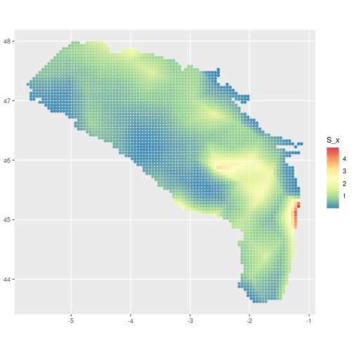

# Checking reproducibility of FishMap results

 <!-- this vignette is generated from dev/dev_check_model_reproducibility_lowres.Rmd with main.R in lowres parameters, make your edit on this original file -->

This notebook gather the analysis performed in order to compare the output of the original FishMap `main.R` script between Client and ThinkR. We will compare the results obtained with identical seeds following the execution of the script `dev/run_main_and_save_output.R`.

Here, we use **low resolution parameters** :

  * `k = 0.25`
  * `month_start <- 11`
  * `month_end <- 11`

## Executing `main.R`

We generate the outputs on ThinkR machine.
> make sure your .Renviron variables `FISHMAP_UPDATE_OUTPUTS` and `FISHMAP_OUTPUT_DIR` are correctly set


```r
# Generate results (model files are compiled)
source(here::here("dev", "run_main_and_save_output.R"))
```


> Note: model fit is perfomed in 118 steps in this run

Executing this code results in four outputs to be compared. Result are not showm here.


```r
output_dir <- Sys.getenv("FISHMAP_OUTPUT_DIR")
list.files(path = file.path(output_dir))
```

```
## [1] "converge_output.rds" "obj_input.rds"       "opt_output.rds"      "report_output.rds"
```


To check whether the seed is effectively making the output reproducible, we will run a second time `main.R` with the same seed. Result are not shown here.


```r
# Create a temporary folder
tmp_folder <- tempfile(pattern = "fishmap_check")
dir.create(tmp_folder)

# Move ThinkR first execution output in temp folder
dir.create(file.path(tmp_folder, "thinkr_output"))
fs::file_move(
  path = list.files(
    path = output_dir,
    full.names = TRUE
  ),
  new_path = file.path(tmp_folder, "thinkr_output")
)

# Run main.R a second time (model files are already compiled from first run)
source(here::here("dev", "run_main_and_save_output.R"))
```



```r
# Move ThinkR second execution in the temp folder
dir.create(file.path(tmp_folder, "thinkr_output_rerun"))
fs::file_move(
  path = list.files(
    path = output_dir,
    full.names = TRUE
  ),
  new_path = file.path(tmp_folder, "thinkr_output_rerun")
)
```

We list the resulting output files.


```r
thinkr1_output_dir <- file.path(tmp_folder, "thinkr_output")

thinkr1_output <- paste0(
  list.files(
    path = thinkr1_output_dir,
    full.names = TRUE
  ),
  collapse = "\n"
)

glue::glue("The paths to ThinkR's second run output files are :\n {thinkr1_output}")
```

```
## The paths to ThinkR's second run output files are :
## /tmp/RtmpDuyRzc/fishmap_check5bb231d5b921/thinkr_output/converge_output.rds
## /tmp/RtmpDuyRzc/fishmap_check5bb231d5b921/thinkr_output/obj_input.rds
## /tmp/RtmpDuyRzc/fishmap_check5bb231d5b921/thinkr_output/opt_output.rds
## /tmp/RtmpDuyRzc/fishmap_check5bb231d5b921/thinkr_output/report_output.rds
```

```r
thinkr2_output_dir <- file.path(tmp_folder, "thinkr_output_rerun")

thinkr2_output <- paste0(
  list.files(
    path = thinkr2_output_dir,
    full.names = TRUE
  ),
  collapse = "\n"
)

glue::glue("The paths to ThinkR's first run output files are :\n {thinkr2_output}")
```

```
## The paths to ThinkR's first run output files are :
## /tmp/RtmpDuyRzc/fishmap_check5bb231d5b921/thinkr_output_rerun/converge_output.rds
## /tmp/RtmpDuyRzc/fishmap_check5bb231d5b921/thinkr_output_rerun/obj_input.rds
## /tmp/RtmpDuyRzc/fishmap_check5bb231d5b921/thinkr_output_rerun/opt_output.rds
## /tmp/RtmpDuyRzc/fishmap_check5bb231d5b921/thinkr_output_rerun/report_output.rds
```

## Checking seed reproducibility

In order to contrast output files from both ThinkR runs, we will use the package `{waldo}`.


```r
# list of output fiiles to contrast
files_to_contrast <- list.files(path = file.path(thinkr1_output_dir))

# running waldo on each files comparing thinkR runs
purrr::map(
  .x = files_to_contrast,
  ~ waldo::compare(
    x = readRDS(
      file.path(thinkr1_output_dir, .x)
    ),
    y = readRDS(
      file.path(thinkr2_output_dir, .x)
    )
  )
) %>% setNames(files_to_contrast)
```

```
## $converge_output.rds
## ✔ No differences
## 
## $obj_input.rds
## ✔ No differences
## 
## $opt_output.rds
## ✔ No differences
## 
## $report_output.rds
## ✔ No differences
```
Both ThinkR outputs are identical. We will use one of them to now compare with the Client's output.

## Loading Client's output

We now load the outputs generated from Clients (BA and JC) in a temporary folder.


```r
# Download and unzip JC outputs from Git repo
jc_zip_file_url <- "https://github.com/balglave/FishMap/files/10897028/outputs_fishmap.zip"
download.file(
  url = jc_zip_file_url,
  destfile = file.path(tmp_folder, "jc_output.zip")
)

unzip(
  zipfile = file.path(tmp_folder, "jc_output.zip"),
  exdir = file.path(tmp_folder, "jc_output")
)

jc_output_dir <- file.path(tmp_folder, "jc_output")

jc_output <- paste0(
  list.files(
    path = jc_output_dir,
    full.names = TRUE
  ),
  collapse = "\n"
)

glue::glue("The paths to Juliette's output files are :\n {jc_output}")
```

```
## The paths to Juliette's output files are :
## /tmp/RtmpDuyRzc/fishmap_check5bb231d5b921/jc_output/converge_output.rds
## /tmp/RtmpDuyRzc/fishmap_check5bb231d5b921/jc_output/obj_input.rds
## /tmp/RtmpDuyRzc/fishmap_check5bb231d5b921/jc_output/opt_output.rds
## /tmp/RtmpDuyRzc/fishmap_check5bb231d5b921/jc_output/report_output.rds
```

```r
# Download and unzip BA outputs from Git repo
ba_zip_file_url <- "https://github.com/balglave/FishMap/files/10912068/shared.zip"
download.file(
  url = ba_zip_file_url,
  destfile = file.path(tmp_folder, "ba_output.zip")
)

unzip(
  zipfile = file.path(tmp_folder, "ba_output.zip"),
  exdir = file.path(tmp_folder, "ba_output")
)

ba_output_dir <- file.path(tmp_folder, "ba_output", "shared", "outputs_fishmap")

ba_output <- paste0(
  list.files(
    path = ba_output_dir,
    full.names = TRUE
  ),
  collapse = "\n"
)

glue::glue("The paths to Baptiste's output files are :\n {ba_output}")
```

```
## The paths to Baptiste's output files are :
## /tmp/RtmpDuyRzc/fishmap_check5bb231d5b921/ba_output/shared/outputs_fishmap/converge_output.rds
## /tmp/RtmpDuyRzc/fishmap_check5bb231d5b921/ba_output/shared/outputs_fishmap/obj_input.rds
## /tmp/RtmpDuyRzc/fishmap_check5bb231d5b921/ba_output/shared/outputs_fishmap/opt_output.rds
## /tmp/RtmpDuyRzc/fishmap_check5bb231d5b921/ba_output/shared/outputs_fishmap/report_output.rds
```


## Contrasting files

Results between ThinkR and Client's are not perfectly identical. 

**Important note** : To compare numerical results we will set a tolerance in numerical differences to **10e-4**.

We find differences in function code present in the outputs (see section on `obj_inputs.rds`). This might indicate a difference in **package version**. Could you please indicate the `R` and `TMB` package version you used for generating the outputs ?

### Create contrast function

We will use again `{waldo}` within a function to display the exact differences for each file.


```r
# Create a function to explore waldo's output file by file between ThinkR and Baptiste + Juliette outputs

compare_output_file <- function(file_name, author) {
  if (author == "juliette") {
    client_output_dir <- jc_output_dir
  } else if (author == "baptiste") {
    client_output_dir <- ba_output_dir
  } else {
    stop("author must be either juliette or baptiste")
  }

  # running waldo on one file (thinkR ~ client)
  message(glue::glue("contrasting output of {file_name} between thinkr and {author}"))
  compare_author <- waldo::compare(
    x = readRDS(
      file.path(client_output_dir, file_name)
    ),
    y = readRDS(
      file.path(thinkr1_output_dir, file_name)
    ),
    x_arg = author,
    y_arg = "thinkr",
    max_diffs = 100,
    tolerance = 10e-4
  )

  return(compare_author)
}
```

### Contrasting `converge_output.rds` output


```r
compare_output_file(file_name = "converge_output.rds", author = "baptiste")
```

```
## contrasting output of converge_output.rds between thinkr and baptiste
```

```
## ✔ No differences
```

```r
compare_output_file(file_name = "converge_output.rds", author = "juliette")
```

```
## contrasting output of converge_output.rds between thinkr and juliette
```

```
## ✔ No differences
```

### Contrasting `opt_output.rds` output


```r
compare_output_file(file_name = "opt_output.rds", author = "baptiste")
```

```
## contrasting output of opt_output.rds between thinkr and baptiste
```

```
## `baptiste$par`: -1.9490 0.2168 -2.5303 -0.0850 0.5574 0.6502 0.1979 0.0129 0.0233 0.5913 0.9355 0.4452 0.6195 3.5273
##   `thinkr$par`: -1.1795 0.3379 -2.1648 -0.0860 0.5643 0.6460 0.1989 0.0112 0.0236 0.5894 0.9549 0.4382 0.5922 3.6926
## 
## `baptiste$objective`: 33456
##   `thinkr$objective`: 33408
## 
## `baptiste$iterations`:  90
##   `thinkr$iterations`: 118
## 
## `baptiste$evaluations`: 107  91
##   `thinkr$evaluations`: 135 119
## 
## baptiste$diagnostics vs thinkr$diagnostics
##                                      Est      gradient
## - baptiste$diagnostics[1, ]  -1.94904960 -0.0001187346
## + thinkr$diagnostics[1, ]    -1.17949342 -0.0001561867
## - baptiste$diagnostics[2, ]   0.21680213 -0.0018261458
## + thinkr$diagnostics[2, ]     0.33792979 -0.0010848019
## - baptiste$diagnostics[3, ]  -2.53032471  0.0029264548
## + thinkr$diagnostics[3, ]    -2.16478513  0.0006139109
## - baptiste$diagnostics[4, ]  -0.08504909  0.0079738797
## + thinkr$diagnostics[4, ]    -0.08599450  0.0146084507
## - baptiste$diagnostics[5, ]   0.55737355  0.0139231033
## + thinkr$diagnostics[5, ]     0.56427059  0.0036463891
## - baptiste$diagnostics[6, ]   0.65017746 -0.0300420653
## + thinkr$diagnostics[6, ]     0.64603308 -0.0029672675
## - baptiste$diagnostics[7, ]   0.19788364 -0.0177909561
## + thinkr$diagnostics[7, ]     0.19894322 -0.0051335908
## - baptiste$diagnostics[8, ]   0.01287220  0.0366791776
## + thinkr$diagnostics[8, ]     0.01122493  0.0208665077
## - baptiste$diagnostics[9, ]   0.02332747 -0.0964211843
## + thinkr$diagnostics[9, ]     0.02364726 -0.0177326826
## - baptiste$diagnostics[10, ]  0.59125481 -0.0178599756
## + thinkr$diagnostics[10, ]    0.58942941 -0.0045798545
## - baptiste$diagnostics[11, ]  0.93551039 -0.0007427178
## + thinkr$diagnostics[11, ]    0.95485275 -0.0033119289
## - baptiste$diagnostics[12, ]  0.44517381 -0.0013373506
## + thinkr$diagnostics[12, ]    0.43819488  0.0019495659
## - baptiste$diagnostics[13, ]  0.61950321  0.0005037572
## + thinkr$diagnostics[13, ]    0.59220858  0.0001770308
## - baptiste$diagnostics[14, ]  3.52729132  0.0003271884
## + thinkr$diagnostics[14, ]    3.69255279 -0.0001496324
## 
##      baptiste$diagnostics$Est | thinkr$diagnostics$Est     
##  [1] -1.9490                  - -1.1795                [1] 
##  [2] 0.2168                   - 0.3379                 [2] 
##  [3] -2.5303                  - -2.1648                [3] 
##  [4] -0.0850                  - -0.0860                [4] 
##  [5] 0.5574                   - 0.5643                 [5] 
##  [6] 0.6502                   - 0.6460                 [6] 
##  [7] 0.1979                   - 0.1989                 [7] 
##  [8] 0.0129                   - 0.0112                 [8] 
##  [9] 0.0233                   - 0.0236                 [9] 
## [10] 0.5913                   - 0.5894                 [10]
## [11] 0.9355                   - 0.9549                 [11]
## [12] 0.4452                   - 0.4382                 [12]
## [13] 0.6195                   - 0.5922                 [13]
## [14] 3.5273                   - 3.6926                 [14]
## 
##      baptiste$diagnostics$gradient | thinkr$diagnostics$gradient     
##  [1] -0.00012                      - -0.00016                    [1] 
##  [2] -0.00183                      - -0.00108                    [2] 
##  [3] 0.00293                       - 0.00061                     [3] 
##  [4] 0.00797                       - 0.01461                     [4] 
##  [5] 0.01392                       - 0.00365                     [5] 
##  [6] -0.03004                      - -0.00297                    [6] 
##  [7] -0.01779                      - -0.00513                    [7] 
##  [8] 0.03668                       - 0.02087                     [8] 
##  [9] -0.09642                      - -0.01773                    [9] 
## [10] -0.01786                      - -0.00458                    [10]
## [11] -0.00074                      - -0.00331                    [11]
## [12] -0.00134                      - 0.00195                     [12]
## [13] 0.00050                       - 0.00018                     [13]
## [14] 0.00033                       - -0.00015                    [14]
```

```r
compare_output_file(file_name = "opt_output.rds", author = "juliette")
```

```
## contrasting output of opt_output.rds between thinkr and juliette
```

```
## juliette$diagnostics vs thinkr$diagnostics
##                                   gradient
## - juliette$diagnostics[1, ]  -0.0001563852
## + thinkr$diagnostics[1, ]    -0.0001561867
## - juliette$diagnostics[2, ]  -0.0010823369
## + thinkr$diagnostics[2, ]    -0.0010848019
## - juliette$diagnostics[3, ]   0.0006077771
## + thinkr$diagnostics[3, ]     0.0006139109
## - juliette$diagnostics[4, ]   0.0145954406
## + thinkr$diagnostics[4, ]     0.0146084507
## - juliette$diagnostics[5, ]   0.0036414382
## + thinkr$diagnostics[5, ]     0.0036463891
## - juliette$diagnostics[6, ]  -0.0029317417
## + thinkr$diagnostics[6, ]    -0.0029672675
## - juliette$diagnostics[7, ]  -0.0051173286
## + thinkr$diagnostics[7, ]    -0.0051335908
## - juliette$diagnostics[8, ]   0.0208625464
## + thinkr$diagnostics[8, ]     0.0208665077
## - juliette$diagnostics[9, ]  -0.0176931908
## + thinkr$diagnostics[9, ]    -0.0177326826
## - juliette$diagnostics[10, ] -0.0045711599
## + thinkr$diagnostics[10, ]   -0.0045798545
## - juliette$diagnostics[11, ] -0.0033184671
## + thinkr$diagnostics[11, ]   -0.0033119289
## - juliette$diagnostics[12, ]  0.0019445474
## + thinkr$diagnostics[12, ]    0.0019495659
## - juliette$diagnostics[13, ]  0.0001790606
## + thinkr$diagnostics[13, ]    0.0001770308
## - juliette$diagnostics[14, ] -0.0001491779
## + thinkr$diagnostics[14, ]   -0.0001496324
## 
##      juliette$diagnostics$gradient | thinkr$diagnostics$gradient     
##  [1] -0.0001564                    - -0.0001562                  [1] 
##  [2] -0.0010823                    - -0.0010848                  [2] 
##  [3] 0.0006078                     - 0.0006139                   [3] 
##  [4] 0.0145954                     - 0.0146085                   [4] 
##  [5] 0.0036414                     - 0.0036464                   [5] 
##  [6] -0.0029317                    - -0.0029673                  [6] 
##  [7] -0.0051173                    - -0.0051336                  [7] 
##  [8] 0.0208625                     - 0.0208665                   [8] 
##  [9] -0.0176932                    - -0.0177327                  [9] 
## [10] -0.0045712                    - -0.0045799                  [10]
## [11] -0.0033185                    - -0.0033119                  [11]
## [12] 0.0019445                     - 0.0019496                   [12]
## [13] 0.0001791                     - 0.0001770                   [13]
## [14] -0.0001492                    - -0.0001496                  [14]
```

### Contrasting `report_output.rds` output


```r
compare_output_file(file_name = "report_output.rds", author = "baptiste")
```

```
## contrasting output of report_output.rds between thinkr and baptiste
```

```
## `baptiste$Sigma_sci`: 1.56
##   `thinkr$Sigma_sci`: 1.55
## 
##       baptiste$E_com | thinkr$E_com                   
##   [1] 1.3577841      - 1.1792888    [1]               
##   [2] 1.0008861      - 1.1848715    [2]               
##   [3] 0.8226959      - 0.7103972    [3]               
##   [4] 0.8709679      - 0.7517946    [4]               
##   [5] 0.9220722      - 0.7956044    [5]               
##   [6] 0.9220722      - 0.7956044    [6]               
##   [7] 1.0028563      - 0.8950327    [7]               
##   [8] 1.0028563      - 0.8950327    [8]               
##   [9] 1.2077563      - 1.1797381    [9]               
##  [10] 1.3098958      - 1.3225070    [10]              
##  [11] 0.7744822      - 0.7795245    [11]              
##  [12] 1.3716259      - 1.3806685    [12]              
##  [13] 0.8109804      - 0.8138066    [13]              
##  [14] 0.8109804      - 0.8138066    [14]              
##  [15] 0.8109804      - 0.8138066    [15]              
##  [16] 0.8109804      - 0.8138066    [16]              
##  [17] 0.8109804      - 0.8138066    [17]              
##  [18] 1.3716259      - 1.3806685    [18]              
##  [19] 0.8109804      - 0.8138066    [19]              
##  [20] 1.3716259      - 1.3806685    [20]              
##  [21] 0.8109804      - 0.8138066    [21]              
##  [22] 0.8109804      - 0.8138066    [22]              
##  [23] 0.8109804      - 0.8138066    [23]              
##  [24] 0.8109804      - 0.8138066    [24]              
##  [25] 1.3716259      - 1.3806685    [25]              
##  [26] 0.8109804      - 0.8138066    [26]              
##  [27] 0.8109804      - 0.8138066    [27]              
##  [28] 0.8109804      - 0.8138066    [28]              
##  [29] 0.8109804      - 0.8138066    [29]              
##  [30] 0.8109804      - 0.8138066    [30]              
##  [31] 0.8109804      - 0.8138066    [31]              
##  [32] 0.8109804      - 0.8138066    [32]              
##  [33] 0.8109804      - 0.8138066    [33]              
##  [34] 0.8109804      - 0.8138066    [34]              
##  [35] 0.8109804      - 0.8138066    [35]              
##  [36] 0.8109804      - 0.8138066    [36]              
##  [37] 0.8109804      - 0.8138066    [37]              
##  [38] 0.8109804      - 0.8138066    [38]              
##  [39] 0.8109804      - 0.8138066    [39]              
##  [40] 0.8109804      - 0.8138066    [40]              
##  [41] 0.8109804      - 0.8138066    [41]              
##  [42] 0.8109804      - 0.8138066    [42]              
##  [43] 0.8109804      - 0.8138066    [43]              
##  [44] 0.8109804      - 0.8138066    [44]              
##  [45] 0.8109804      - 0.8138066    [45]              
##  [46] 0.8109804      - 0.8138066    [46]              
##  [47] 0.8109804      - 0.8138066    [47]              
##  [48] 0.8109804      - 0.8138066    [48]              
##  [49] 0.8109804      - 0.8138066    [49]              
##  [50] 0.8109804      - 0.8138066    [50]              
##  [51] 0.8109804      - 0.8138066    [51]              
##  [52] 0.8109804      - 0.8138066    [52]              
##  [53] 0.8109804      - 0.8138066    [53]              
##  [54] 0.8109804      - 0.8138066    [54]              
##  [55] 1.3716259      - 1.3806685    [55]              
##  [56] 0.8109804      - 0.8138066    [56]              
##  [57] 0.8109804      - 0.8138066    [57]              
##  [58] 0.8109804      - 0.8138066    [58]              
##  [59] 0.8109804      - 0.8138066    [59]              
##  [60] 0.8109804      - 0.8138066    [60]              
##  [61] 0.8109804      - 0.8138066    [61]              
##  [62] 0.8109804      - 0.8138066    [62]              
##  [63] 1.3716259      - 1.3806685    [63]              
##  [64] 0.8109804      - 0.8138066    [64]              
##  [65] 0.8109804      - 0.8138066    [65]              
##  [66] 1.3716259      - 1.3806685    [66]              
##  [67] 0.8109804      - 0.8138066    [67]              
##  [68] 0.8491986      - 0.8495964    [68]              
##  [69] 0.8491986      - 0.8495964    [69]              
##  [70] 0.8491986      - 0.8495964    [70]              
##  [71] 0.8491986      - 0.8495964    [71]              
##  [72] 0.8491986      - 0.8495964    [72]              
##  [73] 0.8491986      - 0.8495964    [73]              
##  [74] 0.8491986      - 0.8495964    [74]              
##  [75] 0.8491986      - 0.8495964    [75]              
##  [76] 0.8491986      - 0.8495964    [76]              
##  [77] 0.8491986      - 0.8495964    [77]              
##  [78] 0.8491986      - 0.8495964    [78]              
##  [79] 0.8491986      - 0.8495964    [79]              
##  [80] 0.8491986      - 0.8495964    [80]              
##  [81] 1.4362651      - 1.4413880    [81]              
##  [82] 0.8491986      - 0.8495964    [82]              
##  [83] 0.8491986      - 0.8495964    [83]              
##  [84] 0.8491986      - 0.8495964    [84]              
##  [85] 0.8491986      - 0.8495964    [85]              
##  [86] 0.8491986      - 0.8495964    [86]              
##  [87] 1.1233223      - 1.2673695    [87]              
##  [88] 0.9590351      - 1.0943240    [88]              
##  [89] 0.9063780      - 1.0548886    [89]              
##  [90] 0.7782948      - 0.7223435    [90]              
##  [91] 0.8239615      - 0.7644371    [91]              
##  [92] 1.0681133      - 1.0296584    [92]              
##  [93] 1.0681133      - 1.0296584    [93]              
##  [94] 0.6889788      - 0.6885220    [94]              
##  [95] 0.6889788      - 0.6885220    [95]              
##  [96] 0.6889788      - 0.6885220    [96]              
##  [97] 1.1652824      - 1.1681162    [97]              
##  [98] 0.6889788      - 0.6885220    [98]              
##  [99] 0.6889788      - 0.6885220    [99]              
## [100] 0.6889788      - 0.6885220    [100]             
##   ... ...              ...          and 26684 more ...
## 
##       baptiste$S_com_i | thinkr$S_com_i                   
##   [1] 1.35778          - 1.17929        [1]               
##   [2] 1.00089          - 1.18487        [2]               
##   [3] 0.82270          - 0.71040        [3]               
##   [4] 0.87097          - 0.75179        [4]               
##   [5] 0.92207          - 0.79560        [5]               
##   [6] 0.92207          - 0.79560        [6]               
##   [7] 1.00286          - 0.89503        [7]               
##   [8] 1.00286          - 0.89503        [8]               
##   [9] 1.20776          - 1.17974        [9]               
##  [10] 1.30990          - 1.32251        [10]              
##  [11] 1.30990          - 1.32251        [11]              
##  [12] 1.37163          - 1.38067        [12]              
##  [13] 1.37163          - 1.38067        [13]              
##  [14] 1.37163          - 1.38067        [14]              
##  [15] 1.37163          - 1.38067        [15]              
##  [16] 1.37163          - 1.38067        [16]              
##  [17] 1.37163          - 1.38067        [17]              
##  [18] 1.37163          - 1.38067        [18]              
##  [19] 1.37163          - 1.38067        [19]              
##  [20] 1.37163          - 1.38067        [20]              
##  [21] 1.37163          - 1.38067        [21]              
##  [22] 1.37163          - 1.38067        [22]              
##  [23] 1.37163          - 1.38067        [23]              
##  [24] 1.37163          - 1.38067        [24]              
##  [25] 1.37163          - 1.38067        [25]              
##  [26] 1.37163          - 1.38067        [26]              
##  [27] 1.37163          - 1.38067        [27]              
##  [28] 1.37163          - 1.38067        [28]              
##  [29] 1.37163          - 1.38067        [29]              
##  [30] 1.37163          - 1.38067        [30]              
##  [31] 1.37163          - 1.38067        [31]              
##  [32] 1.37163          - 1.38067        [32]              
##  [33] 1.37163          - 1.38067        [33]              
##  [34] 1.37163          - 1.38067        [34]              
##  [35] 1.37163          - 1.38067        [35]              
##  [36] 1.37163          - 1.38067        [36]              
##  [37] 1.37163          - 1.38067        [37]              
##  [38] 1.37163          - 1.38067        [38]              
##  [39] 1.37163          - 1.38067        [39]              
##  [40] 1.37163          - 1.38067        [40]              
##  [41] 1.37163          - 1.38067        [41]              
##  [42] 1.37163          - 1.38067        [42]              
##  [43] 1.37163          - 1.38067        [43]              
##  [44] 1.37163          - 1.38067        [44]              
##  [45] 1.37163          - 1.38067        [45]              
##  [46] 1.37163          - 1.38067        [46]              
##  [47] 1.37163          - 1.38067        [47]              
##  [48] 1.37163          - 1.38067        [48]              
##  [49] 1.37163          - 1.38067        [49]              
##  [50] 1.37163          - 1.38067        [50]              
##  [51] 1.37163          - 1.38067        [51]              
##  [52] 1.37163          - 1.38067        [52]              
##  [53] 1.37163          - 1.38067        [53]              
##  [54] 1.37163          - 1.38067        [54]              
##  [55] 1.37163          - 1.38067        [55]              
##  [56] 1.37163          - 1.38067        [56]              
##  [57] 1.37163          - 1.38067        [57]              
##  [58] 1.37163          - 1.38067        [58]              
##  [59] 1.37163          - 1.38067        [59]              
##  [60] 1.37163          - 1.38067        [60]              
##  [61] 1.37163          - 1.38067        [61]              
##  [62] 1.37163          - 1.38067        [62]              
##  [63] 1.37163          - 1.38067        [63]              
##  [64] 1.37163          - 1.38067        [64]              
##  [65] 1.37163          - 1.38067        [65]              
##  [66] 1.37163          - 1.38067        [66]              
##  [67] 1.37163          - 1.38067        [67]              
##  [68] 1.43627          - 1.44139        [68]              
##  [69] 1.43627          - 1.44139        [69]              
##  [70] 1.43627          - 1.44139        [70]              
##  [71] 1.43627          - 1.44139        [71]              
##  [72] 1.43627          - 1.44139        [72]              
##  [73] 1.43627          - 1.44139        [73]              
##  [74] 1.43627          - 1.44139        [74]              
##  [75] 1.43627          - 1.44139        [75]              
##  [76] 1.43627          - 1.44139        [76]              
##  [77] 1.43627          - 1.44139        [77]              
##  [78] 1.43627          - 1.44139        [78]              
##  [79] 1.43627          - 1.44139        [79]              
##  [80] 1.43627          - 1.44139        [80]              
##  [81] 1.43627          - 1.44139        [81]              
##  [82] 1.43627          - 1.44139        [82]              
##  [83] 1.43627          - 1.44139        [83]              
##  [84] 1.43627          - 1.44139        [84]              
##  [85] 1.43627          - 1.44139        [85]              
##  [86] 1.43627          - 1.44139        [86]              
##  [87] 1.12332          - 1.26737        [87]              
##  [88] 0.95904          - 1.09432        [88]              
##  [89] 0.90638          - 1.05489        [89]              
##  [90] 0.77829          - 0.72234        [90]              
##  [91] 0.82396          - 0.76444        [91]              
##  [92] 1.06811          - 1.02966        [92]              
##  [93] 1.06811          - 1.02966        [93]              
##  [94] 1.16528          - 1.16812        [94]              
##  [95] 1.16528          - 1.16812        [95]              
##  [96] 1.16528          - 1.16812        [96]              
##  [97] 1.16528          - 1.16812        [97]              
##  [98] 1.16528          - 1.16812        [98]              
##  [99] 1.16528          - 1.16812        [99]              
## [100] 1.16528          - 1.16812        [100]             
##   ... ...                ...            and 26684 more ...
## 
## `baptiste$Sigma_com`: 1.2188 1.0130 1.0236
##   `thinkr$Sigma_com`: 1.2201 1.0113 1.0239
## 
## `dim(baptiste$delta_x)`: 116 1
##   `dim(thinkr$delta_x)`: 110 1
## 
## `baptiste$delta_x[108:116]`: 0 0 0 0 0 0 0 0 0
##   `thinkr$delta_x[108:110]`: 0 0 0            
## 
##       baptiste$epsilon_com_i | thinkr$epsilon_com_i                  
##   [1] 2.25                   - 1.34                 [1]              
##   [2] 1.95                   - 1.35                 [2]              
##   [3] 1.75                   - 0.84                 [3]              
##   [4] 1.81                   - 0.89                 [4]              
##   [5] 1.87                   - 0.95                 [5]              
##   [6] 1.87                   - 0.95                 [6]              
##   [7] 1.95                   - 1.07                 [7]              
##   [8] 1.95                   - 1.07                 [8]              
##   [9] 2.14                   - 1.34                 [9]              
##  [10] 2.22                   - 1.46                 [10]             
##  [11] 2.22                   - 1.46                 [11]             
##  [12] 2.27                   - 1.50                 [12]             
##  [13] 2.27                   - 1.50                 [13]             
##  [14] 2.27                   - 1.50                 [14]             
##  [15] 2.27                   - 1.50                 [15]             
##  [16] 2.27                   - 1.50                 [16]             
##  [17] 2.27                   - 1.50                 [17]             
##  [18] 2.27                   - 1.50                 [18]             
##  [19] 2.27                   - 1.50                 [19]             
##  [20] 2.27                   - 1.50                 [20]             
##  [21] 2.27                   - 1.50                 [21]             
##  [22] 2.27                   - 1.50                 [22]             
##  [23] 2.27                   - 1.50                 [23]             
##  [24] 2.27                   - 1.50                 [24]             
##  [25] 2.27                   - 1.50                 [25]             
##  [26] 2.27                   - 1.50                 [26]             
##  [27] 2.27                   - 1.50                 [27]             
##  [28] 2.27                   - 1.50                 [28]             
##  [29] 2.27                   - 1.50                 [29]             
##  [30] 2.27                   - 1.50                 [30]             
##  [31] 2.27                   - 1.50                 [31]             
##  [32] 2.27                   - 1.50                 [32]             
##  [33] 2.27                   - 1.50                 [33]             
##  [34] 2.27                   - 1.50                 [34]             
##  [35] 2.27                   - 1.50                 [35]             
##  [36] 2.27                   - 1.50                 [36]             
##  [37] 2.27                   - 1.50                 [37]             
##  [38] 2.27                   - 1.50                 [38]             
##  [39] 2.27                   - 1.50                 [39]             
##  [40] 2.27                   - 1.50                 [40]             
##  [41] 2.27                   - 1.50                 [41]             
##  [42] 2.27                   - 1.50                 [42]             
##  [43] 2.27                   - 1.50                 [43]             
##  [44] 2.27                   - 1.50                 [44]             
##  [45] 2.27                   - 1.50                 [45]             
##  [46] 2.27                   - 1.50                 [46]             
##  [47] 2.27                   - 1.50                 [47]             
##  [48] 2.27                   - 1.50                 [48]             
##  [49] 2.27                   - 1.50                 [49]             
##  [50] 2.27                   - 1.50                 [50]             
##  [51] 2.27                   - 1.50                 [51]             
##  [52] 2.27                   - 1.50                 [52]             
##  [53] 2.27                   - 1.50                 [53]             
##  [54] 2.27                   - 1.50                 [54]             
##  [55] 2.27                   - 1.50                 [55]             
##  [56] 2.27                   - 1.50                 [56]             
##  [57] 2.27                   - 1.50                 [57]             
##  [58] 2.27                   - 1.50                 [58]             
##  [59] 2.27                   - 1.50                 [59]             
##  [60] 2.27                   - 1.50                 [60]             
##  [61] 2.27                   - 1.50                 [61]             
##  [62] 2.27                   - 1.50                 [62]             
##  [63] 2.27                   - 1.50                 [63]             
##  [64] 2.27                   - 1.50                 [64]             
##  [65] 2.27                   - 1.50                 [65]             
##  [66] 2.27                   - 1.50                 [66]             
##  [67] 2.27                   - 1.50                 [67]             
##  [68] 2.31                   - 1.55                 [68]             
##  [69] 2.31                   - 1.55                 [69]             
##  [70] 2.31                   - 1.55                 [70]             
##  [71] 2.31                   - 1.55                 [71]             
##  [72] 2.31                   - 1.55                 [72]             
##  [73] 2.31                   - 1.55                 [73]             
##  [74] 2.31                   - 1.55                 [74]             
##  [75] 2.31                   - 1.55                 [75]             
##  [76] 2.31                   - 1.55                 [76]             
##  [77] 2.31                   - 1.55                 [77]             
##  [78] 2.31                   - 1.55                 [78]             
##  [79] 2.31                   - 1.55                 [79]             
##  [80] 2.31                   - 1.55                 [80]             
##  [81] 2.31                   - 1.55                 [81]             
##  [82] 2.31                   - 1.55                 [82]             
##  [83] 2.31                   - 1.55                 [83]             
##  [84] 2.31                   - 1.55                 [84]             
##  [85] 2.31                   - 1.55                 [85]             
##  [86] 2.31                   - 1.55                 [86]             
##  [87] 2.07                   - 1.42                 [87]             
##  [88] 1.91                   - 1.27                 [88]             
##  [89] 1.85                   - 1.23                 [89]             
##  [90] 1.70                   - 0.85                 [90]             
##  [91] 1.76                   - 0.91                 [91]             
##  [92] 2.01                   - 1.21                 [92]             
##  [93] 2.01                   - 1.21                 [93]             
##  [94] 2.10                   - 1.33                 [94]             
##  [95] 2.10                   - 1.33                 [95]             
##  [96] 2.10                   - 1.33                 [96]             
##  [97] 2.10                   - 1.33                 [97]             
##  [98] 2.10                   - 1.33                 [98]             
##  [99] 2.10                   - 1.33                 [99]             
## [100] 2.10                   - 1.33                 [100]            
##   ... ...                      ...                  and 1147 more ...
## 
##        baptiste$epsilon_com_i | thinkr$epsilon_com_i                  
## [1254] -1.09                  | -1.09                [1231]           
## [1255] -1.09                  | -1.09                [1232]           
## [1256] -1.09                  | -1.09                [1233]           
## [1257] 0.87                   - -1.09                [1234]           
## [1258] 1.00                   - -1.09                [1235]           
## [1259] 1.00                   - -1.09                [1236]           
## [1260] 0.93                   - -1.09                [1237]           
## [1261] 0.93                   - -1.09                [1238]           
## [1262] 0.90                   - -1.09                [1239]           
## [1263] 0.90                   - -1.09                [1240]           
## [1264] 0.90                   - -1.09                [1241]           
## [1265] 0.87                   - -1.09                [1242]           
## [1266] 0.83                   - -1.09                [1243]           
## [1267] 0.83                   - -1.09                [1244]           
## [1268] 0.83                   - -1.46                [1245]           
## [1269] 0.83                   - -1.46                [1246]           
## [1270] 0.83                   - -1.46                [1247]           
## [1271] 0.83                   - -1.46                [1248]           
## [1272] 0.80                   - -1.46                [1249]           
## [1273] 0.80                   - -1.46                [1250]           
## [1274] 0.80                   - -1.46                [1251]           
## [1275] 0.80                   - -1.46                [1252]           
## [1276] 0.80                   - -1.46                [1253]           
## [1277] 0.80                   - -1.46                [1254]           
## [1278] 0.74                   - -1.46                [1255]           
## [1279] 0.74                   - -1.46                [1256]           
## [1280] 0.74                   - 0.12                 [1257]           
## [1281] 0.74                   - 0.18                 [1258]           
## [1282] 0.74                   - 0.18                 [1259]           
## [1283] 0.70                   - 0.14                 [1260]           
## [1284] 0.70                   - 0.14                 [1261]           
## [1285] 0.70                   - 0.06                 [1262]           
## [1286] 0.70                   - 0.06                 [1263]           
## [1287] 0.74                   - 0.06                 [1264]           
## [1288] 0.74                   - -0.01                [1265]           
## [1289] 0.84                   - -0.04                [1266]           
## [1290] 0.84                   - -0.04                [1267]           
## [1291] 0.84                   - -0.04                [1268]           
## [1292] 0.84                   - -0.04                [1269]           
## [1293] 0.84                   - -0.04                [1270]           
## [1294] 0.97                   - -0.04                [1271]           
## [1295] 0.97                   - -0.06                [1272]           
## [1296] 1.10                   - -0.06                [1273]           
## [1297] 1.10                   - -0.06                [1274]           
## [1298] 1.10                   - -0.06                [1275]           
## [1299] 1.10                   - -0.06                [1276]           
## [1300] 1.10                   - -0.06                [1277]           
## [1301] 1.23                   - -0.09                [1278]           
## [1302] 1.23                   - -0.09                [1279]           
## [1303] 1.23                   - -0.09                [1280]           
## [1304] 1.23                   - -0.09                [1281]           
## [1305] 1.23                   - -0.09                [1282]           
## [1306] 1.37                   - -0.11                [1283]           
## [1307] 1.37                   - -0.11                [1284]           
## [1308] 1.37                   - -0.11                [1285]           
## [1309] 1.50                   - -0.11                [1286]           
## [1310] 1.50                   - -0.08                [1287]           
## [1311] 1.50                   - -0.08                [1288]           
## [1312] 1.57                   - 0.12                 [1289]           
## [1313] 1.57                   - 0.12                 [1290]           
## [1314] 1.57                   - 0.12                 [1291]           
## [1315] 1.57                   - 0.12                 [1292]           
## [1316] 1.57                   - 0.12                 [1293]           
## [1317] 1.57                   - 0.31                 [1294]           
## [1318] 1.57                   - 0.31                 [1295]           
## [1319] 1.82                   - 0.51                 [1296]           
## [1320] 1.82                   - 0.51                 [1297]           
## [1321] 1.73                   - 0.51                 [1298]           
## [1322] 1.65                   - 0.51                 [1299]           
## [1323] 1.65                   - 0.51                 [1300]           
## [1324] 1.80                   - 0.67                 [1301]           
## [1325] 1.80                   - 0.67                 [1302]           
## [1326] 1.85                   - 0.67                 [1303]           
## [1327] 1.89                   - 0.67                 [1304]           
## [1328] 1.89                   - 0.67                 [1305]           
## [1329] 1.89                   - 0.69                 [1306]           
## [1330] 1.89                   - 0.69                 [1307]           
## [1331] 1.89                   - 0.69                 [1308]           
## [1332] 1.89                   - 0.71                 [1309]           
## [1333] 1.89                   - 0.71                 [1310]           
## [1334] 1.81                   - 0.71                 [1311]           
## [1335] 1.81                   - 0.73                 [1312]           
## [1336] 1.81                   - 0.73                 [1313]           
## [1337] 1.81                   - 0.73                 [1314]           
## [1338] 1.81                   - 0.75                 [1315]           
## [1339] 1.81                   - 0.75                 [1316]           
## [1340] 1.81                   - 0.75                 [1317]           
## [1341] 1.81                   - 0.75                 [1318]           
## [1342] 1.81                   - 0.99                 [1319]           
## [1343] 1.81                   - 0.99                 [1320]           
## [1344] 1.81                   - 0.96                 [1321]           
## [1345] 1.81                   - 0.96                 [1322]           
## [1346] 1.81                   - 0.96                 [1323]           
## [1347] 1.81                   - 1.08                 [1324]           
## [1348] 1.81                   - 1.08                 [1325]           
## [1349] 1.81                   - 1.10                 [1326]           
## [1350] 1.81                   - 1.12                 [1327]           
## [1351] 1.81                   - 1.12                 [1328]           
## [1352] 1.81                   - 1.12                 [1329]           
## [1353] 1.81                   - 1.12                 [1330]           
##    ... ...                      ...                  and 9840 more ...
## 
##         baptiste$epsilon_com_i | thinkr$epsilon_com_i                  
## [11199] 0.95                   | 0.95                 [11176]          
## [11200] 0.95                   | 0.95                 [11177]          
## [11201] 0.95                   | 0.95                 [11178]          
## [11202] 0.09                   - 0.95                 [11179]          
## [11203] 0.09                   - 0.50                 [11180]          
## [11204] 0.09                   - 0.50                 [11181]          
## [11205] 0.99                   - 0.50                 [11182]          
## [11206] 0.23                   - 0.50                 [11183]          
## [11207] 0.23                   - 0.50                 [11184]          
## [11208] 0.12                   - 0.50                 [11185]          
## [11209] 0.47                   - 0.05                 [11186]          
## [11210] 0.47                   - 0.05                 [11187]          
## [11211] 1.55                   - 0.05                 [11188]          
## [11212] 1.75                   - 0.05                 [11189]          
## [11213] 1.95                   - 0.05                 [11190]          
## [11214] 1.95                   - -0.41                [11191]          
## [11215] 1.95                   - -0.41                [11192]          
## [11216] 1.95                   - -0.41                [11193]          
## [11217] 2.14                   - -0.41                [11194]          
## [11218] 2.34                   - -0.41                [11195]          
## [11219] 2.34                   - -0.41                [11196]          
## [11220] 2.34                   - -0.41                [11197]          
## [11221] 2.34                   - -0.41                [11198]          
## [11222] 2.53                   - -0.41                [11199]          
## [11223] 2.53                   - -0.41                [11200]          
## [11224] 2.53                   - -0.41                [11201]          
## [11225] 2.53                   - -0.86                [11202]          
## [11226] 2.73                   - -0.86                [11203]          
## [11227] 3.01                   - -0.86                [11204]          
## [11228] 3.01                   - -0.30                [11205]          
## [11229] 3.01                   - -0.37                [11206]          
## [11230] 2.95                   - -0.37                [11207]          
## [11231] 2.84                   - -0.49                [11208]          
## [11232] 2.84                   - -0.55                [11209]          
## [11233] 2.79                   - -0.55                [11210]          
## [11234] 2.79                   - 0.92                 [11211]          
## [11235] 2.74                   - 1.10                 [11212]          
## [11236] 2.74                   - 1.28                 [11213]          
## [11237] 2.74                   - 1.28                 [11214]          
## [11238] 2.74                   - 1.28                 [11215]          
## [11239] 2.74                   - 1.28                 [11216]          
## [11240] 2.74                   - 1.46                 [11217]          
## [11241] 2.74                   - 1.64                 [11218]          
## [11242] 2.65                   - 1.64                 [11219]          
## [11243] 2.65                   - 1.64                 [11220]          
## [11244] 2.65                   - 1.64                 [11221]          
## [11245] 2.65                   - 1.82                 [11222]          
## [11246] 2.65                   - 1.82                 [11223]          
## [11247] 2.54                   - 1.82                 [11224]          
## [11248] 2.54                   - 1.82                 [11225]          
## [11249] 2.54                   - 1.82                 [11226]          
## [11250] 2.54                   - 1.69                 [11227]          
## [11251] 2.54                   - 1.69                 [11228]          
## [11252] 2.54                   - 1.69                 [11229]          
## [11253] 2.54                   - 1.70                 [11230]          
## [11254] 2.54                   - 1.72                 [11231]          
## [11255] 2.54                   - 1.72                 [11232]          
## [11256] 2.54                   - 1.73                 [11233]          
## [11257] 2.54                   - 1.73                 [11234]          
## [11258] 2.54                   - 1.74                 [11235]          
## [11259] 2.54                   - 1.74                 [11236]          
## [11260] 2.54                   - 1.74                 [11237]          
## [11261] 2.54                   - 1.74                 [11238]          
## [11262] 2.54                   - 1.74                 [11239]          
## [11263] 2.54                   - 1.74                 [11240]          
## [11264] 2.54                   - 1.74                 [11241]          
## [11265] 2.54                   - 1.77                 [11242]          
## [11266] 2.54                   - 1.77                 [11243]          
## [11267] 2.42                   - 1.77                 [11244]          
## [11268] 2.42                   - 1.77                 [11245]          
## [11269] 2.42                   - 1.77                 [11246]          
## [11270] 2.42                   - 1.81                 [11247]          
## [11271] 2.42                   - 1.81                 [11248]          
## [11272] 2.42                   - 1.81                 [11249]          
## [11273] 2.42                   - 1.81                 [11250]          
## [11274] 2.42                   - 1.81                 [11251]          
## [11275] 2.42                   - 1.81                 [11252]          
## [11276] 2.42                   - 1.81                 [11253]          
## [11277] 2.42                   - 1.81                 [11254]          
## [11278] 2.42                   - 1.81                 [11255]          
## [11279] 2.30                   - 1.81                 [11256]          
## [11280] 2.30                   - 1.81                 [11257]          
## [11281] 2.30                   - 1.81                 [11258]          
## [11282] 2.30                   - 1.81                 [11259]          
## [11283] 2.30                   - 1.81                 [11260]          
## [11284] 2.30                   - 1.81                 [11261]          
## [11285] 2.30                   - 1.81                 [11262]          
## [11286] 2.30                   - 1.81                 [11263]          
## [11287] 2.30                   - 1.81                 [11264]          
## [11288] 2.30                   - 1.81                 [11265]          
## [11289] 2.30                   - 1.81                 [11266]          
## [11290] 2.30                   - 1.86                 [11267]          
## [11291] 2.30                   - 1.86                 [11268]          
## [11292] 2.19                   - 1.86                 [11269]          
## [11293] 2.19                   - 1.86                 [11270]          
## [11294] 2.19                   - 1.86                 [11271]          
## [11295] 2.19                   - 1.86                 [11272]          
## [11296] 2.19                   - 1.86                 [11273]          
## [11297] 2.19                   - 1.86                 [11274]          
## [11298] 2.19                   - 1.86                 [11275]          
##     ... ...                      ...                  and 2247 more ...
## 
##         baptiste$epsilon_com_i | thinkr$epsilon_com_i                   
## [13545] 1.85                   | 1.85                 [13523]           
## [13546] 1.85                   | 1.85                 [13524]           
## [13547] 1.85                   | 1.85                 [13525]           
## [13548] 1.85                   - 1.15                 [13526]           
## [13549] 1.85                   - 1.15                 [13527]           
## [13550] 1.85                   - 1.11                 [13528]           
## [13551] 1.80                   - 1.11                 [13529]           
## [13552] 1.80                   - 1.22                 [13530]           
## [13553] 1.80                   - 1.22                 [13531]           
## [13554] 1.80                   - 1.21                 [13532]           
## [13555] 1.80                   - 1.21                 [13533]           
## [13556] 1.80                   - 1.21                 [13534]           
## [13557] 1.80                   - 1.19                 [13535]           
## [13558] 1.80                   - 1.17                 [13536]           
## [13559] 1.80                   - 1.17                 [13537]           
## [13560] 1.80                   - 1.16                 [13538]           
## [13561] 1.80                   - 1.16                 [13539]           
## [13562] 1.75                   - 1.16                 [13540]           
## [13563] 1.74                   - 1.14                 [13541]           
## [13564] 1.74                   - 1.14                 [13542]           
## [13565] 1.74                   - 1.14                 [13543]           
## [13566] 1.74                   - 1.14                 [13544]           
## [13567] 1.74                   - 1.14                 [13545]           
## [13568] 1.74                   - 1.14                 [13546]           
## [13569] 1.74                   - 1.14                 [13547]           
## [13570] 1.77                   - 1.14                 [13548]           
## [13571] 1.77                   - 1.14                 [13549]           
## [13572] 1.77                   - 1.14                 [13550]           
## [13573] 1.77                   - 1.12                 [13551]           
## [13574] 1.77                   - 1.12                 [13552]           
## [13575] 1.80                   - 1.12                 [13553]           
## [13576] 1.80                   - 1.12                 [13554]           
## [13577] 1.80                   - 1.12                 [13555]           
## [13578] 1.80                   - 1.12                 [13556]           
## [13579] 1.80                   - 1.12                 [13557]           
## [13580] 1.80                   - 1.12                 [13558]           
## [13581] 1.80                   - 1.12                 [13559]           
## [13582] 1.83                   - 1.12                 [13560]           
## [13583] 1.83                   - 1.12                 [13561]           
## [13584] 1.83                   - 1.11                 [13562]           
## [13585] 1.83                   - 1.09                 [13563]           
## [13586] 1.83                   - 1.09                 [13564]           
## [13587] 1.83                   - 1.09                 [13565]           
## [13588] 1.83                   - 1.09                 [13566]           
## [13589] 1.83                   - 1.09                 [13567]           
## [13590] 1.83                   - 1.09                 [13568]           
## [13591] 1.83                   - 1.09                 [13569]           
## [13592] 1.83                   - 1.07                 [13570]           
## [13593] 1.83                   - 1.07                 [13571]           
## [13594] 1.83                   - 1.07                 [13572]           
## [13595] 1.83                   - 1.07                 [13573]           
## [13596] 1.83                   - 1.07                 [13574]           
## [13597] 1.83                   - 1.06                 [13575]           
## [13598] 1.83                   - 1.06                 [13576]           
## [13599] 1.83                   - 1.06                 [13577]           
## [13600] 1.83                   - 1.06                 [13578]           
## [13601] 2.11                   - 1.06                 [13579]           
## [13602] 2.11                   - 1.06                 [13580]           
## [13603] 2.11                   - 1.06                 [13581]           
## [13604] 2.11                   - 0.94                 [13582]           
## [13605] 2.11                   - 0.94                 [13583]           
## [13606] 2.11                   - 0.94                 [13584]           
## [13607] 2.11                   - 0.94                 [13585]           
## [13608] 2.11                   - 0.94                 [13586]           
## [13609] 2.11                   - 0.94                 [13587]           
## [13610] 2.11                   - 0.94                 [13588]           
## [13611] 2.11                   - 0.94                 [13589]           
## [13612] 2.11                   - 0.94                 [13590]           
## [13613] 2.11                   - 0.94                 [13591]           
## [13614] 2.11                   - 0.94                 [13592]           
## [13615] 2.11                   - 0.94                 [13593]           
## [13616] 2.11                   - 0.94                 [13594]           
## [13617] 2.11                   - 0.94                 [13595]           
## [13618] 2.11                   - 0.94                 [13596]           
## [13619] 2.11                   - 0.94                 [13597]           
## [13620] 2.11                   - 0.94                 [13598]           
## [13621] 2.11                   - 0.94                 [13599]           
## [13622] 2.11                   - 0.94                 [13600]           
## [13623] 2.11                   - 1.21                 [13601]           
## [13624] 2.11                   - 1.21                 [13602]           
## [13625] 2.11                   - 1.21                 [13603]           
## [13626] 2.11                   - 1.21                 [13604]           
## [13627] 2.11                   - 1.21                 [13605]           
## [13628] 2.11                   - 1.21                 [13606]           
## [13629] 2.11                   - 1.21                 [13607]           
## [13630] 2.11                   - 1.21                 [13608]           
## [13631] 2.11                   - 1.21                 [13609]           
## [13632] 2.11                   - 1.21                 [13610]           
## [13633] 2.11                   - 1.21                 [13611]           
## [13634] 2.11                   - 1.21                 [13612]           
## [13635] 2.11                   - 1.21                 [13613]           
## [13636] 2.11                   - 1.21                 [13614]           
## [13637] 2.11                   - 1.21                 [13615]           
## [13638] 2.11                   - 1.21                 [13616]           
## [13639] 2.11                   - 1.21                 [13617]           
## [13640] 2.11                   - 1.21                 [13618]           
## [13641] 2.11                   - 1.21                 [13619]           
## [13642] 2.11                   - 1.21                 [13620]           
## [13643] 2.11                   - 1.21                 [13621]           
## [13644] 2.11                   - 1.21                 [13622]           
##     ... ...                      ...                  and 13163 more ...
## 
##      baptiste$log_notencounterprob_sci | thinkr$log_notencounterprob_sci     
##  [1] -8.55                             - -8.54                           [1] 
##  [2] -14.58                            - -12.88                          [2] 
##  [3] -8.52                             - -8.26                           [3] 
##  [4] -6.33                             - -6.29                           [4] 
##  [5] -8.04                             - -8.38                           [5] 
##  [6] -6.20                             - -6.35                           [6] 
##  [7] -7.24                             - -7.65                           [7] 
##  [8] -8.68                             - -8.47                           [8] 
##  [9] -0.31                             - -0.53                           [9] 
## [10] -7.59                             - -7.40                           [10]
## [11] -3.17                             - -3.21                           [11]
## [12] -6.84                             - -6.01                           [12]
## [13] -0.64                             - -0.81                           [13]
## [14] -6.08                             - -6.31                           [14]
## [15] -5.35                             - -5.12                           [15]
## [16] -2.80                             - -2.72                           [16]
## [17] -7.87                             - -8.10                           [17]
## [18] -7.11                             - -7.37                           [18]
## [19] -5.68                             - -5.65                           [19]
## [20] -4.74                             - -5.17                           [20]
## [21] -5.53                             - -5.48                           [21]
## [22] -4.37                             - -4.51                           [22]
## [23] -5.96                             - -5.15                           [23]
## [24] -7.51                             - -5.97                           [24]
## [25] -7.09                             - -6.80                           [25]
## [26] -8.83                             - -8.99                           [26]
## [27] -0.06                             - -0.48                           [27]
## [28] -13.76                            - -14.85                          [28]
## [29] -16.79                            - -12.12                          [29]
## [30] -11.58                            - -12.75                          [30]
## [31] -8.16                             - -8.30                           [31]
## [32] -1.47                             - -0.88                           [32]
## [33] -6.08                             - -2.73                           [33]
## [34] -15.64                            - -13.00                          [34]
## [35] -13.93                            - -14.18                          [35]
## [36] -7.81                             - -7.30                           [36]
## [37] -6.20                             - -3.07                           [37]
## [38] -9.10                             - -7.57                           [38]
## [39] -2.60                             - -3.29                           [39]
## [40] -1.34                             - -2.85                           [40]
## [41] -11.15                            - -10.30                          [41]
## [42] -9.22                             - -6.97                           [42]
## [43] -6.78                             - -4.61                           [43]
## [44] -21.97                            - -22.54                          [44]
## [45] -19.61                            - -19.90                          [45]
## [46] -8.20                             - -9.54                           [46]
## [47] -6.14                             - -5.33                           [47]
## [48] -7.72                             - -6.88                           [48]
## [49] -5.86                             - -8.61                           [49]
## 
## `baptiste$MargSDAR1_S`: 4 0 0 0
##   `thinkr$MargSDAR1_S`: 2 0 0 0
## 
## `baptiste$q1_sci`: 0.62
##   `thinkr$q1_sci`: 0.59
## 
##      baptiste$encounterprob_sci | thinkr$encounterprob_sci     
##  [1] 0.9998069962               - 0.9998048675             [1] 
##  [2] 0.9999995335               - 0.9999974526             [2] 
##  [3] 0.9998007647               - 0.9997423447             [3] 
##  [4] 0.9982247915               - 0.9981508845             [4] 
##  [5] 0.9996784693               - 0.9997707593             [5] 
##  [6] 0.9979656637               - 0.9982466139             [6] 
##  [7] 0.9992791509               - 0.9995236348             [7] 
##  [8] 0.9998295561               - 0.9997899356             [8] 
##  [9] 0.2663434587               - 0.4094655263             [9] 
## [10] 0.9994943103               - 0.9993866210             [10]
## [11] 0.9578241005               - 0.9598297512             [11]
## [12] 0.9989258928               - 0.9975351939             [12]
## [13] 0.4740391034               - 0.5530775401             [13]
## [14] 0.9977143645               - 0.9981819114             [14]
## [15] 0.9952610739               - 0.9940112251             [15]
## [16] 0.9389251156               - 0.9339421206             [16]
## [17] 0.9996161334               - 0.9996950325             [17]
## [18] 0.9991847210               - 0.9993730838             [18]
## [19] 0.9965759244               - 0.9964805408             [19]
## [20] 0.9912441748               - 0.9943331120             [20]
## [21] 0.9960512331               - 0.9958340365             [21]
## [22] 0.9873000080               - 0.9889487191             [22]
## [23] 0.9974126299               - 0.9941967593             [23]
## [24] 0.9994543678               - 0.9974403776             [24]
## [25] 0.9991682018               - 0.9988891273             [25]
## [26] 0.9998542156               - 0.9998749362             [26]
## [27] 0.0552928775               - 0.3828954247             [27]
## [28] 0.9999989398               - 0.9999996457             [28]
## [29] 0.9999999487               - 0.9999945241             [29]
## [30] 0.9999906031               - 0.9999971062             [30]
## [31] 0.9997134549               - 0.9997504788             [31]
## [32] 0.7692994290               - 0.5861107424             [32]
## [33] 0.9977158696               - 0.9348316693             [33]
## [34] 0.9999998389               - 0.9999977415             [34]
## [35] 0.9999991096               - 0.9999993080             [35]
## [36] 0.9995932275               - 0.9993275648             [36]
## [37] 0.9979642297               - 0.9536208041             [37]
## [38] 0.9998881142               - 0.9994827854             [38]
## [39] 0.9260134115               - 0.9625601014             [39]
## [40] 0.7373581185               - 0.9421024215             [40]
## [41] 0.9999855905               - 0.9999664236             [41]
## [42] 0.9999008671               - 0.9990592922             [42]
## [43] 0.9988606330               - 0.9900041362             [43]
## [44] 0.9999999997               - 0.9999999998             [44]
## [45] 0.9999999969               - 0.9999999977             [45]
## [46] 0.9997265971               - 0.9999277939             [46]
## [47] 0.9978555150               - 0.9951359105             [47]
## [48] 0.9995556959               - 0.9989702325             [48]
## [49] 0.9971457042               - 0.9998175013             [49]
## 
## `baptiste$Range_S`: 1.6 2.0 2.0 2.0
##   `thinkr$Range_S`: 1.4 2.0 2.0 2.0
## 
## `baptiste$q1_com`: -0.0850 0.5574 0.6502
##   `thinkr$q1_com`: -0.0860 0.5643 0.6460
## 
## `dim(baptiste$epsilon_p)`: 3537 1
##   `dim(thinkr$epsilon_p)`: 3541 1
## 
##       baptiste$epsilon_p | thinkr$epsilon_p                   
##   [1] 1.75388097303968   - 0.837562384530754 [1]              
##   [2] 1.81089939765849   - 0.894201303715064 [2]              
##   [3] 1.8679178222773    - 0.950840222899374 [3]              
##   [4] 2.13781392595691   - 1.34478586794174  [4]              
##   [5] 2.21899723052633   - 1.45902258100779  [5]              
##   [6] 2.26504643595287   - 1.50206125091315  [6]              
##   [7] 2.31109564137941   - 1.54509992081852  [7]              
##   [8] 2.35714484680595   - 1.58813859072388  [8]              
##   [9] 2.40319405223249   - 1.63117726062924  [9]              
##  [10] 1.69839967092543   - 0.854238902420131 [10]             
##  [11] 1.75541809554425   - 0.910877821604442 [11]             
##  [12] 1.81243652016306   - 0.967516740788752 [12]             
##  [13] 1.86945494478187   - 1.02415565997306  [13]             
##  [14] 1.92647336940069   - 1.08079457915737  [14]             
##  [15] 2.01494340736344   - 1.20872053589283  [15]             
##  [16] 2.10201307352519   - 1.33488575821157  [16]             
##  [17] 2.14806227895173   - 1.37792442811693  [17]             
##  [18] 2.19411148437827   - 1.42096309802229  [18]             
##  [19] 2.24016068980481   - 1.46400176792765  [19]             
##  [20] 2.28620989523136   - 1.50704043783302  [20]             
##  [21] 2.3322591006579    - 1.55007910773838  [21]             
##  [22] 2.37830830608444   - 1.59311777764374  [22]             
##  [23] 1.64291836881119   - 0.814276501125189 [23]             
##  [24] 1.69993679343      - 0.870915420309499 [24]             
##  [25] 1.75695521804882   - 0.927554339493809 [25]             
##  [26] 1.81397364266763   - 0.98419325867812  [26]             
##  [27] 1.87099206728644   - 1.04083217786243  [27]             
##  [28] 1.92801049190526   - 1.09747109704674  [28]             
##  [29] 1.98502891652407   - 1.15411001623105  [29]             
##  [30] 2.03107812195061   - 1.21074893541536  [30]             
##  [31] 2.07712732737715   - 1.25378760532072  [31]             
##  [32] 2.12317653280369   - 1.29682627522608  [32]             
##  [33] 2.16922573823023   - 1.33986494513144  [33]             
##  [34] 2.21527494365677   - 1.38290361503681  [34]             
##  [35] 2.26132414908332   - 1.42594228494217  [35]             
##  [36] 2.30737335450986   - 1.46898095484753  [36]             
##  [37] 2.38983201422347   - 1.51201962475289  [37]             
##  [38] 2.85100780821244   - 1.56688526030608  [38]             
##  [39] 2.93790508594833   - 1.87865109776603  [39]             
##  [40] 2.91769573731694   - 1.95901907082595  [40]             
##  [41] 1.63170863244226   - 1.93674336592136  [41]             
##  [42] 1.64445549131576   - 0.830953019014557 [42]             
##  [43] 1.70147391593457   - 0.887591938198867 [43]             
##  [44] 1.75849234055339   - 0.944230857383177 [44]             
##  [45] 1.8155107651722    - 1.00086977656749  [45]             
##  [46] 1.87252918979101   - 1.04229754489685  [46]             
##  [47] 1.91267215411852   - 1.06851416237124  [47]             
##  [48] 1.92750192800906   - 1.09473077984563  [48]             
##  [49] 1.96750229356383   - 1.12094739732003  [49]             
##  [50] 2.01109845792777   - 1.15100073383087  [50]             
##  [51] 2.05469462229171   - 1.18816478140656  [51]             
##  [52] 2.09829078665565   - 1.22604500831969  [52]             
##  [53] 2.14433999208219   - 1.26392523523282  [53]             
##  [54] 2.19038919750873   - 1.30180546214596  [54]             
##  [55] 2.23643840293528   - 1.34484413205132  [55]             
##  [56] 2.30069233550535   - 1.38788280195668  [56]             
##  [57] 2.61817751023574   - 1.43092147186204  [57]             
##  [58] 2.66162614910368   - 1.47987362459132  [58]             
##  [59] 2.70507478797163   - 1.71612451638122  [59]             
##  [60] 2.74852342683957   - 1.75630850291118  [60]             
##  [61] 2.71187691751629   - 1.79649248944114  [61]             
##  [62] 2.62591892611732   - 1.8366764759711   [62]             
##  [63] 1.65199410711773   - 1.79827302299897  [63]             
##  [64] 1.6221778635105    - 1.71148632582422  [64]             
##  [65] 1.64599261382033   - 0.847629536903934 [65]             
##  [66] 1.70301103843914   - 0.873846154378328 [66]             
##  [67] 1.76002946305796   - 0.900062771852721 [67]             
##  [68] 1.81704788767677   - 0.926279389327114 [68]             
##  [69] 1.84031539171296   - 0.952496006801507 [69]             
##  [70] 1.85514516560351   - 0.9787126242759   [70]             
##  [71] 1.86997493949405   - 1.00492924175029  [71]             
##  [72] 1.90637950623964   - 1.03114585922469  [72]             
##  [73] 1.94997567060358   - 1.05736247669908  [73]             
##  [74] 1.99357183496752   - 1.09125253224636  [74]             
##  [75] 2.03716799933146   - 1.12770040048461  [75]             
##  [76] 2.0807641636954    - 1.16558062739775  [76]             
##  [77] 2.12436032805934   - 1.20346085431088  [77]             
##  [78] 2.16795649242328   - 1.24134108122401  [78]             
##  [79] 2.21155265678722   - 1.27922130813714  [79]             
##  [80] 2.25500129565517   - 1.31710153505027  [80]             
##  [81] 2.29844993452311   - 1.35498176196341  [81]             
##  [82] 2.34189857339106   - 1.39286198887654  [82]             
##  [83] 2.38534721225901   - 1.4330459754065   [83]             
##  [84] 2.42879585112695   - 1.47322996193646  [84]             
##  [85] 2.4722444899949    - 1.51341394846643  [85]             
##  [86] 2.51569312886284   - 1.55359793499639  [86]             
##  [87] 2.55914176773079   - 1.59378192152635  [87]             
##  [88] 2.50605809771561   - 1.63396590805631  [88]             
##  [89] 2.42010010631664   - 1.67414989458628  [89]             
##  [90] 2.33414211491768   - 1.71433388111624  [90]             
##  [91] 2.24818412351871   - 1.65980268007657  [91]             
##  [92] 2.16222613211975   - 1.57301598290182  [92]             
##  [93] 2.07626814072079   - 1.48622928572707  [93]             
##  [94] 1.99031014932182   - 1.39944258855233  [94]             
##  [95] 1.67227958179319   - 1.31265589137758  [95]             
##  [96] 1.64246333818597   - 1.22586919420283  [96]             
##  [97] 1.61264709457874   - 1.13908249702808  [97]             
##  [98] 1.6475297363249    - 0.829120211366936 [98]             
##  [99] 1.70454816094371   - 0.817958926602867 [99]             
## [100] 1.75312885541687   - 0.810261233757386 [100]            
##   ... ...                  ...               and 3441 more ...
## 
##       baptiste$encounterprob_com | thinkr$encounterprob_com                   
##   [1] 0.712657                   - 0.661122                 [1]               
##   [2] 0.601194                   - 0.662853                 [2]               
##   [3] 0.530280                   - 0.478924                 [3]               
##   [4] 0.550651                   - 0.498347                 [4]               
##   [5] 0.571255                   - 0.518113                 [5]               
##   [6] 0.571255                   - 0.518113                 [6]               
##   [7] 0.601915                   - 0.560132                 [7]               
##   [8] 0.601915                   - 0.560132                 [8]               
##   [9] 0.670205                   - 0.661261                 [9]               
##  [10] 0.699737                   - 0.702854                 [10]              
##  [11] 0.741357                   - 0.746028                 [11]              
##  [12] 0.716287                   - 0.718297                 [12]              
##  [13] 0.757326                   - 0.760884                 [13]              
##  [14] 0.757326                   - 0.760884                 [14]              
##  [15] 0.757326                   - 0.760884                 [15]              
##  [16] 0.757326                   - 0.760884                 [16]              
##  [17] 0.757326                   - 0.760884                 [17]              
##  [18] 0.716287                   - 0.718297                 [18]              
##  [19] 0.757326                   - 0.760884                 [19]              
##  [20] 0.716287                   - 0.718297                 [20]              
##  [21] 0.757326                   - 0.760884                 [21]              
##  [22] 0.757326                   - 0.760884                 [22]              
##  [23] 0.757326                   - 0.760884                 [23]              
##  [24] 0.757326                   - 0.760884                 [24]              
##  [25] 0.716287                   - 0.718297                 [25]              
##  [26] 0.757326                   - 0.760884                 [26]              
##  [27] 0.757326                   - 0.760884                 [27]              
##  [28] 0.757326                   - 0.760884                 [28]              
##  [29] 0.757326                   - 0.760884                 [29]              
##  [30] 0.757326                   - 0.760884                 [30]              
##  [31] 0.757326                   - 0.760884                 [31]              
##  [32] 0.757326                   - 0.760884                 [32]              
##  [33] 0.757326                   - 0.760884                 [33]              
##  [34] 0.757326                   - 0.760884                 [34]              
##  [35] 0.757326                   - 0.760884                 [35]              
##  [36] 0.757326                   - 0.760884                 [36]              
##  [37] 0.757326                   - 0.760884                 [37]              
##  [38] 0.757326                   - 0.760884                 [38]              
##  [39] 0.757326                   - 0.760884                 [39]              
##  [40] 0.757326                   - 0.760884                 [40]              
##  [41] 0.757326                   - 0.760884                 [41]              
##  [42] 0.757326                   - 0.760884                 [42]              
##  [43] 0.757326                   - 0.760884                 [43]              
##  [44] 0.757326                   - 0.760884                 [44]              
##  [45] 0.757326                   - 0.760884                 [45]              
##  [46] 0.757326                   - 0.760884                 [46]              
##  [47] 0.757326                   - 0.760884                 [47]              
##  [48] 0.757326                   - 0.760884                 [48]              
##  [49] 0.757326                   - 0.760884                 [49]              
##  [50] 0.757326                   - 0.760884                 [50]              
##  [51] 0.757326                   - 0.760884                 [51]              
##  [52] 0.757326                   - 0.760884                 [52]              
##  [53] 0.757326                   - 0.760884                 [53]              
##  [54] 0.757326                   - 0.760884                 [54]              
##  [55] 0.716287                   - 0.718297                 [55]              
##  [56] 0.757326                   - 0.760884                 [56]              
##  [57] 0.757326                   - 0.760884                 [57]              
##  [58] 0.757326                   - 0.760884                 [58]              
##  [59] 0.757326                   - 0.760884                 [59]              
##  [60] 0.757326                   - 0.760884                 [60]              
##  [61] 0.757326                   - 0.760884                 [61]              
##  [62] 0.757326                   - 0.760884                 [62]              
##  [63] 0.716287                   - 0.718297                 [63]              
##  [64] 0.757326                   - 0.760884                 [64]              
##  [65] 0.757326                   - 0.760884                 [65]              
##  [66] 0.716287                   - 0.718297                 [66]              
##  [67] 0.757326                   - 0.760884                 [67]              
##  [68] 0.772992                   - 0.775467                 [68]              
##  [69] 0.772992                   - 0.775467                 [69]              
##  [70] 0.772992                   - 0.775467                 [70]              
##  [71] 0.772992                   - 0.775467                 [71]              
##  [72] 0.772992                   - 0.775467                 [72]              
##  [73] 0.772992                   - 0.775467                 [73]              
##  [74] 0.772992                   - 0.775467                 [74]              
##  [75] 0.772992                   - 0.775467                 [75]              
##  [76] 0.772992                   - 0.775467                 [76]              
##  [77] 0.772992                   - 0.775467                 [77]              
##  [78] 0.772992                   - 0.775467                 [78]              
##  [79] 0.772992                   - 0.775467                 [79]              
##  [80] 0.772992                   - 0.775467                 [80]              
##  [81] 0.732641                   - 0.733563                 [81]              
##  [82] 0.772992                   - 0.775467                 [82]              
##  [83] 0.772992                   - 0.775467                 [83]              
##  [84] 0.772992                   - 0.775467                 [84]              
##  [85] 0.772992                   - 0.775467                 [85]              
##  [86] 0.772992                   - 0.775467                 [86]              
##  [87] 0.643612                   - 0.687433                 [87]              
##  [88] 0.585566                   - 0.633644                 [88]              
##  [89] 0.565030                   - 0.620145                 [89]              
##  [90] 0.510729                   - 0.484605                 [90]              
##  [91] 0.530826                   - 0.504133                 [91]              
##  [92] 0.625074                   - 0.611248                 [92]              
##  [93] 0.625074                   - 0.611248                 [93]              
##  [94] 0.699712                   - 0.701962                 [94]              
##  [95] 0.699712                   - 0.701962                 [95]              
##  [96] 0.699712                   - 0.701962                 [96]              
##  [97] 0.657085                   - 0.657630                 [97]              
##  [98] 0.699712                   - 0.701962                 [98]              
##  [99] 0.699712                   - 0.701962                 [99]              
## [100] 0.699712                   - 0.701962                 [100]             
##   ... ...                          ...                      and 26684 more ...
## 
##       baptiste$log_notencounterprob_com | thinkr$log_notencounterprob_com                   
##   [1] -1.247080                         - -1.082115                       [1]               
##   [2] -0.919281                         - -1.087237                       [2]               
##   [3] -0.755619                         - -0.651860                       [3]               
##   [4] -0.799955                         - -0.689846                       [4]               
##   [5] -0.846893                         - -0.730046                       [5]               
##   [6] -0.846893                         - -0.730046                       [6]               
##   [7] -0.921091                         - -0.821281                       [7]               
##   [8] -0.921091                         - -0.821281                       [8]               
##   [9] -1.109285                         - -1.082527                       [9]               
##  [10] -1.203096                         - -1.213531                       [10]              
##  [11] -1.352308                         - -1.370533                       [11]              
##  [12] -1.259793                         - -1.266900                       [12]              
##  [13] -1.416037                         - -1.430806                       [13]              
##  [14] -1.416037                         - -1.430806                       [14]              
##  [15] -1.416037                         - -1.430806                       [15]              
##  [16] -1.416037                         - -1.430806                       [16]              
##  [17] -1.416037                         - -1.430806                       [17]              
##  [18] -1.259793                         - -1.266900                       [18]              
##  [19] -1.416037                         - -1.430806                       [19]              
##  [20] -1.259793                         - -1.266900                       [20]              
##  [21] -1.416037                         - -1.430806                       [21]              
##  [22] -1.416037                         - -1.430806                       [22]              
##  [23] -1.416037                         - -1.430806                       [23]              
##  [24] -1.416037                         - -1.430806                       [24]              
##  [25] -1.259793                         - -1.266900                       [25]              
##  [26] -1.416037                         - -1.430806                       [26]              
##  [27] -1.416037                         - -1.430806                       [27]              
##  [28] -1.416037                         - -1.430806                       [28]              
##  [29] -1.416037                         - -1.430806                       [29]              
##  [30] -1.416037                         - -1.430806                       [30]              
##  [31] -1.416037                         - -1.430806                       [31]              
##  [32] -1.416037                         - -1.430806                       [32]              
##  [33] -1.416037                         - -1.430806                       [33]              
##  [34] -1.416037                         - -1.430806                       [34]              
##  [35] -1.416037                         - -1.430806                       [35]              
##  [36] -1.416037                         - -1.430806                       [36]              
##  [37] -1.416037                         - -1.430806                       [37]              
##  [38] -1.416037                         - -1.430806                       [38]              
##  [39] -1.416037                         - -1.430806                       [39]              
##  [40] -1.416037                         - -1.430806                       [40]              
##  [41] -1.416037                         - -1.430806                       [41]              
##  [42] -1.416037                         - -1.430806                       [42]              
##  [43] -1.416037                         - -1.430806                       [43]              
##  [44] -1.416037                         - -1.430806                       [44]              
##  [45] -1.416037                         - -1.430806                       [45]              
##  [46] -1.416037                         - -1.430806                       [46]              
##  [47] -1.416037                         - -1.430806                       [47]              
##  [48] -1.416037                         - -1.430806                       [48]              
##  [49] -1.416037                         - -1.430806                       [49]              
##  [50] -1.416037                         - -1.430806                       [50]              
##  [51] -1.416037                         - -1.430806                       [51]              
##  [52] -1.416037                         - -1.430806                       [52]              
##  [53] -1.416037                         - -1.430806                       [53]              
##  [54] -1.416037                         - -1.430806                       [54]              
##  [55] -1.259793                         - -1.266900                       [55]              
##  [56] -1.416037                         - -1.430806                       [56]              
##  [57] -1.416037                         - -1.430806                       [57]              
##  [58] -1.416037                         - -1.430806                       [58]              
##  [59] -1.416037                         - -1.430806                       [59]              
##  [60] -1.416037                         - -1.430806                       [60]              
##  [61] -1.416037                         - -1.430806                       [61]              
##  [62] -1.416037                         - -1.430806                       [62]              
##  [63] -1.259793                         - -1.266900                       [63]              
##  [64] -1.416037                         - -1.430806                       [64]              
##  [65] -1.416037                         - -1.430806                       [65]              
##  [66] -1.259793                         - -1.266900                       [66]              
##  [67] -1.416037                         - -1.430806                       [67]              
##  [68] -1.482769                         - -1.493731                       [68]              
##  [69] -1.482769                         - -1.493731                       [69]              
##  [70] -1.482769                         - -1.493731                       [70]              
##  [71] -1.482769                         - -1.493731                       [71]              
##  [72] -1.482769                         - -1.493731                       [72]              
##  [73] -1.482769                         - -1.493731                       [73]              
##  [74] -1.482769                         - -1.493731                       [74]              
##  [75] -1.482769                         - -1.493731                       [75]              
##  [76] -1.482769                         - -1.493731                       [76]              
##  [77] -1.482769                         - -1.493731                       [77]              
##  [78] -1.482769                         - -1.493731                       [78]              
##  [79] -1.482769                         - -1.493731                       [79]              
##  [80] -1.482769                         - -1.493731                       [80]              
##  [81] -1.319162                         - -1.322617                       [81]              
##  [82] -1.482769                         - -1.493731                       [82]              
##  [83] -1.482769                         - -1.493731                       [83]              
##  [84] -1.482769                         - -1.493731                       [84]              
##  [85] -1.482769                         - -1.493731                       [85]              
##  [86] -1.482769                         - -1.493731                       [86]              
##  [87] -1.031735                         - -1.162937                       [87]              
##  [88] -0.880842                         - -1.004151                       [88]              
##  [89] -0.832478                         - -0.967965                       [89]              
##  [90] -0.714838                         - -0.662822                       [90]              
##  [91] -0.756782                         - -0.701447                       [91]              
##  [92] -0.981027                         - -0.944814                       [92]              
##  [93] -0.981027                         - -0.944814                       [93]              
##  [94] -1.203012                         - -1.210535                       [94]              
##  [95] -1.203012                         - -1.210535                       [95]              
##  [96] -1.203012                         - -1.210535                       [96]              
##  [97] -1.070274                         - -1.071863                       [97]              
##  [98] -1.203012                         - -1.210535                       [98]              
##  [99] -1.203012                         - -1.210535                       [99]              
## [100] -1.203012                         - -1.210535                       [100]             
##   ... ...                                 ...                             and 26684 more ...
## 
##      baptiste$E_sci | thinkr$E_sci     
##  [1] 4.603          - 4.725        [1] 
##  [2] 7.846          - 7.124        [2] 
##  [3] 4.586          - 4.571        [3] 
##  [4] 3.409          - 3.481        [4] 
##  [5] 4.329          - 4.635        [5] 
##  [6] 3.336          - 3.510        [6] 
##  [7] 3.894          - 4.231        [7] 
##  [8] 4.670          - 4.684        [8] 
##  [9] 0.167          - 0.291        [9] 
## [10] 4.085          - 4.091        [10]
## [11] 1.704          - 1.778        [11]
## [12] 3.679          - 3.322        [12]
## [13] 0.346          - 0.445        [13]
## [14] 3.273          - 3.490        [14]
## [15] 2.880          - 2.831        [15]
## [16] 1.505          - 1.503        [16]
## [17] 4.233          - 4.478        [17]
## [18] 3.828          - 4.079        [18]
## [19] 3.055          - 3.125        [19]
## [20] 2.550          - 2.861        [20]
## [21] 2.979          - 3.031        [21]
## [22] 2.350          - 2.492        [22]
## [23] 3.206          - 2.848        [23]
## [24] 4.044          - 3.301        [24]
## [25] 3.817          - 3.763        [25]
## [26] 4.754          - 4.971        [26]
## [27] 0.031          - 0.267        [27]
## [28] 7.404          - 8.215        [28]
## [29] 9.034          - 6.701        [29]
## [30] 6.230          - 7.054        [30]
## [31] 4.391          - 4.589        [31]
## [32] 0.789          - 0.488        [32]
## [33] 3.273          - 1.510        [33]
## [34] 8.418          - 7.191        [34]
## [35] 7.498          - 7.845        [35]
## [36] 4.202          - 4.040        [36]
## [37] 3.335          - 1.699        [37]
## [38] 4.897          - 4.185        [38]
## [39] 1.401          - 1.817        [39]
## [40] 0.720          - 1.576        [40]
## [41] 6.000          - 5.698        [41]
## [42] 4.962          - 3.855        [42]
## [43] 3.648          - 2.547        [43]
## [44] 11.822         - 12.466       [44]
## [45] 10.552         - 11.005       [45]
## [46] 4.416          - 5.274        [46]
## [47] 3.307          - 2.946        [47]
## [48] 4.154          - 3.804        [48]
## [49] 3.153          - 4.762        [49]
## 
##      baptiste$S_sci_i | thinkr$S_sci_i     
##  [1] 1.305            - 1.279          [1] 
##  [2] 2.224            - 1.929          [2] 
##  [3] 1.300            - 1.238          [3] 
##  [4] 0.966            - 0.943          [4] 
##  [5] 1.227            - 1.255          [5] 
##  [6] 0.946            - 0.951          [6] 
##  [7] 1.104            - 1.146          [7] 
##  [8] 1.324            - 1.268          [8] 
##  [9] 0.047            - 0.079          [9] 
## [10] 1.158            - 1.108          [10]
## [11] 0.483            - 0.482          [11]
## [12] 1.043            - 0.900          [12]
## [13] 0.098            - 0.121          [13]
## [14] 0.928            - 0.945          [14]
## [15] 0.817            - 0.767          [15]
## [16] 0.427            - 0.407          [16]
## [17] 1.200            - 1.213          [17]
## [18] 1.085            - 1.105          [18]
## [19] 0.866            - 0.846          [19]
## [20] 0.723            - 0.775          [20]
## [21] 0.844            - 0.821          [21]
## [22] 0.666            - 0.675          [22]
## [23] 0.909            - 0.771          [23]
## [24] 1.146            - 0.894          [24]
## [25] 1.082            - 1.019          [25]
## [26] 1.348            - 1.346          [26]
## [27] 0.009            - 0.072          [27]
## [28] 2.099            - 2.225          [28]
## [29] 2.561            - 1.815          [29]
## [30] 1.766            - 1.910          [30]
## [31] 1.245            - 1.243          [31]
## [32] 0.224            - 0.132          [32]
## [33] 0.928            - 0.409          [33]
## [34] 2.387            - 1.947          [34]
## [35] 2.126            - 2.125          [35]
## [36] 1.191            - 1.094          [36]
## [37] 0.946            - 0.460          [37]
## [38] 1.388            - 1.133          [38]
## [39] 0.397            - 0.492          [39]
## [40] 0.204            - 0.427          [40]
## [41] 1.701            - 1.543          [41]
## [42] 1.407            - 1.044          [42]
## [43] 1.034            - 0.690          [43]
## [44] 3.352            - 3.376          [44]
## [45] 2.991            - 2.980          [45]
## [46] 1.252            - 1.428          [46]
## [47] 0.938            - 0.798          [47]
## [48] 1.178            - 1.030          [48]
## [49] 0.894            - 1.290          [49]
## 
## `dim(baptiste$epsilon_x)`: 116 1
##   `dim(thinkr$epsilon_x)`: 110 1
## 
##       baptiste$epsilon_x  | thinkr$epsilon_x                    
##   [1] -2.06631028254234   - -1.49311941043425    [1]            
##   [2] -1.97683156083828   - -1.67801745290118    [2]            
##   [3] 0.194803674996462   - 0.134934830871664    [3]            
##   [4] 0.604252756507073   - 0.877633189284536    [4]            
##   [5] 1.78797845244684    - 2.26797924417238     [5]            
##   [6] 1.71946492614619    - 2.33275753375895     [6]            
##   [7] -0.68304845158009   - 0.263873338515935    [7]            
##   [8] -2.38521945137641   - -1.5493257575153     [8]            
##   [9] -4.2084060397052    - -3.71262828090601    [9]            
##  [10] -3.2294768242158    - -3.09309504389625    [10]           
##  [11] -0.888011975287325  - -0.940654965263602   [11]           
##  [12] 0.490651989346937   - 1.21067535197893     [12]           
##  [13] 1.10521429441562    - 2.80687839157125     [13]           
##  [14] 1.65880397329524    - 3.74749498679464     [14]           
##  [15] 2.68374819875036    - 3.67815634522694     [15]           
##  [16] 4.43548407204828    - 3.18816363168379     [16]           
##  [17] -7.70964229662556   - -4.40859384981406    [17]           
##  [18] -12.324112664958    - -5.62590978812016    [18]           
##  [19] -12.1715766924214   - -5.45924119310308    [19]           
##  [20] -4.03608768538449   - -2.98105961051388    [20]           
##  [21] -5.41786202075259   - -4.58730731449436    [21]           
##  [22] -9.94786855915663   - -7.65699716424093    [22]           
##  [23] -7.46589708835209   - -5.70046161867796    [23]           
##  [24] 2.92082327645157    - 1.83344653011818     [24]           
##  [25] 2.76400039122017    - 1.99031065299404     [25]           
##  [26] 2.07060851354547    - 1.51326442419385     [26]           
##  [27] 2.12804848151224    - 2.58445011995642     [27]           
##  [28] 2.79341321667397    - 0.546356689100558    [28]           
##  [29] 0.218787677407407   - -0.644787507313307   [29]           
##  [30] -1.61989450014436   - -1.15879468079158    [30]           
##  [31] -1.11268888651427   - -1.59733531973539    [31]           
##  [32] -1.12968231688978   - -0.892511561165467   [32]           
##  [33] -0.0262942045153535 - 0.265488144929778    [33]           
##  [34] 0.466515323613705   - 0.112257930252898    [34]           
##  [35] -0.0871671559754165 - 1.55941268645955     [35]           
##  [36] 1.43366913037481    - 3.56186428851989     [36]           
##  [37] 3.08498488708398    - 3.20678963275992     [37]           
##  [38] 3.8698484978024     - 1.43018350128089     [38]           
##  [39] 0.245051384658393   - 0.370086665833869    [39]           
##  [40] -0.817118187717365  - -1.06509565094584    [40]           
##  [41] -1.51469684013079   - -3.27872886323633    [41]           
##  [42] -3.39429352846484   - -0.23077813817598    [42]           
##  [43] 0.579081441528957   - 3.01273777435311     [43]           
##  [44] 1.30126750770994    - 2.99483322520409     [44]           
##  [45] 1.55651266733811    - 2.91554191522974     [45]           
##  [46] 2.12779864654247    - 4.24647774138632     [46]           
##  [47] 6.59011339935751    - -4.18290878790984    [47]           
##  [48] -4.76703441281875   - -5.28759175437053    [48]           
##  [49] -11.9018931215533   - -1.35680435581864    [49]           
##  [50] -1.43382109736545   - -3.69900558618405    [50]           
##  [51] -3.99270585138589   - -3.69755462943549    [51]           
##  [52] -3.82850820624516   - -4.4043731965325     [52]           
##  [53] -4.72163791958158   - -6.07336712075486    [53]           
##  [54] -7.36905265048657   - 2.56563079260075     [54]           
##  [55] 3.85643100465164    - 1.99406197619891     [55]           
##  [56] 2.71866272622974    - 0.430925373333653    [56]           
##  [57] 1.65860277978717    - 0.846528015351186    [57]           
##  [58] 1.84679522075674    - 0.847629536903934    [58]           
##  [59] 1.55195151886219    - 1.04576709162156     [59]           
##  [60] 1.79235468116191    - 0.85528055869784     [60]           
##  [61] 1.76413859199286    - 3.64603168973427     [61]           
##  [62] 4.98780017776109    - 1.21074893541536     [62]           
##  [63] 1.98502891652407    - 1.39286198887654     [63]           
##  [64] 2.21155265678722    - 1.46964869140653     [64]           
##  [65] 2.18037844951324    - 0.623419718024637    [65]           
##  [66] 1.59358555671522    - 1.61025538110531     [66]           
##  [67] 1.53964278229452    - 0.670726036178366    [67]           
##  [68] 2.46217869058315    - 0.795506260761633    [68]           
##  [69] 1.51099129833203    - 0.977877323942492    [69]           
##  [70] 1.58134197691676    - 0.712784497661867    [70]           
##  [71] 1.60710941407089    - -0.14471051673988    [71]           
##  [72] 0.56231424776519    - -0.699354730879629   [72]           
##  [73] 0.642639727587027   - 0.896977066901253    [73]           
##  [74] 1.46935154233921    - 0.710578670540305    [74]           
##  [75] 1.58969952794643    - 1.22383397620816     [75]           
##  [76] 1.95675296205985    - -0.0145796209662669  [76]           
##  [77] 2.02751531885422    - 0.458750803189001    [77]           
##  [78] 0.906934760447566   - 0.7850391030292      [78]           
##  [79] 1.31395634875565    - 1.73611970012058     [79]           
##  [80] -0.707427725555913  - 0.125862862226191    [80]           
##  [81] 1.05455608125329    - 0.989639700986961    [81]           
##  [82] 1.53129242193117    - 1.01236819641246     [82]           
##  [83] 2.47899193741716    - 1.06268264566024     [83]           
##  [84] 1.98971646065871    - -0.0122616442372809  [84]           
##  [85] 1.70637907429228    - 0.340087578918362    [85]           
##  [86] 1.93986638507835    - 0.707923017637106    [86]           
##  [87] 0.999823100164258   - 0.889709397760529    [87]           
##  [88] 0.300940896996935   - -0.00337566352404796 [88]           
##  [89] 1.40181655146258    - -1.53986146193703    [89]           
##  [90] 1.7032183037189     - 0.936449253863586    [90]           
##  [91] 0.820615189196891   - 0.404414203809052    [91]           
##  [92] -0.413478880596293  - 0.497556201939566    [92]           
##  [93] 1.43268631262433    - 2.04709853123547     [93]           
##  [94] 2.13314465027351    - -0.165096490888401   [94]           
##  [95] 1.0532526966979     - 2.34494677904865     [95]           
##  [96] -0.382145482090422  - 1.84724963988496     [96]           
##  [97] 3.13229411160563    - -0.35096141371868    [97]           
##  [98] 2.69964953746952    - 1.53062507310064     [98]           
##  [99] 0.785511191652221   - -1.29209245866935    [99]           
## [100] 1.81806085976331    - 2.05184202221456     [100]          
##   ... ...                   ...                  and 16 more ...
## 
## `dim(baptiste$S_p)`: 3537 1
##   `dim(thinkr$S_p)`: 3541 1
## 
##       baptiste$S_p      | thinkr$S_p                         
##   [1] 0.822695913650892 - 0.710397197397872 [1]              
##   [2] 0.870967856278071 - 0.751794613086663 [2]              
##   [3] 0.922072170388246 - 0.795604406008907 [3]              
##   [4] 1.20775627626726  - 1.17973808384231  [4]              
##   [5] 1.30989584401845  - 1.32250698190646  [5]              
##   [6] 1.37162590906802  - 1.3806685439063   [6]              
##   [7] 1.43626506108694  - 1.44138795046996  [7]              
##   [8] 1.50395039351561  - 1.50477769116247  [8]              
##   [9] 1.57482546045089  - 1.57095520264477  [9]              
##  [10] 0.778294778469079 - 0.722343483334292 [10]             
##  [11] 0.823961470462928 - 0.764437052339368 [11]             
##  [12] 0.87230767003585  - 0.808983565951081 [12]             
##  [13] 0.923490598141516 - 0.856125966129107 [13]             
##  [14] 0.977676700722723 - 0.906015524578428 [14]             
##  [15] 1.06811328018945  - 1.0296584228562   [15]             
##  [16] 1.16528240884675  - 1.16811617138763  [16]             
##  [17] 1.2201974306996   - 1.21948789346901  [17]             
##  [18] 1.27770037424611  - 1.2731188547376   [18]             
##  [19] 1.33791319771314  - 1.32910841261218  [19]             
##  [20] 1.40096360672287  - 1.38756029407842  [20]             
##  [21] 1.46698532514423  - 1.44858278785477  [21]             
##  [22] 1.53611837870833  - 1.51228894500963  [22]             
##  [23] 0.736289985328988 - 0.694046084971567 [23]             
##  [24] 0.779492032815819 - 0.734490662163015 [24]             
##  [25] 0.825228974086682 - 0.77729209124026  [25]             
##  [26] 0.873649544835138 - 0.822587714492363 [26]             
##  [27] 0.924911207868557 - 0.870522877640623 [27]             
##  [28] 0.979180665174276 - 0.92125139622754  [28]             
##  [29] 1.0366344000314   - 0.974936049183951 [29]             
##  [30] 1.08548676431576  - 1.0317491011581   [30]             
##  [31] 1.13664134189355  - 1.07712363614074  [31]             
##  [32] 1.1902066267164   - 1.12449366442943  [32]             
##  [33] 1.24629622561477  - 1.17394694435682  [33]             
##  [34] 1.30502909924709  - 1.22557509371473  [34]             
##  [35] 1.36652981440394  - 1.27947375948646  [35]             
##  [36] 1.43092880820221  - 1.33574279504367  [36]             
##  [37] 1.55392254656237  - 1.39448644513601  [37]             
##  [38] 2.46442423305003  - 1.47313361581885  [38]             
##  [39] 2.68815606559118  - 2.01205719911897  [39]             
##  [40] 2.63437544850704  - 2.18043773797222  [40]             
##  [41] 0.728082456763188 - 2.13240393003351  [41]             
##  [42] 0.737422623514137 - 0.705717404923967 [42]             
##  [43] 0.780691128904288 - 0.746842112168681 [43]             
##  [44] 0.826498427516942 - 0.790363304938852 [44]             
##  [45] 0.874993483846445 - 0.836420635119163 [45]             
##  [46] 0.92633400292591  - 0.871799448262046 [46]             
##  [47] 0.964276257998953 - 0.894957315005574 [47]             
##  [48] 0.978682815844945 - 0.918730331016724 [48]             
##  [49] 1.01862399161115  - 0.943134836687538 [49]             
##  [50] 1.06401432382533  - 0.971909405468311 [50]             
##  [51] 1.11142726916808  - 1.00870906964663  [51]             
##  [52] 1.16095295616828  - 1.0476521274856   [52]             
##  [53] 1.21566394852009  - 1.08809865327136  [53]             
##  [54] 1.27295324748477  - 1.13010669113276  [54]             
##  [55] 1.33294235816951  - 1.17980682223378  [55]             
##  [56] 1.42140061011847  - 1.23169267885154  [56]             
##  [57] 1.95253378371044  - 1.2858603854012   [57]             
##  [58] 2.03923868433112  - 1.35037213179202  [58]             
##  [59] 2.12979383320582  - 1.71023553267195  [59]             
##  [60] 2.2243702058101   - 1.78035910077301  [60]             
##  [61] 2.14433035034998  - 1.85335789553687  [61]             
##  [62] 1.96770781822791  - 1.92934980783228  [62]             
##  [63] 0.743002776243275 - 1.856660801059    [63]             
##  [64] 0.721176234187757 - 1.70232150195311  [64]             
##  [65] 0.738557004041685 - 0.717584993845223 [65]             
##  [66] 0.781892069567646 - 0.736646416398026 [66]             
##  [67] 0.827769833753105 - 0.756214173159115 [67]             
##  [68] 0.876339490245159 - 0.776301714033909 [68]             
##  [69] 0.896968788332987 - 0.796922846201644 [69]             
##  [70] 0.910369753697398 - 0.818091743605745 [70]             
##  [71] 0.923970933244325 - 0.839822956696291 [71]             
##  [72] 0.958227458491816 - 0.862131422431272 [72]             
##  [73] 1.00092649467777  - 0.885032474543513 [73]             
##  [74] 1.04552821865988  - 0.915540310505208 [74]             
##  [75] 1.09211741504157  - 0.949525382627115 [75]             
##  [76] 1.1407826464654   - 0.986183546024189 [76]             
##  [77] 1.19161642196418  - 1.02425696484069  [77]             
##  [78] 1.24471537281382  - 1.06380027759957  [78]             
##  [79] 1.3001804362223   - 1.10487023224386  [79]             
##  [80] 1.35791670509104  - 1.14752576757468  [80]             
##  [81] 1.41821683098301  - 1.19182809783332  [81]             
##  [82] 1.48119466543323  - 1.23784080054877  [82]             
##  [83] 1.54696911570789  - 1.28859510427905  [83]             
##  [84] 1.61566436931105  - 1.34143045053596  [84]             
##  [85] 1.68741012846062  - 1.39643216682238  [85]             
##  [86] 1.76234185497675  - 1.45368907926396  [86]             
##  [87] 1.84060102604475  - 1.51329365606062  [87]             
##  [88] 1.74544317668835  - 1.57534215681997  [88]             
##  [89] 1.60167587260129  - 1.63993478801366  [89]             
##  [90] 1.46975028183982  - 1.70717586480786  [90]             
##  [91] 1.34869103538402  - 1.61657427171165  [91]             
##  [92] 1.2376031026497   - 1.48219273044882  [92]             
##  [93] 1.13566517423468  - 1.35898197109695  [93]             
##  [94] 1.04212358970997  - 1.24601339611706  [94]             
##  [95] 0.75822885220921  - 1.14243559982622  [95]             
##  [96] 0.735955027050537 - 1.04746795164286  [96]             
##  [97] 0.714335520552719 - 0.960394712739861 [97]             
##  [98] 0.739693129591882 - 0.704425145260605 [98]             
##  [99] 0.783094857643409 - 0.696606569460807 [99]             
## [100] 0.822077382189391 - 0.691264891728684 [100]            
##   ... ...                 ...               and 3441 more ...
## 
## `dim(baptiste$delta_p)`: 3537 1
##   `dim(thinkr$delta_p)`: 3541 1
## 
## `baptiste$delta_p[3535:3537]`: 0 0 0        
##   `thinkr$delta_p[3535:3541]`: 0 0 0 0 0 0 0
## 
##      baptiste$epsilon_sci_i | thinkr$epsilon_sci_i     
##  [1] 2.22                   - 1.43                 [1] 
##  [2] 2.75                   - 1.84                 [2] 
##  [3] 2.21                   - 1.39                 [3] 
##  [4] 1.91                   - 1.12                 [4] 
##  [5] 2.15                   - 1.41                 [5] 
##  [6] 1.89                   - 1.13                 [6] 
##  [7] 2.05                   - 1.32                 [7] 
##  [8] 2.23                   - 1.42                 [8] 
##  [9] -1.10                  - -1.36                [9] 
## [10] 2.10                   - 1.28                 [10]
## [11] 1.22                   - 0.45                 [11]
## [12] 1.99                   - 1.07                 [12]
## [13] -0.37                  - -0.94                [13]
## [14] 1.87                   - 1.12                 [14]
## [15] 1.75                   - 0.91                 [15]
## [16] 1.10                   - 0.28                 [16]
## [17] 2.13                   - 1.37                 [17]
## [18] 2.03                   - 1.28                 [18]
## [19] 1.81                   - 1.01                 [19]
## [20] 1.62                   - 0.92                 [20]
## [21] 1.78                   - 0.98                 [21]
## [22] 1.54                   - 0.79                 [22]
## [23] 1.85                   - 0.92                 [23]
## [24] 2.09                   - 1.07                 [24]
## [25] 2.03                   - 1.20                 [25]
## [26] 2.25                   - 1.48                 [26]
## [27] -2.80                  - -1.45                [27]
## [28] 2.69                   - 1.98                 [28]
## [29] 2.89                   - 1.78                 [29]
## [30] 2.52                   - 1.83                 [30]
## [31] 2.17                   - 1.40                 [31]
## [32] 0.45                   - -0.84                [32]
## [33] 1.87                   - 0.29                 [33]
## [34] 2.82                   - 1.85                 [34]
## [35] 2.70                   - 1.93                 [35]
## [36] 2.12                   - 1.27                 [36]
## [37] 1.89                   - 0.40                 [37]
## [38] 2.28                   - 1.30                 [38]
## [39] 1.03                   - 0.47                 [39]
## [40] 0.36                   - 0.33                 [40]
## [41] 2.48                   - 1.61                 [41]
## [42] 2.29                   - 1.22                 [42]
## [43] 1.98                   - 0.81                 [43]
## [44] 3.16                   - 2.40                 [44]
## [45] 3.04                   - 2.27                 [45]
## [46] 2.17                   - 1.54                 [46]
## [47] 1.88                   - 0.95                 [47]
## [48] 2.11                   - 1.21                 [48]
## [49] 1.84                   - 1.43                 [49]
## 
## `baptiste$total_abundance`: 2845
##   `thinkr$total_abundance`: 2759
```

```r
compare_output_file(file_name = "report_output.rds", author = "juliette")
```

```
## contrasting output of report_output.rds between thinkr and juliette
```

```
## ✔ No differences
```

### Contrasting `obj_input.rds` output


```r
compare_output_file(file_name = "obj_input.rds", author = "juliette")
```

```
## contrasting output of obj_input.rds between thinkr and juliette
```

```
##     body(environment(juliette$fn)$dataSanitize)                | body(environment(thinkr$fn)$dataSanitize)    
## [2] `    if (is.list(x)) `                                     | `    if (is.list(x)) `                    [2]
## [3] `        return(lapply(x, dataSanitize))`                  | `        return(lapply(x, dataSanitize))` [3]
## [4] `    if (is(x, "sparseMatrix")) {`                         | `    if (is(x, "sparseMatrix")) {`        [4]
## [5] `        x <- as(as(x, "TsparseMatrix"), "generalMatrix")` - `        x <- as(x, "dgTMatrix")`         [5]
## [6] `    }`                                                    | `    }`                                   [6]
## [7] `    else if (is.character(x)) {`                          | `    else if (is.character(x)) {`         [7]
## [8] `    }`                                                    | `    }`                                   [8]
```

We encounter an error when contrasting the `fn` and `env` element of the `obj_input.rds` object between Baptiste's version and ThinkR's version. We run `{waldo}` element by element except for the object of class `environment`, with a specific parameter (`ignore_function_env = TRUE`) that ignore function environment comparison and allows the comparison to succeed. This error might come from a difference in package version (cf. comment at the beginning of section).


```r
file_name <- "obj_input.rds"
author <- "baptiste"
client_output_dir <- ba_output_dir

message(glue::glue("contrasting elemts of {file_name} element by element between thinkr and {author}"))
```

```
## contrasting elemts of obj_input.rds element by element between thinkr and baptiste
```

```r
client_obj <- readRDS(
    file.path(client_output_dir, file_name)
  )

thinkr_obj <- readRDS(
    file.path(thinkr1_output_dir, file_name)
  )

# select elements of list that are not a env class
list_is_env <- purrr::map_lgl(client_obj, ~ inherits(.x, "environment"))
list_names_not_env <- names(client_obj)[!list_is_env]

purrr::map(
  .x = list_names_not_env,
  ~ waldo::compare(
  x = client_obj[[.x]],
  y = thinkr_obj[[.x]],
  x_arg = author,
  y_arg = "thinkr",
  tolerance = 10e-6,
  max_diffs = 100,
  ignore_function_env = TRUE
)
) %>% setNames(list_names_not_env)
```

```
## $par
## ✔ No differences
## 
## $fn
## body(baptiste)[5:19] vs body(thinkr)[5:30]
##   `    }`
##   `    if (!validpar(x)) `
##   `        return(NaN)`
## - `    ans <- try({`
## - `        if (MCcontrol$doMC) {`
## - `            ff(x, order = 0)`
## - `            MC(last.par, n = MCcontrol$n, seed = MCcontrol$seed, `
## - `                order = 0)`
## + `    if (is.null(random)) {`
## + `        ans <- f(x, order = 0)`
## + `        if (!ADreport) {`
## + `            if (is.finite(ans) && ans < value.best) {`
## + `                last.par.best <<- x`
## + `                value.best <<- ans`
## + `            }`
##   `        }`
## - `        else ff(x, order = 0)`
## - `    }, silent = silent)`
## - `    if (is.character(ans)) `
## - `        NaN`
## - `    else ans`
## + `    }`
## + `    else {`
## + `        ans <- try({`
## + `            if (MCcontrol$doMC) {`
## + `                ff(x, order = 0)`
## + `                MC(last.par, n = MCcontrol$n, seed = MCcontrol$seed, `
## + `                  order = 0)`
## + `            }`
## + `            else ff(x, order = 0)`
## + `        }, silent = silent)`
## + `        if (is.character(ans)) `
## + `            ans <- NaN`
## + `    }`
## + `    ans`
##   `}`
## 
## `formals(baptiste)$x`: `last.par[-random]` 
## `formals(thinkr)$x`:   `last.par[lfixed()]`
## 
## $gr
## body(baptiste)[1:14] vs body(thinkr)[1:19]
##   `{`
## - `    ans <- try({`
## - `        if (MCcontrol$doMC) {`
## - `            ff(x, order = 0)`
## - `            MC(last.par, n = MCcontrol$n, seed = MCcontrol$seed, `
## - `                order = 1)`
## - `        }`
## - `        else ff(x, order = 1)`
## - `    }, silent = silent)`
## - `    if (is.character(ans)) `
## - `        ans <- rep(NaN, length(x))`
## + `    if (is.null(random)) {`
## + `        ans <- f(x, order = 1)`
## + `    }`
## + `    else {`
## + `        ans <- try({`
## + `            if (MCcontrol$doMC) {`
## + `                ff(x, order = 0)`
## + `                MC(last.par, n = MCcontrol$n, seed = MCcontrol$seed, `
## + `                  order = 1)`
## + `            }`
## + `            else ff(x, order = 1)`
## + `        }, silent = silent)`
## + `        if (is.character(ans)) `
## + `            ans <- rep(NaN, length(x))`
## + `    }`
##   `    if (tracemgc) `
##   `        cat("outer mgc: ", max(abs(ans)), "\\n")`
##   `    ans`
## 
## `formals(baptiste)$x`: `last.par[-random]` 
## `formals(thinkr)$x`:   `last.par[lfixed()]`
## 
## $he
## body(baptiste) vs body(thinkr)
##   `{`
## - `    stop("Hessian not yet implemented for models with random effects.")`
## - `    if (MCcontrol$doMC) {`
## - `        ff(x, order = 0)`
## - `        MC(last.par, n = MCcontrol$n, seed = MCcontrol$seed, `
## - `            order = 2)`
## + `    if (is.null(random)) {`
## + `        if (!atomic) `
## + `            return(f(x, order = 2))`
## + `        if (is.null(ADGrad)) `
## + `            retape_adgrad()`
## + `        return(f(x, type = "ADGrad", order = 1))`
##   `    }`
## - `    else ff(x, order = 2)`
## + `    else {`
## + `        stop("Hessian not yet implemented for models with random effects.")`
## + `    }`
##   `}`
## 
## `names(formals(baptiste))`: "x" "..."   
## `names(formals(thinkr))`:   "x" "atomic"
## 
## `formals(baptiste)$x`: `last.par[-random]` 
## `formals(thinkr)$x`:   `last.par[lfixed()]`
## 
## `formals(baptiste)$atomic` is absent
## `formals(thinkr)$atomic` is a call
## 
## $hessian
## ✔ No differences
## 
## $method
## ✔ No differences
## 
## $retape
## body(baptiste)[1:11] vs body(thinkr)[1:10]
##   `{`
## + `    omp <- config(DLL = DLL)`
## + `    random <<- .random`
##   `    if (atomic) {`
## - `        Fun <<- .Call("MakeDoubleFunObject", data, parameters, `
## - `            reportenv, PACKAGE = DLL)`
## - `        registerFinalizer(Fun, DLL)`
## - `        out <- .Call("EvalDoubleFunObject", Fun$ptr, unlist(parameters), `
## - `            control = list(do_simulate = as.integer(0), get_reportdims = as.integer(1)), `
## - `            PACKAGE = DLL)`
## + `        Fun <<- MakeDoubleFunObject(data, parameters, reportenv, `
## + `            DLL = DLL)`
## + `        out <- EvalDoubleFunObject(Fun, unlist(parameters), get_reportdims = TRUE)`
##   `        ADreportDims <<- attr(out, "reportdims")`
##   `    }`
##   `    if (is.character(profile)) {`
## 
## body(baptiste)[56:66] vs body(thinkr)[55:136]
##   `        }`
##   `    }`
##   `    if ("ADFun" %in% type) {`
## - `        ADFun <<- .Call("MakeADFunObject", data, parameters, `
## - `            reportenv, control = list(report = as.integer(ADreport)), `
## - `            PACKAGE = DLL)`
## - `        if (!is.null(ADFun)) `
## - `            registerFinalizer(ADFun, DLL)`
## + `        if (omp$autopar) `
## + `            openmp(1, DLL = DLL)`
## + `        ADFun <<- MakeADFunObject(data, parameters, reportenv, `
## + `            ADreport = ADreport, DLL = DLL)`
## + `        if (omp$autopar) `
## + `            openmp(omp$nthreads, DLL = DLL)`
## + `        if (!is.null(integrate)) {`
## + `            nm <- sapply(parameters, length)`
## + `            nmpar <- rep(names(nm), nm)`
## + `            for (i in seq_along(integrate)) {`
## + `                I <- integrate[i]`
## + `                if (is.null(names(I)) || names(I) == "") {`
## + `                  I <- I[[1]]`
## + `                }`
## + `                ok <- all(names(I) %in% nmpar[random])`
## + `                if (!ok) `
## + `                  stop("Names to be 'integrate'd must be among the random parameters")`
## + `                w <- which(nmpar[random] %in% names(I))`
## + `                arg_which <- I[[1]]$which`
## + `                if (!is.null(arg_which)) `
## + `                  w <- w[arg_which]`
## + `                method <- sapply(I, function(x) x$method)`
## + `                ok <- all(duplicated(method)[-1])`
## + `                if (!ok) `
## + `                  stop("Grouping only allowed for identical methods")`
## + `                method <- method[1]`
## + `                cfg <- NULL`
## + `                if (method == "marginal_sr") {`
## + `                  fac <- factor(nmpar[random[w]], levels = names(I))`
## + `                  cfg <- list(grid = I, random2grid = fac)`
## + `                }`
## + `                else {`
## + `                  cfg <- I[[1]]`
## + `                }`
## + `                stopifnot(is.list(cfg))`
## + `                TransformADFunObject(ADFun, method = method, `
## + `                  random_order = random[w], config = cfg, mustWork = 1L)`
## + `                activeDomain <- as.logical(info(ADFun)$activeDomain)`
## + `                random_remove <- random[w][!activeDomain[random[w]]]`
## + `                TransformADFunObject(ADFun, method = "remove_random_parameters", `
## + `                  random_order = random_remove, mustWork = 1L)`
## + `                attr(ADFun$ptr, "par") <- attr(ADFun$ptr, "par")[-random_remove]`
## + `                par_mask <- rep(FALSE, length(attr(ADFun$ptr, `
## + `                  "par")))`
## + `                par_mask[random] <- TRUE`
## + `                par <<- par[-random_remove]`
## + `                nmpar <- nmpar[-random_remove]`
## + `                par_mask <- par_mask[-random_remove]`
## + `                random <<- which(par_mask)`
## + `                if (length(random) == 0) {`
## + `                  random <<- NULL`
## + `                  type <<- setdiff(type, "ADGrad")`
## + `                }`
## + `                if (config(DLL = DLL)$optimize.instantly) {`
## + `                  TransformADFunObject(ADFun, method = "optimize", `
## + `                    mustWork = 1L)`
## + `                }`
## + `            }`
## + `        }`
## + `        if (intern) {`
## + `            cfg <- inner.control`
## + `            if (is.null(cfg$sparse)) `
## + `                cfg$sparse <- TRUE`
## + `            cfg <- lapply(cfg, as.double)`
## + `            TransformADFunObject(ADFun, method = "laplace", config = cfg, `
## + `                random_order = random, mustWork = 1L)`
## + `            TransformADFunObject(ADFun, method = "remove_random_parameters", `
## + `                random_order = random, mustWork = 1L)`
## + `            attr(ADFun$ptr, "par") <- attr(ADFun$ptr, "par")[-random]`
## + `            par <<- par[-random]`
## + `            random <<- NULL`
## + `            if (config(DLL = DLL)$optimize.instantly) {`
## + `                TransformADFunObject(ADFun, method = "optimize", `
## + `                  mustWork = 1L)`
## + `            }`
## + `        }`
##   `        if (set.defaults) {`
##   `            par <<- attr(ADFun$ptr, "par")`
##   `            last.par <<- par`
## 
## body(baptiste)[69:84] vs body(thinkr)[139:159]
##   `            last.par2 <<- par`
##   `            last.par.best <<- par`
##   `            value.best <<- Inf`
##   `        }`
## + `    }`
## + `    if (omp$autopar && !ADreport) {`
## + `        TransformADFunObject(ADFun, method = "parallel_accumulate", `
## + `            num_threads = as.integer(openmp(DLL = DLL)), mustWork = 0L)`
##   `    }`
## + `    if (length(random) > 0) {`
## + `        TransformADFunObject(ADFun, method = "reorder_random", `
## + `            random_order = random, mustWork = 0L)`
## + `    }`
##   `    if ("Fun" %in% type) {`
## - `        Fun <<- .Call("MakeDoubleFunObject", data, parameters, `
## - `            reportenv, PACKAGE = DLL)`
## - `        registerFinalizer(Fun, DLL)`
## + `        Fun <<- MakeDoubleFunObject(data, parameters, reportenv, `
## + `            DLL = DLL)`
##   `    }`
##   `    if ("ADGrad" %in% type) {`
## - `        ADGrad <<- .Call("MakeADGradObject", data, parameters, `
## - `            reportenv, PACKAGE = DLL)`
## - `        registerFinalizer(ADGrad, DLL)`
## + `        retape_adgrad(lazy = TRUE)`
##   `    }`
##   `    env$skipFixedEffects <- !is.null(ADGrad)`
##   `    delayedAssign("spHess", sparseHessianFun(env, skipFixedEffects = skipFixedEffects), `
## 
## $report
## ✔ No differences
## 
## $simulate
## ✔ No differences
```


```r
# delete temporary folder
unlink(tmp_folder)
```


```r
# knit the Rmd as a compiled Rmd in vignettes
knitr::knit(
  input = here::here("dev/dev_check_model_reproducibility_lowres.Rmd"),
  output = here::here("vignettes/dev-check-model-reproducibility-lowres.Rmd")
)
```
